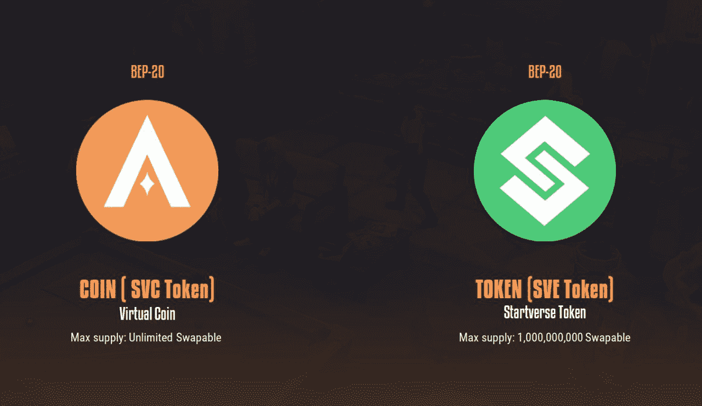

# 什么是 SocialFi？这是一种新的密码货币趋势吗？

> 原文：<https://medium.com/coinmonks/what-exactly-is-socialfi-is-this-a-new-cryptocurrency-trend-1d2bf209dd99?source=collection_archive---------25----------------------->

## *SocialFi:快速概述*

**SocialFi**

**什么是社会责任？它是如何运作的？**

SocialFi 是一个结合了社交网络和金融的区块链平台。SocialFi 可能被视为 DeFi 的一种新“变体”，强调分散化、开放性和用户授权。然而，另外两个想法，Web 3.0 和 DAO，将与 SocialFi 紧密联系在一起。

您可能会看到这样的事情，以使其更容易理解。这个市场现在由脸书和推特等社交媒体平台主导。他们的共同点是都通过中间人向用户提供免费服务。然后，他们收集用户的数据并从中获利，例如，通过发送广告。

随着 SocialFi 的引入，传统的社交网络将升级到 Web 3.0 平台。权力不是集中在一个中间公司手中，而是在这个时候将权力置于用户手中。他们有能力决定这种模式是否会继续存在，他们甚至可以将他们的数据货币化。

**在这种情况下，SocialFi 解决了什么问题？**

回到上面的脸书或推特例子，用户的数据现在已经被集中并置于第三方中间人手中。这是 SocialFi 必须解决的首要问题之一。它还与向消费者传播奖励以及确保安全和隐私有关。具体如下:

**数据分散化:**传统社交媒体网络捕获并保留尽可能多的用户数据。要使用任何平台，您必须首先披露您的个人信息，然后跟踪您使用平台时的行为。如前所述，这可能用于发布广告或出于特定目的使用数据。为了取代这些现有的方法，SocialFi 必须使用户数据的收集更加透明和不可欺骗。区块链技术可以帮助解决这个问题。

**利益分配:**社交媒体网络通过基于用户流量销售广告来赚钱。流量和用户互动推动了这些平台。作为交换，客户只能获得平台的优势。SocialFi 应该开发更多的模式，让人们直接将他们在社交媒体上的影响力转化为金钱。当然，这些模式必须与区块链工业联系起来。

**隐私和安全:**在一个标准的社交网络中，每个账户注册都需要用户的信息，比如他们的手机号码、电子邮件地址等等。这些信息保存在一个文件中。这些平台的服务器系统是集中的。当然，因为它是中央集权的，所以总是容易受到攻击。SocialFi 必须利用区块链技术协助保护用户信息的隐私和安全。这意味着每个人都可以访问这些信息，但是没有人知道这些信息到底是什么。

**SocialFi 的机遇与挑战**

**SocialFi 的机会**

在加密货币领域，Web 3.0 已经并将继续成为一种新趋势。它有助于创造更多的机会，这意味着新的商业模式。区块链正在逐步渗透到社会的方方面面，旧的方法将被淘汰。

**SocialFi 的挑战**

尽管我们有可能目睹这一事实，但传统的社交网络继续主导着这个市场。区块链技术有可能帮助 SocialFi 破坏这些社交网络，但它必须克服两个主要障碍才能获得牵引力:

1.影响垄断

SocialFi 简单来说就是个人价值的可视化表示，这种价值用现金(加密货币)来表示。SocialFi 将把对内容生产的垄断扩大到已有的参与者或已经强大的超级明星。另一方面，对于后一种参与者，或者只是很少或没有权力的普通人，他们的材料可能很难到达大量的人。因此，他们需要创造更多吸引人的内容来保持人们的兴趣。事实上，这种定价并不适合所有人。

2.货币化模式

SocialFi 的用户目前可以通过多种方式创造价值。创建材料并等待追随者的反馈是典型的(捐赠的一种形式)。另一种方法可能是“写赚”(类似于“玩赚”的概念)，它允许作者通过写作赚钱。这需要复杂的算法技术以及用户友好的访问。

**social fi 生态系统包括什么？**

目前，大多数 SocialFi 计划都专注于发布令牌，然后将这些社交令牌作为项目的核心。一般来说，社交令牌可以分为三组:

**个人代币:**假设你拥有一个粉丝群，个人代币将帮助你与你的粉丝互动并保持联系。简单地说，你将能够设计你自己的社交令牌，你将能够出售并分发给你的追随者。例如，个人代币可能会授予你的粉丝访问你创建的专属群组或独特材料的权限。

**社区令牌:**社区令牌是特定社区发行的令牌，类似于上面的类型。例如，假设你是一个游戏玩家，想加入任何一个游戏公会。为了将这个社区游戏公会聚集在一起，参与者将创建自己的令牌并将其分发给其他成员。

**社交平台令牌:**由社交网络产生的一种令牌被称为社交平台令牌。未来，用户将很有可能从脸书或推特这样的模式中收到这种代币。它可以用于安全、锁定，甚至社区管理。

**Startverse Currencies**

另外， **Starverse** 也是一款 SocialFi 游戏，已经发行了两个代币:Startverse 币(SVC)和 Startverse 代币(SVE)。这个游戏的多样性和独特性正等着你去发现。

**星际社交**

Startverse 是一款元宇宙游戏，SocialFi 游戏，面向所有想要建立自己的创业公司的人。在这里，你可以成为老板、著名的艺术家、英俊的披萨外卖员，你甚至可以成为赌场的老板，或者建立一个专门从事土地承包的行会，随心所欲地经营你的帝国！

要在游戏中成功，你必须在事业和人际关系两方面都成功。玩家必须满足他们的需求，平衡睡眠、饮食、工作、健身，就像真正的人类一样。他们还需要找工作或建立自己的公司来赚钱。游戏的真正目标是帮助你的角色用他梦想的职业获得成功。

最新的虚拟现实技术被实施到 Startverse 中，以在虚拟世界中带来独特的 3D 体验。我们的游戏将支持运行于:

●移动端:安卓、IOS。

● WebGL 和 PC。

游戏流派:模拟，管理，VR。

年龄:9 岁以上

希望这篇文章给你提供了有用的信息。如果你有任何问题或者想和 **Startverse** 讨论这个帖子，请在下面留下评论！

*在****Startverse****加入来自世界各地的创业公司、老板、土地所有者的社区，同时接收最新的项目新闻，享受特别内容:*

[网站](https://startverse.io/) | [脸书](https://www.facebook.com/Startverse-Global-102077955725659/) | [推特](https://twitter.com/StartverseGame) | [不和](https://discord.gg/cfUSrHUvSz) | [电报](https://t.me/StarverseGlobal) | [白皮书](https://whitepaper.startverse.io/)