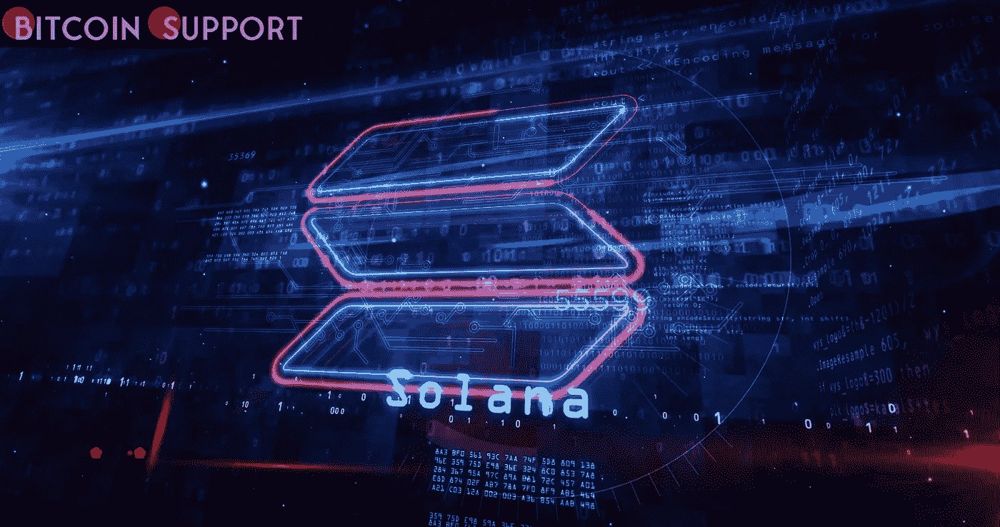
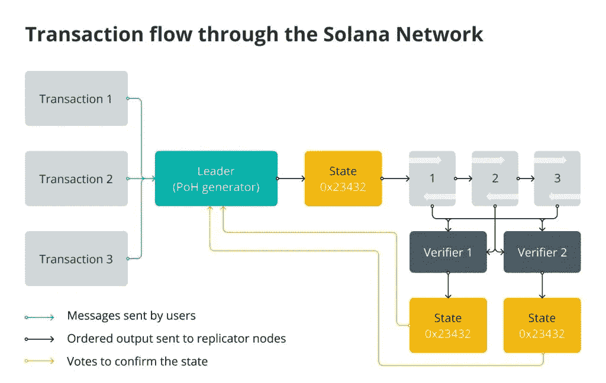

# 索拉纳到底是什么，它是如何发挥作用的？

> 原文：<https://medium.com/coinmonks/what-exactly-is-solana-and-how-does-it-function-e7f4b3516333?source=collection_archive---------80----------------------->

**Visit our website:-** [**https://bitcoinsupports.com/**](https://bitcoinsupports.com/)

Solana’s ambitious design tries to overcome the blockchain trilemma, however it has a number of flaws, including a vulnerability to centralization.

**So, what exactly is Solana?**

Solana is a highly functional open source project that develops a new layer-1 blockchain that is permissionless and fast.

Solana was founded in 2017 by Anatoly Yakovenko, a former Qualcomm executive, with the goal of scaling throughput beyond what is currently possible with popular blockchains while keeping prices low. Solana employs a novel hybrid consensus model that combines a one-of-a-kind proof-of-history (PoH) algorithm with a lightning-fast synchronisation engine, which is a variant of proof-of-stake (PoS). As a result, the Solana network may theoretically perform more than 710,000 transactions per second (TPS) without the requirement for scaling solutions.

The third-generation blockchain architecture developed by Solana is intended to make smart contracts and decentralised application (DApp) development easier. Decentralized finance (DeFi) systems and nonfungible token (NFT) marketplaces are supported by the project.

During the initial coin offering (ICO) frenzy of 2017, the Solana blockchain was launched. In 2018, the project’s internal testnet was released, followed by various testnet phases running up to the main network’s formal launch in 2020.

**What distinguishes Solana from the rest of the pack?**

Solana’s ambitious design tries to address the blockchain trilemma in a novel way, a concept articulated by Ethereum developer Vitalik Buterin. Decentralization, security, and scalability are the three key issues that developers confront when constructing blockchains, as described in this trilemma.

Because blockchains can only deliver two of the three benefits at any given moment, it is often assumed that developers are forced to compromise one of the qualities in favour of the other two.

The Solana blockchain platform has proposed a hybrid consensus process that prioritises speed above decentralisation. Solana is a one-of-a-kind initiative in the blockchain market due to its novel blend of PoS and PoH.

In general, the more and better a blockchain’s scalability is determined by the number of transactions per second it can accommodate. However, time differences and more throughput slow down decentralised blockchains, implying that additional nodes confirming transactions and timestamps takes longer.

In a word, Solana’s design tackles this problem by selecting a single leader node based on the PoS method for message sequencing between nodes. As a result, the Solana network benefits, decreasing workload and increasing throughput despite the lack of a centralised and precise time source.

Also, by hashing the output of one transaction and using it as the input of the next, Solana establishes a chain of transactions. Solana’s main consensus mechanism is named after this history of transactions: PoH, a principle that enables for better scalability of the protocol, which improves usability.

**How does Solana function?**

Proof-of-history is the heart of the Solana protocol, a series of computations that produce a digital record confirming that an event occurred on the network at any point in time. It can be presented as a cryptographic clock that assigns a timestamp to every network transaction, as well as a data structure that can be added to it easily.

The Tower Byzantine fault tolerance (BFT) algorithm, which is an optimised variant of the practical Byzantine fault tolerance (pBFT) protocol, is used in PoH. It is used by Solana to reach an agreement. The Tower BFT keeps the network secure and operational while also serving as an additional tool for transaction validation.

PoH can also be thought of as a high-frequency Verifiable Delay Function (VDF), a triple function (setup, evaluation, and verification) that generates unique and dependable results. VDF keeps the network in order by confirming that block makers have given the network adequate time to go forward.

Solana employs a 256-bit secure hash algorithm (SHA-256), which consists of a collection of patented cryptographic operations that produce a 256-bit result. The network samples the number and SHA-256 hashes on a regular basis, delivering real-time data based on the set of hashes stored on central processing units.

This sequence of hashes can be used by Solana validators to record a specific piece of data that was created before the generation of a specific hash index. After this particular piece of data is inserted, the timestamp for transactions is created. To accomplish the promised high TPS and block generation times, all nodes on the network must have cryptographic clocks to keep track of events instead than waiting for other validators to authenticate transactions.

**Visit our website:-** [**https://bitcoinsupports.com/**](https://bitcoinsupports.com/)

sola(SOL)令牌是一种加密货币。

索尔是索拉纳的加密货币。它是索拉纳的天然和实用的象征，它作为一种转移价值的手段，以及通过赌注提供区块链的安全。SOL 成立于 2020 年 3 月，目标是成为总市场估值排名前十的加密货币之一。

SOL 代币的操作策略与以太坊网络相同。尽管它们的功能相似，但 Solana 令牌持有者必须将令牌作为赌注，以便通过 PoS 共识流程验证交易。索拉纳令牌还用于获取奖品和支付交易成本，以及允许用户参与治理。要回答有多少索拉纳硬币在流通的问题，将有超过 5 亿枚代币发行，索拉纳的总供应量目前超过 5.11 亿枚代币——索拉纳的流通供应量略超过一半。索拉纳的创始人和索拉纳基金会拥有大约 60%的 SOL 代币，剩下的 38%留给社区。

SOL 代币如果你想知道 Solana 在哪里买，在大部分交易所都可以买到。币安、比特币基地、KuCoin、Huobi、FTX 和其他交易所是 Solana 的主要加密货币交易所。

**以太坊 vs 索拉纳**

索拉纳因其速度和性能获得了很多赞誉，甚至被称为以太坊等加密行业重量级公司的合法竞争者。

那么，Solana 与以太坊有何不同，是否可以认为是以太坊的竞争对手？Solana 能够在处理速度方面挑战占主导地位的智能合约平台，因为据传它能够实现超过 50，000 TPS 的速度。为了避免缓慢的交易确认，索拉纳采用了多种共识机制。Solana 是业内最快的区块链之一，这使得它可以与加密以外的行业竞争。

相比之下，目前以太坊的工作验证方法，不可伸缩，只能处理 15 TPS。结果，索拉纳的表现超过以太坊数千倍。Solana 网络的另一个好处是其非凡的成本效益，因为该项目使用新的令牌组学来降低成本。

同样值得注意的是，在使用 PoS 版本的同时，Solana 的区块链更加环保和可持续。相比之下，以太坊目前的 PoW 方法需要使用大量的处理能力。

另一方面，以太坊升级到 PoS 是加密界所有人都在期待的事情。一个执行层(以前称为以太坊 1.0)和一个共识层将组成一个正在严格开发的新型以太坊(以前称为以太坊 2.0)。它有可能显著提高吞吐量、可伸缩性、交易费用和用电量。

**索拉纳的缺点**

如果你还在犹豫索拉纳是否是一项体面的投资，是否应该购买，决定权在你。尽管有明显的好处，索拉纳，像其他所有的加密项目一样，也有缺陷。

首先也是最重要的，虽然能够与高端区块链项目竞争，但索拉纳区块链仍然容易受到集中化的影响，因为区块链验证器的数量有限。网络上的任何人都可以成为索拉纳验证者，然而这样做是有挑战性的，因为需要很高的计算能力。此外，该协议仍然称自己是 mainnet 的测试版，暗示可能有错误。尽管面临这些挑战，Solana 仍然是最大的加密生态系统之一，并且似乎正走在扩张的正确道路上。

**访问我们的网站:-**[**https://bitcoinsupports.com/**](https://bitcoinsupports.com/)

**免责声明:以上为作者观点，不应视为投资建议。读者应该自己做研究。**