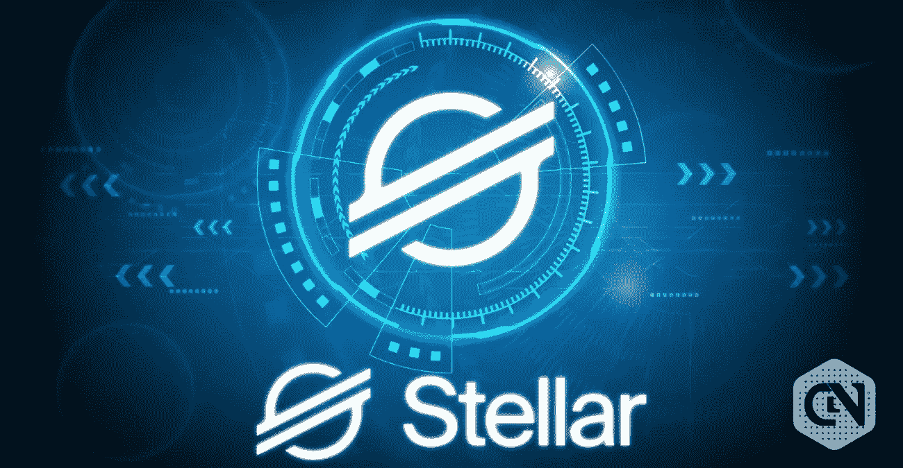

# 恒星到底是什么？XLM 如何在 2022 年超越 XRP！

> 原文：<https://medium.com/coinmonks/what-exactly-is-stellar-how-xlm-can-surpass-xrp-in-2022-36f82a9a3ce0?source=collection_archive---------9----------------------->

Source photo [xlm — Bing images](https://www.bing.com/images/search?view=detailV2&ccid=pXBBg7xM&id=8065B160ECBFB3DE7C0CAA3AA71449A9747F9779&thid=OIP.pXBBg7xM-TWd1gXQCFX0vwHaD2&mediaurl=https%3a%2f%2fwww.cryptonewsz.com%2fwp-content%2fuploads%2f2019%2f09%2fStellar-Lumens-XLM-1-780x405.jpg&cdnurl=https%3a%2f%2fth.bing.com%2fth%2fid%2fR.a5704183bc4cf9359dd605d00855f4bf%3frik%3deZd%252fdKlJFKc6qg%26pid%3dImgRaw%26r%3d0%26sres%3d1%26sresct%3d1%26srh%3d675%26srw%3d1300&exph=405&expw=780&q=xlm&simid=608027237510243777&FORM=IRPRST&ck=DF587AFF3671704D56E0D79A8FD758C6&selectedIndex=10&ajaxhist=0&ajaxserp=0)

虽然比特币仍然是最广泛使用的密码货币，但替代密码货币的出现扩大了数字资产在全球的使用。除了比特币之外，Ethereum、XRP 和 Litecoin 等密码货币已经发展成为密码货币投资者的重要资产。它们的存在保证了市场不仅仅是以比特币为中心。遗憾的是，没有一个…