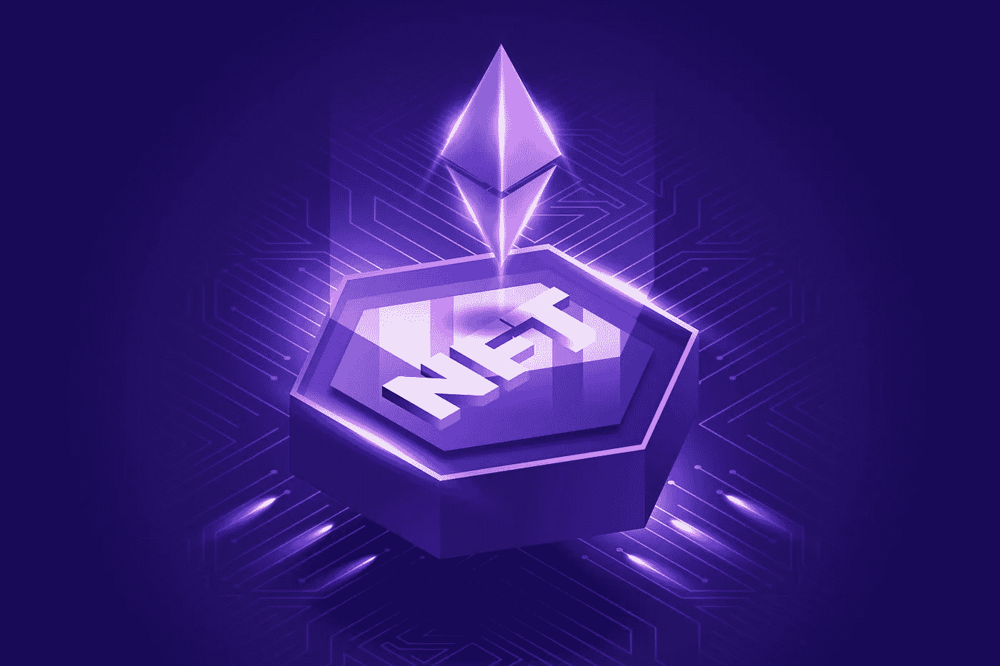

# 到底是什么让 NFT 如此值钱？

> 原文：<https://medium.com/coinmonks/what-exactly-makes-an-nft-so-valuable-25ac4f4a6827?source=collection_archive---------19----------------------->

一张 JPEG 图片怎么会比你一年的工资还值钱呢？人们是不是疯了，或者在这种疯狂的背后真的有一种方法？

Disclaimer: This is not financial advice, always do your own research.

让我们从什么是 NFT 的基础知识开始。术语 NFT 代表不可替代令牌。*不可替代*简单地说，资产是独一无二的。*可替代性*是将一项资产与另一项同类资产互换的能力。NFT 的储存在…