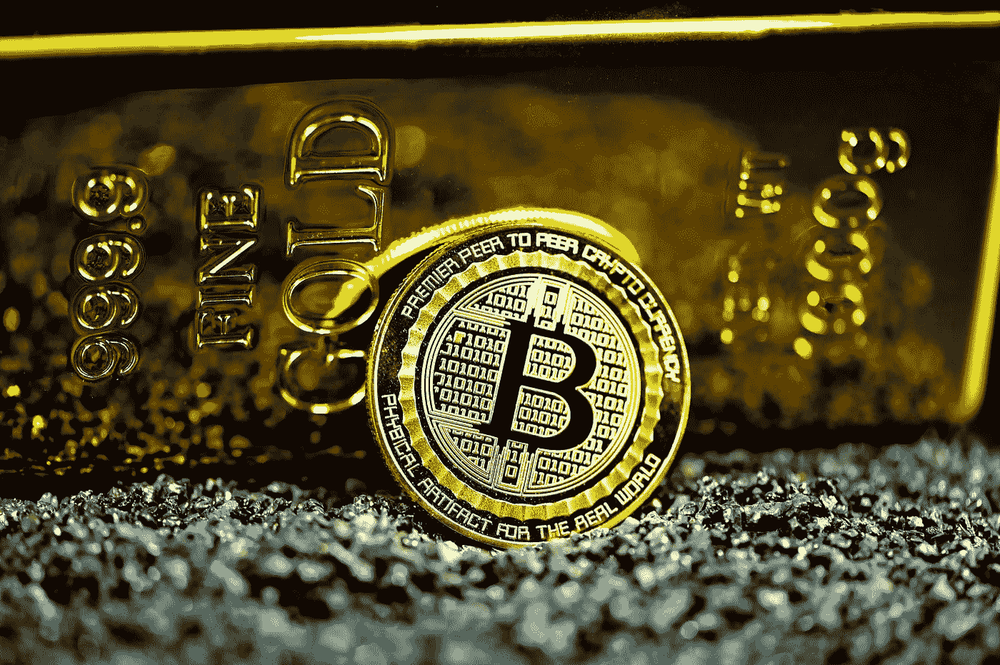
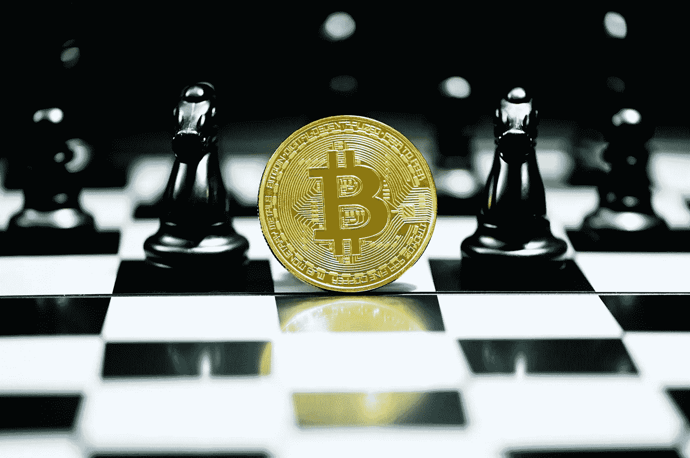
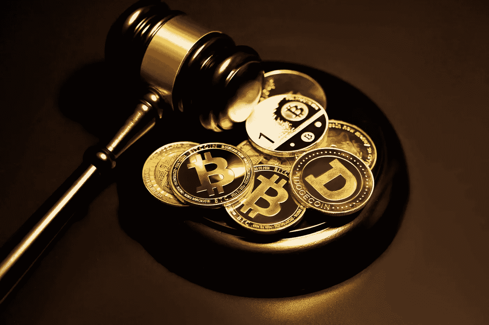

# 是什么赋予了加密货币价值？

> 原文：<https://medium.com/coinmonks/what-gives-cryptocurrencies-their-value-210c59207584?source=collection_archive---------22----------------------->

Source: Unsplash.com

**加密货币的快速概述**

加密货币是一种基于互联网的交易媒介，使用加密程序进行金融交易。加密货币采用区块链技术来保证去中心化、透明和不变性。

加密货币最重要的特征是单一实体无法控制它:区块链的分散结构使加密货币能够抵抗政府的操纵和控制。

加密货币可以使用私钥和公钥在双方之间直接发送。通过以最少的处理费用转移支付，用户可以避免传统银行机构支付的高额费用。加密货币已经发展成为一种大多数人都熟悉的全球现象。如今，你不可能找到一家大型银行、一家重要的会计公司、一家知名的软件公司，或者一个政府没有研究过加密货币、发表过关于这个主题的论文，或者启动过所谓的区块链项目。

美利坚合众国参议员托马斯·卡珀指出，"虚拟货币，也许最著名的是比特币，激发了一些人的想象力，引起了另一些人的恐惧，并迷惑了我们其余的人。

然而，尽管兴奋和新闻发布，绝大多数人对加密货币只有初步的了解。

> **参见:** [**帮助你入门加密货币的 6 个小技巧。**](/coinmonks/6-tips-to-help-you-get-started-with-cryptocurrencies-10a886cbec0e)

**加密货币与法定货币:有什么区别？**

Source: Unsplash.com

当围绕加密货币的所有宣传都被剥离后，你会发现它只不过是数据库中有限条目的集合，除非符合特定条件，否则没有人可以更改。

准确地说，加密货币是一种基于互联网的交易媒介，它使用加密程序来执行金融交易。加密货币采用区块链技术来保证去中心化、透明和不变性。

**加密货币的价值来源是什么？**

比特币开发者的目标是让数字资产完全取代法定货币。每种电子货币都是加密和区块链技术相结合的结果，导致了分散、快速和低成本的交易、交换和转换。区块链是一种去中心化的公共账本，以复杂的方式记录和收集已完成交易的数据，使黑客或欺骗成为不可能。

所有加密货币都因其技术和经济成分而具有价值。人们倾向于优先考虑一个因素，尽管技术和经济在决定加密货币的价值方面都有作用。

加密货币领域有两种类型的投资者:一种是相信支撑加密货币的技术区块链的潜力的投资者，另一种是仅仅根据当前外部因素和加密的内在属性来推测加密资产的最大未来价值的投资者。

> **参见:** [**加密货币是如何工作的？加密货币初学者指南。**](/coinmonks/how-do-cryptocurrencies-work-beginners-guide-to-cryptocurrencies-b1915189fd4f)

那些相信技术潜力和效用的人会专注于他们感兴趣的项目。例如，一些投资者相信 Ripple(XRP)仲裁银行间国际支付的能力，在这种情况下，XRP 令牌被用作一种快速和低成本的交换方法，而不是依赖几个中介来连接不同的金融网络。

自从以太坊在 2015 年发布以来，已经出现了大量的区块链，每一个都声称解决了困扰中央金融系统的一系列不同的问题——这些组织已经存在了几千年。

另一方面，另一些人认为用自己的财富去冒险购买一种稀有的、主观估价的资产是值得的，这也是他们感知价值的来源。一个众所周知的例子是比特币。比特币的基本编码阻止了超过 2100 万个比特币被创造出来。新的比特币是通过奖励矿工创造的，这些矿工在 10 分钟的比赛中拥有所有其他矿工中最强的处理能力。这一奖项的价值每四年减半，使得比特币在未来变得极其稀缺，尤其是在需求增长的情况下。

因此，我们可以得出结论，加密货币的价值主要是主观的。

**投资加密货币堪比投资房地产。**

Source: Unsplash.com

大多数人认为加密货币类似于黄金。许多加密产品都有一个有限的供应上限，允许它们被用作通货紧缩的对冲。

黄金也是可替代的，这意味着一克黄金与另一克同等重量的黄金价值相同——这是 cryptos 共有的属性。

另一方面，加密资产可以被认为是像土地或财产一样的资产，人们对它们的估价类似于房地产。尽管土地是不可替代的，但在一个地区内，价格是相当稳定的。并非所有地点的收费都相同，也并非所有加密资产的价值都相同。某个区域的土地可能因为其更大的效用(即，战略性地位于城市中心和公共交通枢纽附近)而更有吸引力。

另一方面，其他人只关注一个地方的土地稀缺程度，购买土地只卖给出价最高的人。这种类型的土地所有者可能会希望持有他们的财产，直到他们在未来获得现金收益。在加密领域，这些类似于保持器。

**确定加密货币的内在价值**

首先，什么是内在价值？内在价值被定义为一个物体的价值来源于其自身的特性，不考虑外部因素。虽然价值总是因人而异，但很难否认任何具有积极影响和广泛效用的事物都具有更高的价值。

例如，黄金具有内在价值，因为它可以用来制造珠宝和计算机部件金属合金。因为水可以用于生存、灌溉、处理，甚至用于运输和发电，所以它具有内在价值。

> [**参见:需要使用 Bitxmi 交易所交易的 8 个理由。**](/coinmonks/8-reasons-you-need-to-trade-with-bitxmi-exchange-c4bff2ab3096)

**加密货币真的有什么内在价值吗？**

所有形式的加密货币都有内在价值。藐视审查的能力使比特币及其分支(如莱特币、比特币现金、比特币黄金和 Dash)和其他加密货币被广泛用作实际交换价值的媒介。以太坊、卡尔达诺和波尔卡都有这些和其他的基本价值。这些区块链中的任何一个都可以用来创建各种 DeFi 服务，例如贷款、贸易、私人银行业务，甚至赌博。

像美元一样，法定货币具有内在价值，但与加密货币不同。法定货币很有价值，因为政府宣布它们是法定货币。法定货币除了充当交换媒介之外，没有别的功能。

**什么因素影响加密货币的内在价值，为什么它比法定货币更有价值？**

法定货币具有内在价值，因为它们被用作法定货币，这意味着它们是纳税的唯一方式。虽然并非所有加密货币都是如此，但大多数加密货币确实提供了法定货币所没有的东西:真正的稀缺性。

央行政策很复杂。试图让一个国家的经济产出与货币供应相匹配，可能导致货币过剩，引发货币贬值和通货膨胀。大多数加密货币都有供给上限，而法定货币的供给是无限的。

因此，加密货币的价值高于法定现金。出于同样的原因，黄金比水更有价值，尽管事实上没有黄金生命就不可能存在。

加密货币也是唯一一种生成成本不断上升的资产，导致供应率随着时间的推移而下降。当这种成分与网络效应相结合时，比特币和其他密码的价格看起来会呈指数级攀升。所有这些都意味着加密货币比法定货币更有价值。

**为什么对加密货币的价值有这么多质疑？**

Source: Unsplash.com

加密货币仅仅是“创造”出来的，只不过是一行行代码，这一概念是加密货币怀疑论最常见的形式之一。此外，某些加密货币，如比特币和以太坊，是部分或完全开源的，因此它们是完全可复制的。

更复杂的是，今天的法定货币经常受到拥有该货币的政府的权力和权威的支持。加密货币从一开始就没有得到任何人或一小部分人或投资者的支持。

尽管这是近十年来的一个趋势，但随着加密市场的增长，怀疑者已经减少；曾经是一家规模不大的企业，现在的市值约为 2 万亿美元。这超过了黄金总市值(11.2 万亿美元)的 12%，超过了白银的市值(1.4 万亿美元)。

数字说明了一切:加密是一个严肃的行业。

**影响加密货币价值的因素**

加密货币在十年内从默默无闻到价值巨大，其金额根据资产而波动。

**那么，加密货币的哪些属性让它能够保值？**

加密货币受到重视有几个原因，但它们都属于以下四个类别之一:

**实用性:**它有功能吗，能用来做什么有用的事情吗？这是迄今为止判断一枚硬币价值最常见的标准。从定义上来说，硬币如果有存在的机制，就会产生价值。数以千计的加密货币作为价值储存、支付机制和智能合约平台，见证了这一点。

硬币具有内在价值，因为它们可以发挥作用，并且可以在点对点(P2P)网络上进行交换。因为密码通常可以在没有保管人或中央机构的帮助下运行，所以不必依赖额外的联系点就有很大的价值，就像过去你可以用农场动物或东西进行交易一样。像移动应用程序一样，基于智能合约的货币可以执行订单和服务，增加了效用。

**需求:如果存在争夺一枚硬币的竞争，供求原则可能会帮助它保持其价值。如果有更多的人想要硬币，硬币就会升值，就像现在的 iPhone 价值已经超过 1000 美元一样。想要某样东西的人越多，它的价值就越高。如果硬币的供应量有限或随着时间的推移而减少，这种价值可能会飙升。**

****稀缺性:**在等式的供应端，大多数硬币的价值是由可获得的供应量决定的。一枚硬币的数量通常是固定的，随着时间的推移，获得它的机会会减少。这就产生了稀缺性，把价值的两个因素合二为一:硬币有固定的供应量(不像法币，可能是铸造出来增加供应量的)，数量在递减。**

****适应性**:这一特性有点挑战性，因为每种货币都不一样，但大多数硬币都提供了一种脱离传统金融的方法，同时保持内在价值。该值使您能够在没有银行、政府或其他第三方帮助的情况下使用加密货币(除非您选择这样做)。**

**其他特性包括能够作为开源软件使用；可替代性，允许交易和交换；便携性，这使得价值数百万美元的密码可以被带上飞机(或者基于你头脑中记住的助记短语)；密码术，大大增加了安全性；利用区块链网络产生分散融资；和可除性转换成八进制浮点表示形式。**

**许多帮助加密货币增值的属性与帮助法定货币增值的属性相当，例如需求或广泛使用。让加密货币变得有价值的许多特征是法定货币所不具备的:大多数加密货币都具有通缩性、适应性和稀缺性。**

**考虑到这一点，可以认为加密货币比法定货币更有价值。至少，这一概念可以部分地与最近利率和价格的飙升联系起来，这也表明了巨大的增长潜力。**

> **加入 Coinmonks [电报频道](https://t.me/coincodecap)和 [Youtube 频道](https://www.youtube.com/c/coinmonks/videos)了解加密交易和投资**

# **另外，阅读**

*   **[Bookmap 评论](https://coincodecap.com/bookmap-review-2021-best-trading-software) | [美国 5 大最佳加密交易所](https://coincodecap.com/crypto-exchange-usa)**
*   **最佳加密[硬件钱包](/coinmonks/hardware-wallets-dfa1211730c6) | [Bitbns 评论](/coinmonks/bitbns-review-38256a07e161)**
*   **[新加坡十大最佳加密交易所](https://coincodecap.com/crypto-exchange-in-singapore) | [购买 AXS](https://coincodecap.com/buy-axs-token)**
*   **[红狗赌场评论](https://coincodecap.com/red-dog-casino-review) | [Swyftx 评论](https://coincodecap.com/swyftx-review) | [造币厂评论](https://coincodecap.com/coingate-review)**
*   **[投资印度的最佳密码](https://coincodecap.com/best-crypto-to-invest-in-india-in-2021)|[WazirX P2P](https://coincodecap.com/wazirx-p2p)|[Hi Dollar Review](https://coincodecap.com/hi-dollar-review)**