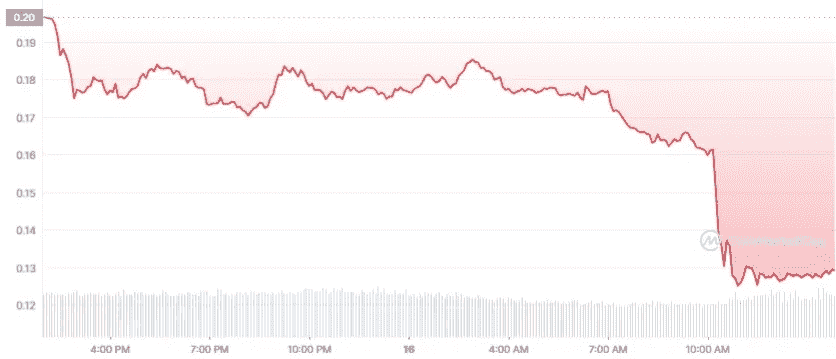
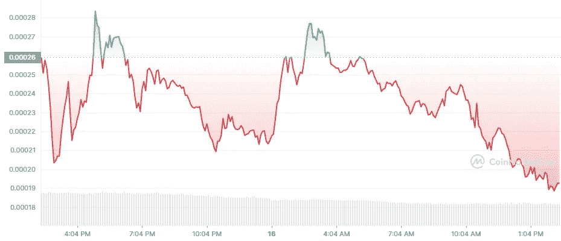

# 露娜怎么了

> 原文：<https://medium.com/coinmonks/what-happened-to-luna-4df271ae47c?source=collection_archive---------3----------------------->

Terra 区块链允许用户创建算法分散的稳定副本。LUNA 是 Terra 平台上的本机令牌，它充当治理令牌，并授予令牌持有者对协议的投票权。月神也是在区块链大地上铸造稳定金币的抵押品。

TerraUSD (UST)是 Terra 平台上最受欢迎的稳定币。目前有超过 110 亿美元的供应量。UST 的目标是通过一个套利交易者网络来维持其与美元的联系，这些套利交易者铸造并焚烧 Terra 不稳定的本地令牌 LUNA。

由 Tether (USDT)、Circle (USDC)和币安(BUSD)发行的 Stablecoins 通过在其储备中保留商业票据、现金、信托存款和储备回购票据以及国库券的组合来维持与美元的联系。他们的储备金额应该始终等于流通中的代币的美元价值。

**UST 如何运作**

为了在特拉区块链铸造 UST，交易者需要燃烧等量的月神。

例如，如果 1 个月神等于 10 美元，当它燃烧时，会产生 10 个 UST。

为了维持联系汇率，交易员受到贸易套利利润的激励。

从前面的例子来看，如果 UST 的交易价格是 1.5 美元(而不是 1 美元)，交易者可以利用这个机会烧掉 10 卢纳，赚 5 UST。

这将有效地增加 UST 的供应，导致其价格下降，使其回到 1 美元的价值。

相反，如果 UST 交易价格低于 1 美元，交易者可以烧掉 UST 和薄荷露娜。这减少了 UST 的供应量，稳定了其价格。

**撞车**

卢娜和 UST 的关系非常微妙。它们都是相互关联的，这意味着影响卢娜的事件往往会影响 UST，反之亦然。2022 年 5 月 9 日，当 UST 在加密市场崩盘期间失去盯住美元的汇率机制时，卢纳也被拖垮了。

有可能 UST 持有者担心代币失去挂钩并开始抛售，区块链土地上的交易者无法跟上大规模抛售，所以 LUNA 崩溃了。

在撰写本文时，UST 目前的价值为 0.1238 美元。下降了 37%以上。

*Source: CoinMarketCap (2022)*

卢娜受到了更重的打击。2022 年 5 月 12 日下跌 100%，至 0.00913 美元。换个角度来看，LUNA 曾经创下 119 美元的历史新高。它在 CoinMarketCap 排名第八，市值为 280 亿美元(T2)。5 月 12 日，它的市值几乎低至 6 亿美元。它目前以[14 亿美元](https://coinmarketcap.com/currencies/terra-luna/historical-data/)的市值排名第 211 位。

*Source: CoinMarketCap (2022)*

**破绽**

许多批评家在研究 LUNA 模型时提出的主要问题是缺乏稳定的抵押。

本质上，一个被认为是稳定的代币不应该被一个 ***易变资产*** 抵押。

这是导致灾难的原因！

用 Tradfi 的术语来说，想象一下一家银行允许借款人使用手机和私家车等不稳定资产作为贷款抵押。这家银行最终会倒闭，因为用作抵押品的资产会随着时间的推移迅速贬值。然而，也有像限量版手机和豪华车这样的例外，但大多数人不会接触到它们。

这就是为什么银行倾向于要求更稳定的资产，如房地产、艺术品、收藏品、保险单和珠宝。这些债券更加稳定，一旦出现违约，银行将能够收回资金。

**善后事宜**

Terraform 实验室的联合创始人 Do Kwon 提出了一个恢复协议的行动计划。

在 [Terra 生态系统复兴计划](https://agora.terra.money/t/terra-ecosystem-revival-plan/8701)中，道权提议将特拉区块链分支到 Terra2。他建议验证机构将 UST 供应量重置为 10 亿单位，其分配如下:

验证器应将网络所有权重置为 1B 令牌，这些令牌分布在:

*   **400 万(40%)** 在解除挂钩前给 LUNA 持有者。他建议在与币安脱钩之前，以最后一个 1 美元为基础进行结算。锁定在智能合约中的 LUNA 也将得到解决。
*   **4 亿(40%)** 按持股比例分给 UST 持有者。他将它们列为优先项目，并将尽可能多的退款。
*   **100 米(10%)** 在链条停止操作的最后时刻，向 LUNA 支架移动。试图为网络提供稳定性的最终边际交易者将得到补偿。
*   **1 亿英镑(10%)** 用于社区池，为链中的未来发展做准备。

该计划发布后，受到了以太坊联合创始人维塔利克·布特林(Vitalik Buterin)和币安首席执行官赵昌鹏(Changpeng Zhao)的批评。

维塔利克批评了 UST 的模式，指出这种模式本身就有缺陷，是不可持续的。他将与戴(DAI)等分散化的稳定债券进行了比较，后者以智能合约中持有的实际现金资产为抵押。这与 UST 不同，后者没有现金资产作为抵押。

赵昌鹏(CZ)批评道权发布的恢复计划。他说分叉网络对本地令牌没有积极的影响。

CZ 解释了 Kwon 发布的恢复策略中的一个主要缺陷。他说，“铸造硬币(印钞票)并不创造价值，它只是稀释了现有的硬币持有者。”

本质上，铸造新代币将使代币的价值进一步下降，因为供应将超过需求。

CZ 还质疑 Luna Foundation Guard (LFG)持有的 35 亿美元比特币，认为它可以用于备份

**结论**

UST 的故事表明，如果忽视基本经济学，后果将是多么灾难性。UST 没有任何资产抵押，它的价值是由区块链土地上的交易者持续不断的铸造和燃烧机制支撑的。这有点类似于庞氏骗局，因为在稳定的硬币背后没有 ***真实价值*** 的资产。

LUNA 的崩溃非常令人沮丧，因为许多持有人在崩溃中失去了所有的钱。这一事件给所有替代硬币的持有者带来了冲击波，因为不是狗屎硬币的 LUNA 突然崩溃了，然而流行的狗屎硬币自诞生以来还没有经历过这样的下跌。

最终，我相信密码部门会度过这个难关。我们可以从这次事件中吸取教训，希望我们不会再看到这样的事情发生。

**参考文献**

1.  [什么是 Terra？算法稳定协议解释](https://decrypt.co/resources/what-is-terra-algorithmic-stablecoin-protocol-explained)
2.  [土地生态系统复兴计划](https://agora.terra.money/t/terra-ecosystem-revival-plan/8701)
3.  [维塔利科和 CZ 对 Terra 的灭亡有些想法](https://decrypt.co/100461/vitalik-and-cz-have-some-thoughts-on-terras-demise)

> 加入 Coinmonks [电报频道](https://t.me/coincodecap)和 [Youtube 频道](https://www.youtube.com/c/coinmonks/videos)了解加密交易和投资

# 另外，阅读

*   [3 商业评论](/coinmonks/3commas-review-an-excellent-crypto-trading-bot-2020-1313a58bec92) | [Pionex 评论](https://coincodecap.com/pionex-review-exchange-with-crypto-trading-bot) | [Coinrule 评论](/coinmonks/coinrule-review-2021-a-beginner-friendly-crypto-trading-bot-daf0504848ba)
*   [莱杰 vs n rave](/coinmonks/ledger-vs-ngrave-zero-7e40f0c1d694)|[莱杰 nano s vs x](/coinmonks/ledger-nano-s-vs-x-battery-hardware-price-storage-59a6663fe3b0) | [币安评论](/coinmonks/binance-review-ee10d3bf3b6e)
*   [Bybit Exchange 审查](/coinmonks/bybit-exchange-review-dbd570019b71) | [Bityard 审查](https://coincodecap.com/bityard-reivew) | [Jet-Bot 审查](https://coincodecap.com/jet-bot-review)
*   [3 commas vs crypto hopper](/coinmonks/3commas-vs-pionex-vs-cryptohopper-best-crypto-bot-6a98d2baa203)|[赚取加密利息](/coinmonks/earn-crypto-interest-b10b810fdda3)
*   最好的比特币[硬件钱包](/coinmonks/hardware-wallets-dfa1211730c6) | [BitBox02 回顾](/coinmonks/bitbox02-review-your-swiss-bitcoin-hardware-wallet-c36c88fff29)
*   [BlockFi vs 摄氏度](/coinmonks/blockfi-vs-celsius-vs-hodlnaut-8a1cc8c26630) | [Hodlnaut 审核](/coinmonks/hodlnaut-review-best-way-to-hodl-is-to-earn-interest-on-your-bitcoin-6658a8c19edf) | [KuCoin 审核](https://coincodecap.com/kucoin-review)