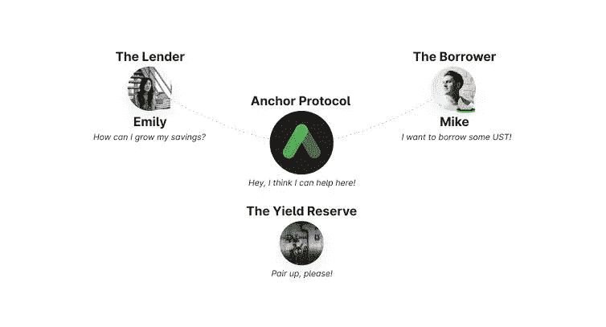
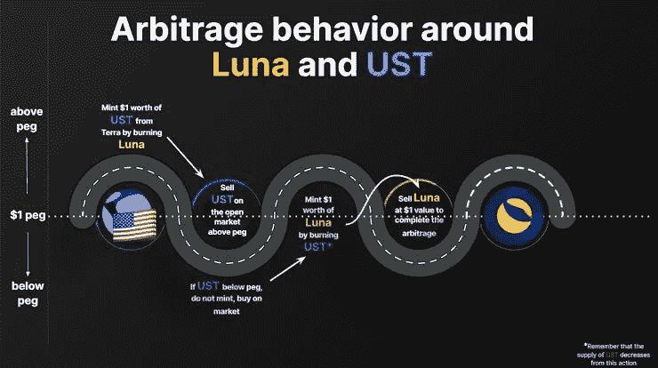
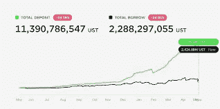

# 泰若露娜怎么了？

> 原文：<https://medium.com/coinmonks/what-happened-to-terra-luna-5b7d8a2bed50?source=collection_archive---------47----------------------->

> 写于 2022 年 6 月 13 日

这篇紧急的长文是出于我看到交易者/投资者试图“购买”LUNA 加密货币及其生态系统时的悲伤。因此，这是为那些发现很难从互联网上的无数信息中收集信息的人和那些对当前发生的事件感到困惑的人而创建的。

**三难困境**

我从 Luna 生态系统中的 3 个关键角色开始写这篇文章。露娜，UST，主播。

卢娜和 UST 分享彼此的关系，因为 UST 是一个算法稳定的硬币(**)，它没有任何东西支持，不像 USDC、BUSD 和其他人完全由现实生活中的美元支持；每 1 美元或 1 美分，就有 1 美元，真正的现金作为抵押品，在储备中支持它**。所以 UST 获得稳定的唯一方法就是焚烧和铸造卢娜和 UST。没有后盾的 UST 依靠套利交易来维持 1 美元兑 1 美元的汇率。

这就是它的工作原理，你可以用 1 美元的 UST 烧 1 美元的月神，你可以反过来做。

UST 存在于交易所，所以有时 UST 在这些交易所变得便宜/昂贵，所以这里有套利机会。

> 交易新手？试试[密码交易机器人](/coinmonks/crypto-trading-bot-c2ffce8acb2a)或[复制交易](/coinmonks/top-10-crypto-copy-trading-platforms-for-beginners-d0c37c7d698c)

币安等交易所的一 UST 为 0.95，你可以决定在交易所买入大量 UST，然后烧掉它们以获得卢纳(此时会更多)，然后你会去这些交易所将这些卢纳卖给 USDC、BUSD 或 USDT，以获取利润。

(IMAGE: The open market here is the guy exchanges, TERRA here represents the on chain environment of LUNA)

所以从我上面的例子来看，当 UST 下跌时，交易所的买入压力将 UST 的价格推回到 1 美元，因此稳定得以恢复。反之亦然，每当 UST 超过 1 美元。

**锚协议**

简单来说，这是一个关于 Luna、POLKADOT、Eth 和 cosmos 区块链的借贷协议。基本上，你借钱给协议，并获得 20%的 APY(这是整个问题的开始)，请注意，在传统金融中，你只能从你的贷款/储蓄中获得少得可怜的 5%的 APY。

然后回到借款人身上。这些人以 bLUNA 和 bETH 的形式存放抵押品(作为借款人，你必须购买这些东西，这样你才能借得更多)。这并不是唯一的问题，因为你从协议中借钱，ANC 仍然会以 ANC 的形式向你借钱。

没道理对吧。借款如何获得报酬？从字面上看，我可以拿回我的抵押品，我没有任何损失。

钱从哪里来？请注意，他们仍然有贷款人支付 20%的 APY。这说明庞氏骗局。Anchor protocol 赚钱的唯一途径是从支付贷款利息的借款人那里赚钱。

综上所述，如果从 ANCHOR 处借的钱比借出的钱多一定数量，ANCHOR 作为一个协议赚钱，他们不需要从准备金中拿钱来支付他们承诺给贷款人的 20% APY。

上图显示了系统的不可持续性。借款利率有一些计算，但它是一个浮动利率。它可以从 31%到低至 14%(计入利用率和借款利率后)。

**进退两难**

简单明了地说，一名攻击者使用 10 万 BTC 和价值 10 亿美元的 UST 来制造恐慌和恐惧。当 BTC 股价在 4.2 万美元左右时，他做空了价值 42 亿美元的 BTC，并平仓了他在 UST 的空头头寸，然后去了币安，卖掉了所有的 UST，换来了另一枚稳定的硬币。乔治·索罗斯风格。干净又甜美。

出售 UST 的数量使 UST 下跌。这使得套利者尽其所能恢复联系汇率制(我在上面解释过)。过度购买 UST 以恢复 1 美元的联系汇率制在一段时间内发挥了作用。但这些套利者会为 LUNA 烧掉这些 UST，然后回来在交易所卖出这些 LUNA。反过来，给 LUNA 带来抛售压力，因此 LUNA 的价格下跌。左右挤压颈部。乔治·索罗斯风格。

这让锚定贷款人感到恐慌，他们开始在交易所出售协议中的所有 UST。从而压低 UST 价格。

恶性循环。

露娜会干掉我的兄弟姐妹。如果没有，它会有狗屎硬币定价(0.000000000…).不要把资金投入到你不完全了解的事物中。

旁注。曾经有过 Siegnorage 稳定币和算法稳定币失去价值的历史。仅举几个例子，AMPL、巴西卡什和铁金融。

LUNA 的 Do Kwon 曾经是 BasicsCash 的 CFO。Lol 对吧？

每个人都在这个区块链上赔了钱。我个人在这些链上有价值 18，000 美元的 NFT 和域名。我们都会挺过来的。不要烦恼。这一切都会过去。