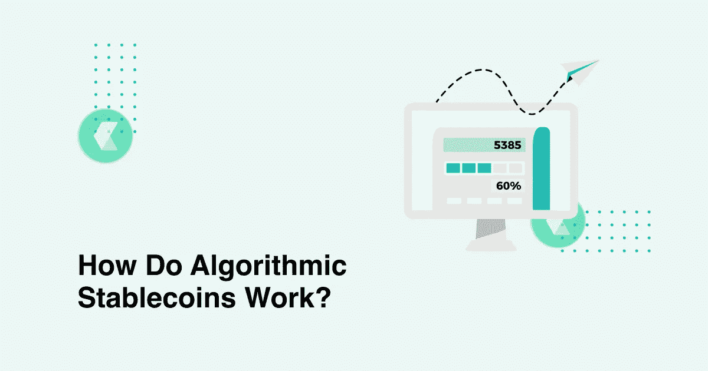

# TerraUSD 算法 stablecoin 怎么了？

> 原文：<https://medium.com/coinmonks/what-happened-to-the-terrausd-algorithmic-stablecoin-e172953ef2e6?source=collection_archive---------24----------------------->

## 他们和同行有什么不同？

Photo Source on Google

大多数稳定货币通过抵押机制与他们追踪的货币保持 1:1 的联系。流通中的稳定币由现金或其他资产支持，以支持稳定币的估价。例如，按市值计算最大的稳定货币 Tether (USDT)是由存放在银行或其他中央实体的现金(美元)和现金等价债券等链外资产抵押的。

然而，遵循这种方法并不总是可行的，因为随着稳定币发行量的增加，协议需要不断增加它们的附属库存。这就是算法稳定的切入点。

算法 stablecoins 的功能有点不同。他们通常没有任何抵押品支持，而是使用复杂的算法来维持与他们追踪的法定货币挂钩。这些算法还可以激励和操纵投资者的行为，以稳定盯住汇率的硬币价格。

# **算法稳定积分的类型及其工作原理**

有两种类型的算法稳定资本——重计基数和铸币税。重定基础稳定货币操纵稳定货币的供应，以维持其与法定货币的挂钩。该协议铸造(增加)或焚烧(去除)硬币，与稳定硬币的价格运动保持一致，以保持其价值稳定。如果稳定的硬币价格滑落到 1 美元以下，硬币就会停止流通，反之亦然。

铸币税的作用类似。然而，他们也将稳定币与其他加密货币配对，以更好地控制其估值。除了铸造和焚烧机制，该协议还为市场参与者提供了购买/出售配对加密货币的激励措施，以维持稳定的货币价格。

TerraUSD 是铸币税稳定的主要例子。它使用 Terra 的本地加密货币 LUNA 来维持其对美元的估值。然而，这种创新的挂钩方法也导致了它的垮台。

# **terra USD 算法稳定币怎么了？**

卢娜-UST 这对搭档的工作方式非常简单。用户可以用 1 UST 兑换 1 美元的露娜，反之亦然。当 1 美元的月神兑换成 1 UST 时，月神被烧毁，UST 被铸造。当 1 UST 兑换 1 美元月神时，情况正好相反。当 UST 的估值稳定并与美元挂钩时，这种做法很管用。

然而，当 UST 价格下跌时，市场参与者可能会开始用它来交换卢纳，以快速获利。在这个过程中，LUNA 的流通供应量飙升，导致价格下跌。例如，如果 UST 跌至 0.5 美元，用户可以花 10 美元购买 20 个 UST。然后他们可以用 20 UST 换 20 卢纳，在公开市场上出售，很快就能获得 100%的利润。

这就是 Terra 生态系统的情况。2022 年 5 月 8 日，一头鲸鱼倾倒了价值近 1.93 亿美元的 UST。这导致了短暂的脱钩，UST 跌至 0.98 美元。虽然 UST 显示出从脱钩中复苏的迹象，但恐惧和恐慌已经开始，导致了 LUNA 的大规模抛售。

在撰写本文时，LUNA 从 5 月 5 日的 87 美元跌至 0.00018 美元。UST 也未能重新盯住美元，目前汇率徘徊在 0.14 美元。

# **算法稳定的未来即将到来**

迄今为止，算法稳定点数已被广泛用于流动性池和投机套利交易。然而，随着最近 Terra 的崩溃，未来看起来很黯淡。此外，随着立法者密切关注该行业的发展，监管可能会对这些稳定的行业实施严厉的制裁。

事实上，美国财政部长珍妮特·耶伦已经在一次呼吁稳定货币立法的听证会上提出了 Terra 案。在听证会上，耶伦指出，UST 是一个“不断增长的产品，风险也在迅速增长”。她补充说，国会在今年年底前通过稳定货币立法是“重要的，甚至是紧迫的”。

> 加入 Coinmonks [电报频道](https://t.me/coincodecap)和 [Youtube 频道](https://www.youtube.com/c/coinmonks/videos)了解加密交易和投资

# 另外，阅读

*   [BigONE 交易所评论](/coinmonks/bigone-exchange-review-64705d85a1d4) | [电网交易机器人](https://coincodecap.com/grid-trading)
*   [氹欞侊贸易评论](https://coincodecap.com/anny-trade-review) | [CoinSpot 评论](https://coincodecap.com/coinspot-review)
*   [新加坡十大最佳加密交易所](https://coincodecap.com/crypto-exchange-in-singapore) | [购买 AXS](https://coincodecap.com/buy-axs-token)
*   [投资印度的最佳加密软件](https://coincodecap.com/best-crypto-to-invest-in-india-in-2021) | [WazirX P2P](https://coincodecap.com/wazirx-p2p)
*   [西班牙 5 大最佳文案交易平台](https://coincodecap.com/copy-trading-spain)
*   [Pionex 双投](https://coincodecap.com/pionex-dual-investment) | [AdvCash 审核](https://coincodecap.com/advcash-review) | [秉持审核](https://coincodecap.com/uphold-review)
*   [面向开发者的 8 个最佳加密货币 APIs】](https://coincodecap.com/best-cryptocurrency-apis)