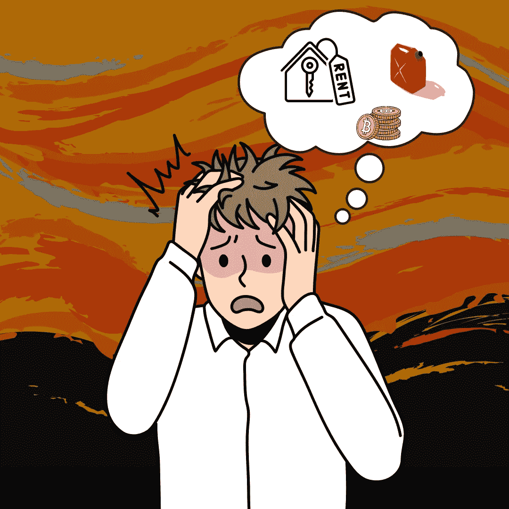

# 美国市场怎么了？(用简单的英语)

> 原文：<https://medium.com/coinmonks/what-happened-to-the-usa-market-in-plain-english-7c605aff502?source=collection_archive---------20----------------------->

## 滞涨是不是说明我太慢了？联邦基金利率是否意味着联邦调查局的突袭？我知道行话正在失去你们所有人。先说常识。

Source: Self Created Image with [Canva](http://www.canva.com).

**大局**

大局不难理解。很多专家喜欢使用大词。目标是听起来…