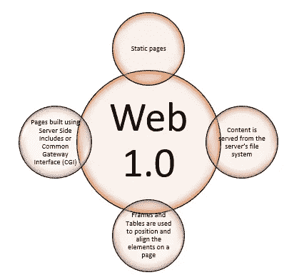

# 万维网怎么了？

> 原文：<https://medium.com/coinmonks/what-happened-to-the-world-wide-web-244c1ea0f8d7?source=collection_archive---------25----------------------->

万维网是数十亿人通过互联网交换、阅读和书写信息以及相互交流的主要工具。自诞生以来，万维网已经通过各种阶段取得了重大进展，这些阶段可以分为三类:Web 1.0、Web 2.0 和 Web 3.0。

[https://www.bueno.art/blog/whats-web3](https://www.bueno.art/blog/whats-web3)

# 首先是 Web 1.0

web 1.0 通常被称为只读 Web 或语法 Web，是 1989 年至 2005 年期间万维网革命的第一阶段。

这些网站只是提供信息，而且只有静态内容；它们只是通过超链接连接在一起，不包含任何互动内容或设计特征。用户仅限于查看内容创建者提供的信息，并且用户或客户无法将信息发送回内容创建者(评论、意见和反馈)。

**Design essentials of a Web 1.0 site**

# 然后是 Web 2.0

Web 2.0 是网络发展的第二个阶段，也被称为社交网络或读写网络，它是网站变得与用户更加互动的时期(2005 年至今)。网站开始更加重视用户生成的内容、可用性和最终用户的互操作性，这导致了交互式社交网络的出现。

> 每个用户都可以是内容创建者，内容在网站之间分发和共享。

移动互联网接入和社交网站等重要突破推动了 Web 2.0 的快速扩张，随后导致应用程序占据主导地位，极大地扩展了在线交互性和实用性。

脸书和 Twitter 等社交网站就是这一阶段的例子，因为它们允许用户建立自己的账户，分享内容，并在更大的范围内相互联系。YouTube 允许用户制作自己的视频材料，博客允许典型的互联网用户成为家庭记者，维基百科允许互联网社区创建世界上最全面的百科全书。

**Major features of Web 2.0**

# Web 2.0 的好处和局限性是什么？

如果说 Web 1.0 彻底改变了人们获取信息的方式，那么 Web 2.0 则彻底改变了人们与周围环境互动的方式。

优势是显而易见的，但是 Web 2.0 有许多被开发人员利用的限制，这导致了 Web 3.0 的出现，Web 3.0 是当前 Web 发展阶段的特征。

**Web 2.0 的优势:**

*   **成本效益** : Web 2.0 工具价格低廉，易于维护，停机时间更少，从而降低费用。
*   **触及更广泛的受众**:用户生成的内容几乎可以在一瞬间被全球数百万人观看
*   **轻松共享信息** : Web 2.0 工具提供网络和通信功能，使用户能够共享内容、文档和各种信息
*   **改善沟通和协作** : Web 2.0 工具提供网络和通信功能，因为它们全天候可用，易于访问且用户友好

**Web 2.0 的局限性:**

1.  **数据集中和审查**:有了 Web 2.0，用户被鼓励提供内容，而不仅仅是浏览。他们可以发布文章、视频和图像，还可以对一系列材料进行评论、反应和互动。人们可以在不同的网站上创建账户和个人资料来分享想法、观点和意见。然而，为了能够做到以上所有，用户必须能够访问大公司拥有的众多平台，在这些平台上，用户可以通过共享他们的数据来使用他们的服务。因此，随着越来越多的人开始利用互联网，像脸书和谷歌这样的集中式平台看到他们的用户群大幅增长。这意味着数十亿用户的数据被集中并依赖于全球少数几家科技公司。这种集中化导致了各种问题:

*   将人们从他们的平台上移走
*   **去货币化:**去除个人在线内容的货币化能力
*   **佣金:**更改费用结构和佣金
*   **应用程序更改:**未经使用他们的社区的批准，更改他们的应用程序的布局
*   **算法:**使用算法操纵用户查看内容，用于营销、广告或其他目的

**2。安全性:**随着数据的高速增长，网络承担了存储数据的责任，这可能会导致访问问题和安全性问题。

*   **数据桥梁**:用户将个人机密信息的控制权移交给第三方公司，他们的基础设施可能存在安全缺陷，允许其他人访问他们的信息或泄露私人数据。
*   **停机**:如果存储提供商的服务器崩溃或停机维护，数据将无法访问。

以上问题主要探讨了 Web 3.0 背后的主要概念。

# 什么是 Web 3.0？

在 web 应用的这一演变中，下一个版本的 internet，Web 3.0，通过构建一个新的侧重于去中心化和用户所有权的基础设施，带来了一种全新的人们与 internet 交互的方法。也可以叫做‘可执行 Web’、‘读写执行’Web 或者‘语义 Web’。

与目前的 Web 2.0 时代不同，在这个时代，大型科技公司等中央实体拥有并维护平台和应用程序，而 Web 3.0 平台和应用程序将由用户开发、拥有和维护。

> 用户不再简单地使用技术平台来交换数据，而是成为这种去中心化形式的互联网的所有者。
> 
> 它旨在创建一个由开放的、链接的、智能的网站和网络应用组成的去中心化的互联网。

# 将如何实现这一点？

区块链是 Web 3.0 背后的关键技术，还有机器学习和人工智能(AI)。区块链相当于一个数据库，在整个计算机系统网络中以数字格式存储信息，这些信息不能被修改、黑客攻击或删除。

区块链技术有以下特点:

*   **可编程:**所有的规则都写成一行行的代码，例如，智能合约
*   **分发**:所有网络参与者都有一份完整透明的账本
*   **不可变**:任何已生效的记录都是不可逆的，不能更改
*   **时间戳:**事务时间戳记录在块上
*   **一致:**所有网络参与者同意每个记录的有效性
*   **匿名:**参与者的身份要么匿名，要么匿名
*   **安全:**所有记录都单独加密

下图显示了区块链如何更好地理解其功能:

[https://kilroyblockchain.com/what-is-blockchain](https://kilroyblockchain.com/what-is-blockchain)

Web 3.0 提供了以下关键原则，因为它包含了区块链技术。因此，Web 3.0 可以是:

**去中心化:**不同于集中的公司控制和拥有互联网的重要领域，所有权在创造者和使用者之间分配。

**透明**:交易可以被审计，决策可以公开，数据不能被操纵。

**无限制:**每个人都有同样的参与机会，没有人被排除在外。

**无信任的:**它不是依赖可信任的第三方，而是通过激励和经济机制运行。

> 互联网目前由组织及其数据和想法主导。个人数据被商业化，公众意见很容易被操纵——这些导致了之前讨论过的对 Web 2.0 的担忧。
> 
> Web 3.0 将通过将内容权利归还给创作者、增强在线安全性、分散垄断以及建立一个新的、更加透明的数字经济来应对这些挑战，这将带来以下好处。

# Web 3.0 有什么好处？

**数据所有权**

用户将能够拥有和交易他们的数据资产，而不需要中间人，中间人通常规定他们自己的规则，并可能收取交易费用。因此，用户将拥有一个数字钱包。钱包帐户生成的所有数据都将被视为该钱包中的资产。通过区块链，钱包账户可以将资产转移到另一个账户，而不需要中介。

*举例*:比如一个用户在玩 Web 2.0 游戏。如果玩家购买了游戏中的物品，例如武器，那么该物品将与玩家的账户相关联。如果游戏创建者删除了那个账号或者玩家决定停止玩游戏，那么他们将会失去游戏中的所有物品及其价值。

然而，随着 Web 3.0 和区块链技术，游戏中的物品将被视为用户钱包中的资产，他们将是唯一合法的所有者。自动地，拥有者拥有出售或交易游戏中物品的所有权。任何人，包括游戏设计者或创作者，都没有权利剥夺这种所有权。

**安全和隐私**

与 Web 2.0 相比，Web 3.0 将更加安全和隐私。黑客和网络犯罪分子将更难闯入互联网并发起复杂的骗局。如果没有中央集权，犯罪黑客将会发现完全控制组织是不可能的，因为区块链上的每一笔交易都必须事先得到同意。

然而，由于区块链技术仍处于早期阶段，区块链平台可能容易受到攻击，如 51%的攻击或用户可以很容易被骗。

**审查制度**

在 Web 2.0 中，内容提供商必须相信平台不会改变规则。有了 Web 3.0，一个去中心化的数据库以不变和透明的方式记录一切，防止版主删除内容、操纵数据或禁止用户。这主要是因为，信息是储存在区块链上的。如果用户离开平台，他们可以带着他们的声誉，把它插入另一个更符合他们原则的界面。

*例*:2021 年 8 月，OnlyFans(用户生成的成人内容平台)，宣布计划禁止色情露骨的内容。网络上的创作者对这一声明感到愤怒，认为他们在自己帮助建立的平台上被剥夺了收入。这一决定很快被推翻，但它凸显了 Web 2.0 中的一个主要问题。

**分散自治组织**

Dao 是互联网本地组织，由其成员集体拥有和管理。他们没有中央领导，决策由社区做出，社区遵循在区块链实施的一套特定规则。拥有代币(类似于公司股票)的用户是决策制定的一部分，他们可以就资源如何使用或项目需要做哪些改变等问题进行投票，这些改变会影响项目的未来。

然而，Dao 仍处于非常初级的阶段，其用途仍有待探索和证明。

# Web 3.0 有哪些风险？

Web 3.0 也伴随着风险和担忧:

*   功能不太先进的设备将无法访问 Web 3.0。
*   初学者可能很难理解。
*   目前的技术比它的前辈有更高的碳足迹，因此它必须变得更加环保。
*   Web 3.0 将很难被监管
*   现有的网站将需要现代化
*   更容易获得关于用户的公共和私人生活的信息
*   Web 3.0 将需要更好的处理器，设备将需要高于平均水平的规格来处理下一代互联网

# 结论

Web 3.0 有很大的潜力，尽管对于日常用户来说，它似乎太理想化而无法付诸实践。Web 3.0 作为一项年轻且不断发展的技术，它仍处于起步阶段。近年来，有了很多进步，有了改进，有了大量的实验，有了很多有趣和令人兴奋的东西。

> 这个互联网的新时代仍处于创造一个更好的网络的开端，随着它继续改善基础设施，未来仍有待观察。
> 
> 加入 Coinmonks [电报频道](https://t.me/coincodecap)和 [Youtube 频道](https://www.youtube.com/c/coinmonks/videos)了解加密交易和投资

# 另外，阅读

*   [霍比评论](https://coincodecap.com/huobi-review) | [OKEx 保证金交易](https://coincodecap.com/okex-margin-trading) | [期货交易](https://coincodecap.com/futures-trading)
*   [麻雀交换评论](https://coincodecap.com/sparrow-exchange-review) | [纳什交换评论](https://coincodecap.com/nash-exchange-review)
*   最好的[加密税务软件](/coinmonks/best-crypto-tax-tool-for-my-money-72d4b430816b) | [CoinTracking 评论](/coinmonks/cointracking-review-a-reliable-cryptocurrency-tax-software-5114e3eb5737)
*   [Stackedinvest 评论](https://coincodecap.com/stackedinvest-review) | [北海巨妖评论](/coinmonks/kraken-review-6165fc1056ac) | [bitFlyer 评论](https://coincodecap.com/bitflyer-review)
*   最佳[加密借贷平台](/coinmonks/top-5-crypto-lending-platforms-in-2020-that-you-need-to-know-a1b675cec3fa) | [杠杆令牌](/coinmonks/leveraged-token-3f5257808b22)
*   最佳[加密制图工具](/coinmonks/what-are-the-best-charting-platforms-for-cryptocurrency-trading-85aade584d80) | [最佳加密交易所](/coinmonks/crypto-exchange-dd2f9d6f3769)