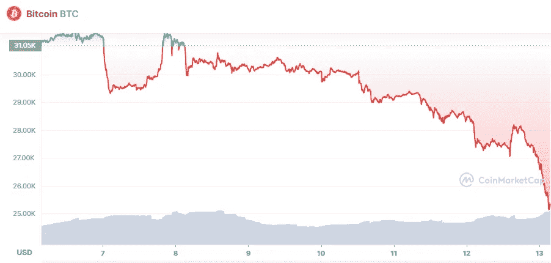

# 今天，6 月 13 日，最重要的加密货币的价格发生了什么？

> 原文：<https://medium.com/coinmonks/what-happened-today-13th-of-june-with-price-for-the-most-important-cryptocurrencies-b5c1b1e6cc9a?source=collection_archive---------32----------------------->

# 1.比特币(-8.47%)

Source photo [Bitcoin price today, BTC to USD live, marketcap and chart | CoinMarketCap](https://coinmarketcap.com/currencies/bitcoin/)

# 市值 4826 亿美元

比特币目前的价格为 25.57757 美元，24 小时交易量为 41.42 亿美元。在过去的 24 小时里，比特币的使用量下降了 8.47%。