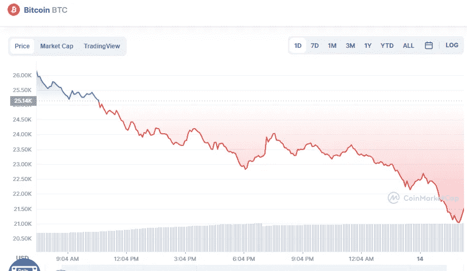

# 今天 6 月 14 日，最重要的加密货币的价格发生了什么？

> 原文：<https://medium.com/coinmonks/what-happened-today-14th-of-june-with-the-price-for-the-most-important-cryptocurrencies-6f47a08649ef?source=collection_archive---------23----------------------->

# 1.比特币(-15.58%)

Source photo [Bitcoin price today, BTC to USD live, marketcap and chart | CoinMarketCap](https://coinmarketcap.com/currencies/bitcoin/)

# 市值 4104 亿美元

比特币目前的价格为 21.61057 美元，24 小时交易量为 70.13 亿美元。在过去的 24 小时里，比特币的使用量下降了 15.58%。