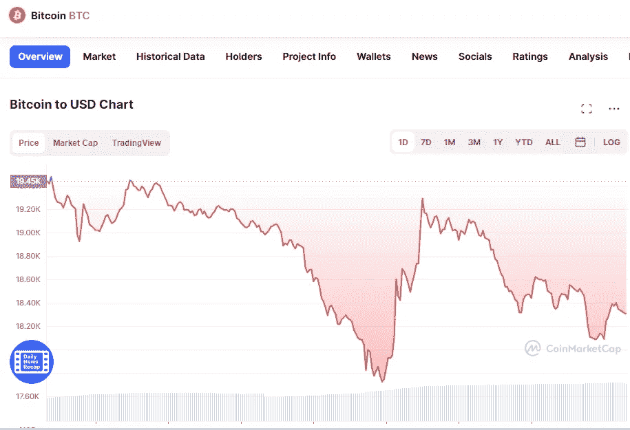

# 今天 6 月 19 日，最重要的加密货币的价格发生了什么？

> 原文：<https://medium.com/coinmonks/what-happened-today-19th-of-june-with-the-price-for-the-most-important-cryptocurrencies-aaec4f5e564f?source=collection_archive---------23----------------------->

# 1.比特币(-10.17%)

Source photo [Bitcoin price today, BTC to USD live, marketcap and chart | CoinMarketCap](https://coinmarketcap.com/currencies/bitcoin/)

# 市值 3494 亿美元

比特币目前的价格为 18.46355 美元，24 小时交易量为 45.46 亿美元。在过去的 24 小时里，比特币的使用量下降了 10.17%。