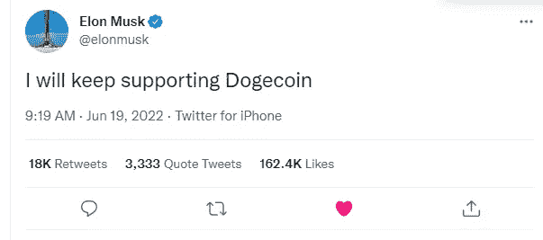

# 埃隆·马斯克发推特后，加密货币市场发生了什么

> 原文：<https://medium.com/coinmonks/what-happened-with-cryptocurrency-market-after-elon-musk-tweet-7a0b2b1c559e?source=collection_archive---------17----------------------->

Source photo [Elon Musk on Twitter: “I will keep supporting Dogecoin” / Twitter](https://twitter.com/elonmusk/status/1538406040374595585)

# 比特币(+1.35%)

# 市值 3709 亿美元

比特币目前的价格为 19.62555 美元，24 小时交易量为 447.9 亿美元。在过去的 24 小时里，比特币的使用量增加了 1.35%。