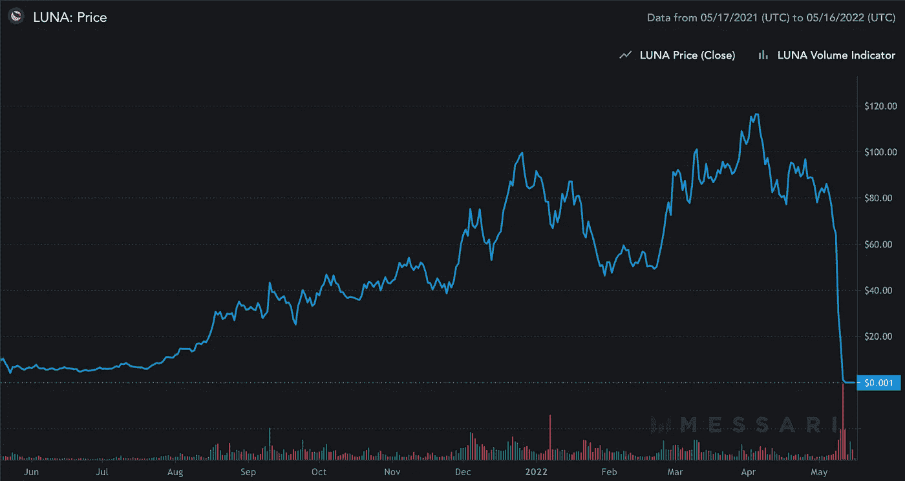

# Terra LUNA 崩溃发生了什么，这对稳定的硬币未来意味着什么

> 原文：<https://medium.com/coinmonks/what-happened-with-the-terra-luna-collapse-and-what-it-means-for-stable-coins-going-forwards-104c0e28ae44?source=collection_archive---------26----------------------->

作者:[克里斯托弗·h·卢，医学博士](http://www.drchrisloomdphd.com)

Photo courtesy of: [Messari.io](https://messari.io/asset/terra)

***注:*** *我的看法。不是投资建议。*

上周，由于包括股票和密码在内的资产遭到大规模抛售，价值超过 2000 亿美元的密码市值被抹去。