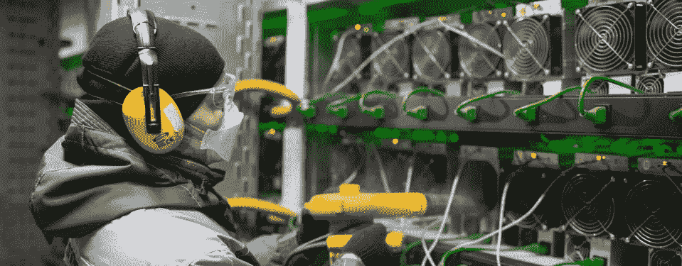
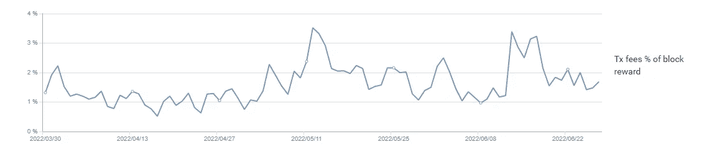

# 比特币全部用完，矿工会怎么样？

> 原文：<https://medium.com/coinmonks/what-happens-to-miners-when-all-the-bitcoins-run-out-88784a2c950c?source=collection_archive---------32----------------------->

比特币的安全性是由区块补贴推动的，这是矿工每成功开采一个区块所获得的报酬。矿工用这些收入支付各种业务费用，如电费、新专用集成电路和工资。他们的大部分收入通常用于电力，因此拥有廉价电力对保持竞争力至关重要。区块补贴越高，越多的矿工可以上线并盈利，从而提高比特币网络的安全性。然而，每隔四年，这个数量(在 BTC)就会减半，称为减半事件。目前，矿工的工资是每块 6.25 BTC。每十分钟只有一名矿工被选中开采一个区块，并获得 6.25 BTC 的奖励。

尽管大宗补贴下降，但由于 BTC 价格相应上涨，采矿业仍保持盈利。因此，如果 BTC 的价格为 1 万美元，每块 6.25 BTC，则块补贴为 62，500 美元。如果区块补贴减半至每块 3.125 BTC，比特币的价格必须翻倍至 2 万美元，区块补贴才能保持在每块 6.25 万美元。因此，为了让比特币在减半期间保持安全性，价格必须在同一时间段内翻倍。

**这对安全意味着什么:**
当矿工收入开始减少时，无利可图的矿工不得不关闭他们的钻机，降低了网络的总哈希功率，这也降低了网络的安全性。网络上的挖掘器和哈希函数越多，安全性就越高。因此，如果区块补贴太低，比特币的价格没有每四年翻一番，安全预算就会减少。

> 交易新手？试试[加密交易机器人](/coinmonks/crypto-trading-bot-c2ffce8acb2a)或者[复制交易](/coinmonks/top-10-crypto-copy-trading-platforms-for-beginners-d0c37c7d698c)

**但是交易费用呢！** 比特币将如何保持高安全性的合理化解释是，交易费用最终将盖过大宗补贴，从而无限期地确保安全预算。

Transaction fees as a percentage of block reward

区块奖励=区块补贴+交易费，目前交易费不到区块奖励的 2%。因此，如果整体补贴今天停止，比特币的安全性将下降近 98%。

那么，为了不影响安全性，费用应该是多少呢？按照今天的价格，6.25 BTC = 129550 美元。比特币网络平均每块约[2759.12 笔交易。为了匹配大宗补贴，每笔交易的费用必须在 50 美元左右。这将确保该链的当前加密经济安全性。不幸的是，我们不能保证费用在将来会是一个确定的价格。此外，可能会有高收费期和低收费期，这种波动性将允许攻击者在安全性最弱的时候发动攻击。问题变成了，什么是适当的安全级别。因为如果我们使用我们的例子，但在 2020 年减半之前，当整体补贴为 12.5 BTC 时，那么在这种情况下，交易费用将必须为每笔交易约 100 美元，以匹配该安全水平。在此之前减半，每笔交易约 200 美元等。从另一个角度来看，如果 BTC 的价格目前是 60，000 美元，而大宗补贴的美元价值是(6.25 * 60，000 = 375，000 美元)，那么在没有大宗补贴的情况下，要达到同样的安全水平，每笔交易将需要大约 150 美元。](https://towardsdatascience.com/the-blockchain-scalability-problem-the-race-for-visa-like-transaction-speed-5cce48f9d44#:~:text=The%20current%20Bitcoin%20block%20generation,only%204.6%20transactions%20per%20second.)

即使比特币的交易费用最终非常高，而大宗补贴接近于 0，但以太坊利用 ZK-累计+乐观-累计+ EIP1559 + PoS，它有一个更好的长期安全模型。

**EIP-1559** 随着 EIP-1559 的引入，以太坊上的大部分交易费用被烧掉(销毁)。这抵消了矿工的整体补贴，因此它允许整体补贴保持一致，不像比特币的整体补贴不断减少。在 2021 年末的一段时间里，被摧毁的以太坊多于被创造的以太坊，导致了通缩压力。随着 PoS 的引入，通货紧缩将几乎成为一种永久状态。

**利益证明**
当以太坊 PoS 链最终与当前的 PoW 链合并时，将会有更少的发行，因为不再需要向矿工支付高额的 ETH 来支付他们的电费。成为赌注者的成本将会很低，因此连锁店能够相应地支付赌注者。这几乎肯定会将以太坊推入净通缩。这为以太坊提供了与比特币 2100 万英镑相同的实力，但没有继承长期的安全问题。以太坊的安全预算仍然是一致的，无论宏观经济面临什么样的外部环境，它都会一直存在。

**ZK 汇总和乐观汇总**
这些汇总类型的创新允许用户以安全的方式进行离线交易(不像闪电网络)。例如，如果用户使用 ZK 汇总并向汇总提交许多交易，然后汇总的定序器离线，用户仍然可以通过以太坊 L1 从汇总中提取他们的资金。这允许更高的交易吞吐量，从而降低费用。

比特币的长期安全模式肯定有缺陷，但可能是可控的。也许在未来，人们和机构可以接受支付高额的外链费用。但这无疑限制了人们可以用比特币做什么，以及他们使用的服务可能需要多少监管。然而，以太坊的长期安全模式可能是所有其他项目中最好的，因为它确保了高度的长期安全性，它创造了一个理想的储蓄通缩环境，并允许以太坊熙熙攘攘的创新生态系统中的巨大可用性。如果你感兴趣，你也可以[阅读](/coinmonks/is-proof-of-stake-really-like-the-current-fiat-system-a259e3bcc36d)关于以太坊的 PoS 如何优于 Bitcon 的 PoW(总体而言)。

> 加入 Coinmonks [电报频道](https://t.me/coincodecap)和 [Youtube 频道](https://www.youtube.com/c/coinmonks/videos)了解加密交易和投资

# 另外，阅读

*   [投资印度的最佳密码](https://coincodecap.com/best-crypto-to-invest-in-india-in-2021)|[WazirX P2P](https://coincodecap.com/wazirx-p2p)|[Hi Dollar Review](https://coincodecap.com/hi-dollar-review)
*   [加拿大最佳加密交易机器人](https://coincodecap.com/5-best-crypto-trading-bots-in-canada) | [库币评论](https://coincodecap.com/kucoin-review)
*   [火币的加密交易信号](https://coincodecap.com/huobi-crypto-trading-signals) | [HitBTC 审查](/coinmonks/hitbtc-review-c5143c5d53c2)
*   [TraderWagon 回顾](https://coincodecap.com/traderwagon-review) | [北海巨妖 vs 双子座 vs BitYard](https://coincodecap.com/kraken-vs-gemini-vs-bityard)
*   [如何在 FTX 交易所交易期货](https://coincodecap.com/ftx-futures-trading)