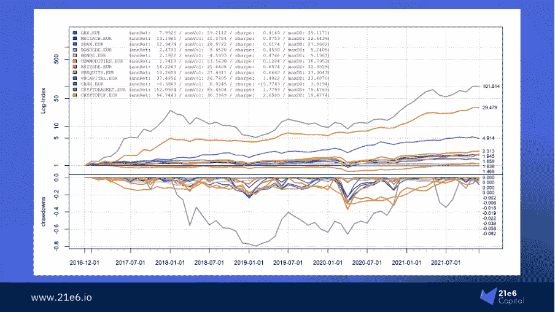
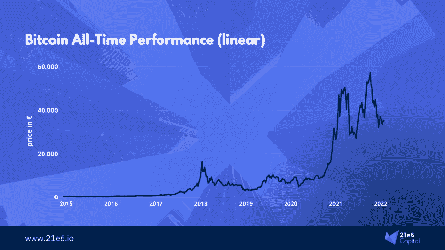
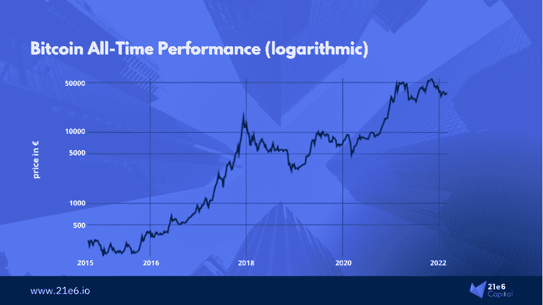
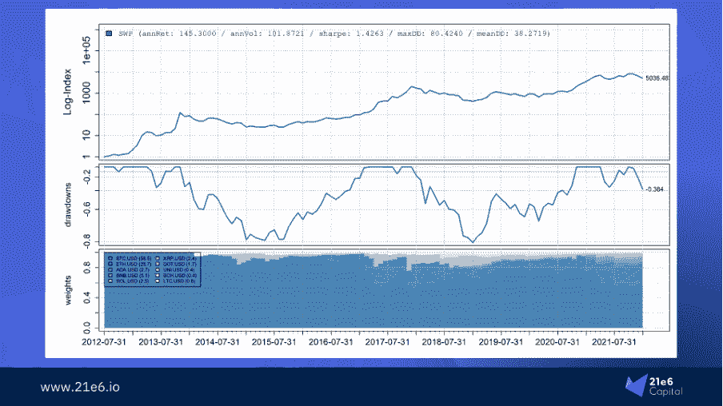
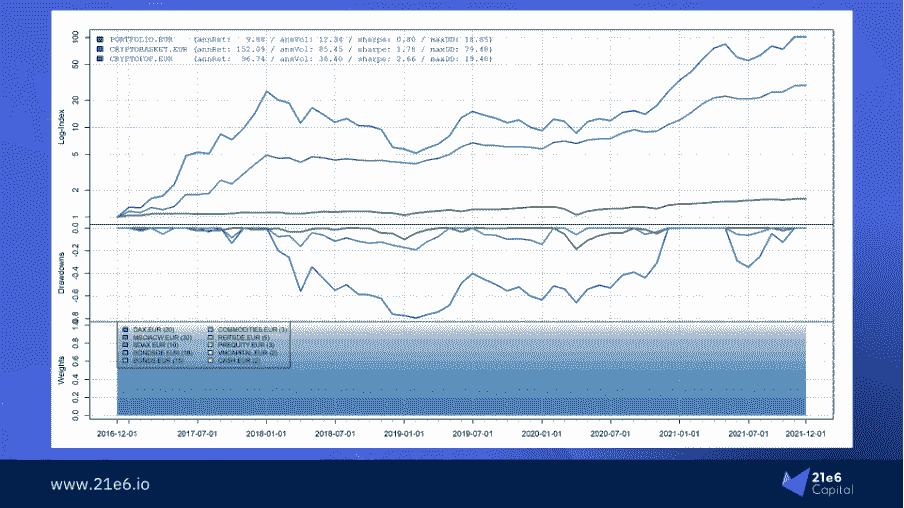
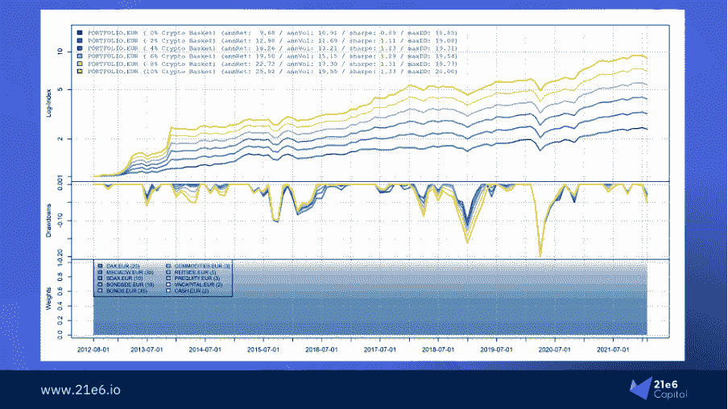
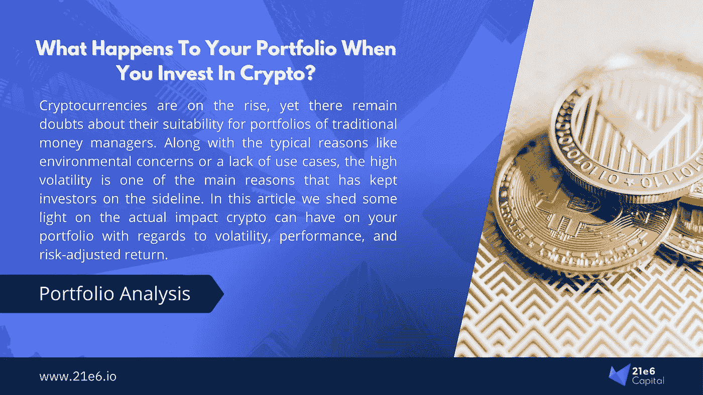

# 当你投资 Crypto 时，你的投资组合会发生什么变化？

> 原文：<https://medium.com/coinmonks/what-happens-to-your-portfolio-when-you-invest-in-crypto-26415004e55?source=collection_archive---------47----------------------->

对加密作为一种新的资产类别的兴趣正在增长，甚至(或者我应该说特别是)在专业和机构投资者中。世界范围内的投资会议再也不能在他们的主题演讲中忽略密码了；如果没有至少一个来自密码领域的赞助商，你很难找到这样一个会议。资产管理公司和家族理财室都在考虑将加密纳入其投资组合，通常他们的客户已经开始要求这样做。事实上，EY 的一项研究发现，超过五分之一的机构投资者和四分之一的传统对冲基金正计划进一步增加对加密资产的敞口。预计这里的资本流入将是巨大的。然而，许多首次加密投资者不确定加密分配对其投资组合的影响。21e6 Capital 是一家瑞士加密投资顾问公司，该公司重现了一个欧洲家族理财室的典型投资组合配置，并分析了不同级别的加密风险对这种投资组合的表现有何影响。
*作者:马克西米利安·布鲁克纳*

# 模拟德国家族理财室的典型投资组合

我们分析的第一步是构建一个投资于股票、债券和一些替代产品的参考投资组合。我们将关注典型的德国或瑞士投资组合，因为这是我们目前最活跃的地区。基本上，这里的资产管理公司通常会将投资组合分为大约 60%的股票和 30%的债券。剩下的 10%分布在房地产、商品、风险资本和私募股权中。为了模拟这种投资组合的标准表现，我们使用指数来代表提到的各种资产类别。图 1 概述了所使用的不同资产和指数，以及它们在过去几年中的表现。

*Figure 1: Creating a reference portfolio to use for our analysis*

在此图中，我们将参考产品组合的不同组成部分进行了拆分。实际投资组合中的分配如下:

● 20% DAX(德国股票指数)
● 30% MSCI ACWI(全球股票)
● 10% SDAX(德国小盘股指数)
● 10% BONDSDE(德国债券)
● 15% BONDS(全球债券)
● 3%大宗商品
● 5% REITSDE(德国房地产)
● 3% PREQUITY(私募股权基金)
● 2% VNCAPITAL(风险投资基金)

图 1 还包括一个 cryptobasket 和 crypto fund 概念，我们将在后面介绍。目前，这应该足以对专业投资者构建的典型投资组合的表现进行建模。

# 分析密码时，线性标度是没有用的

细心的读者可能已经注意到我们在这个图中使用了对数标度，并会问自己为什么。实际上，本文中的所有其他数字也将使用对数标度。对数标度确保指数的变动总是具有相同的相对幅度，而不管它发生的时间。例如:**如果指数在很长一段时间内从 1 增长到 1200，那么在线性标度上，指数开始时 10%的移动(例如，从 10 到 11)将远小于指数结束时 10%的移动(例如，从 1000 到 1100)。然而相对来说，这个运动是一样的。**因此，对数刻度确保两种机芯在插图中的视觉尺寸相同。

*Figure 2a: Bitcoin on a linear scale. Note how it seems as if volatility is increasing as we move toward the right side of the graph.*

特别是在分析加密货币时，由于这个确切的原因，线性标度没有什么意义。当在线性尺度上看待比特币时，似乎比特币现在比六年前更不稳定。然而，事实并非如此，对数刻度很好地显示了这一点。波动性和提款保持相当一致。图 2a 显示了线性标度的比特币，而图 2b 应用了对数标度。这里，所描述的问题被非常清楚地说明了。非常受欢迎的[比特币股票流向模型](https://stats.buybitcoinworldwide.com/stock-to-flow/)也正是因为这个原因使用了对数标度。

*Figure 2b: Bitcoin on a logarithmic scale. A much clearer, more consistent picture.*

# 创建一个原始的密码篮添加到投资组合中

接下来，为了模拟加密混合对我们的参考投资组合的影响，我们通过任意选择十种加密货币来创建一个“加密篮子”。我们的密码篮子中不同货币的权重严格按照市值确定。所以比特币和以太坊是最大的两个仓位。它们合起来约占冷冻篮的 84%。此外，有立场，在币安硬币，卡尔达诺，索拉纳，以及波尔卡多特，以涵盖最大的替代硬币。对于分散融资，我们增加了 Uniswap。排在最后的是除了比特币和以太之外的“原始”加密货币，即 Ripple、莱特币和比特币现金。权重的详细说明可以在图 3 下三分之一的瀑布图中看到。

**这个加密篮子的目标是代表一个长期投资不同加密货币的典型加密投资组合。因此，我们的相当简单组成的密码篮产生的性能可以被描述为非常典型的密码。**回报非常可观。然而，波动性和提款率分别为 101%和 80%，远远超过大多数专业投资者的痛苦阈值。

*Figure 3: Returns and drawdowns of our cryptobasket. The waterfall diagram also shows the allocation in the basket.*

在我们将这种密码篮子的各种混合物纳入我们之前建立的投资组合之前，让我们首先直接比较性能。为此，图 4 给出了一个很好的概述。蓝线代表密码篮，如图 3 所示。绿线反映了参考投资组合，回报在 2016 年以来的预期范围内，夏普比率为 0.80 也是正常的。由于 drawdowns 是阻碍专业加密投资的主要障碍之一，我们应该在这里详细了解一下。2018 年至 2020 年是我们参考投资组合的稳定期，但加密篮子在此期间出现了大规模的提款。在密码圈内，这段时间被称为“密码冬天”。2018 年是一件特别血腥的事情，比特币损失了大约 70%。

*Figure 4: Comparing our reference portfolio with the naive cryptobasket, as well as a more sophisticated crypto fund concept.*

您可能已经注意到，图 4 包括另一条紫色线。这代表了一种加密基金的概念，它使用战略资产配置和机构风险管理，旨在实现类似股权的提款，并在很大程度上保持类似加密的回报。虽然 2018 年对这一概念来说也不会是一个好的年份，但实际上提取的金额与我们参考投资组合的金额在同一范围内。具体来说，自 2016 年以来，参考投资组合的最大提取率为 18.9%，而加密篮子为 79.5%。最高提现 19.5%，基金概念仅略高于参考组合。这类工具表明:在不完全暴露于臭名昭著的波动性的情况下投资加密是可能的，我们预计未来几年将出现更多这种高度复杂的方法。

# 低密码暴露对夏普比率有正面影响

现在，我们终于可以进入实质了:当我们开始添加加密暴露时，我们的参考投资组合的性能会发生什么变化？当我们逐渐增加风险敞口时，投资组合的风险回报状况会发生怎样的变化？我们从分配 2%到我们的密码篮开始。我们通过将现有头寸重新分配到我们的密码篮子中来实现这一点，因此各种传统资产的权重不会改变。保持投资组合和以前一样平衡是很重要的，这样结果才是真实世界的准确表现。**在 2%的较小加密分配下，我们已经观察到夏普比率(即风险调整回报的衡量标准)从 0.89 显著提高到 1.11。**这意味着回报的增加超过了投资组合的额外波动和提取。

如果我们将加密分配增加到 4%，夏普比率将进一步提高，但幅度较小，达到 1.23。从图 5 中，我们还可以观察到，随着加密暴露的增加，夏普比率的改善变得越来越小，因为加密篮子的波动性慢慢接管。因此，最大提取量也会增加。在我们的密码篮子中增加 6%的风险敞口将导致提款增加，这对许多专业和机构投资者来说是没有吸引力的。

*Figure 5: Adding crypto to our reference portfolio.*

**值得注意的是，特别是在风险敞口较低的情况下，投资组合的波动性和最大提款几乎没有变化——每个都不到 100 个基点，尽管有时非常不稳定的时期(秘密冬天)也包括在观察的时间段内。回报增加了 3%。从纯粹理性的、以投资组合优化为导向的角度来看，投资者几乎没有理由不在他们的投资组合中增加少量的加密配置。**人们还应该考虑到我们的密码篮子反映了一种相当幼稚的策略——然而，这种原始的密码篮子对投资组合有积极的影响。与此同时，还有更复杂的产品，如前面提到的基金概念，可以进一步减少波动和提款。

通过仔细观察图 5 的下半部分，可以得出另一个有趣的观察结果，图 5 只显示了下降。在某些时期，更多的加密暴露会导致比零加密投资组合更大的提款(例如，在 2018 年底)。但在最近的历史上，几乎没有任何情况下，只有加密沉重的投资组合经历了绞拧机。事实上，在 2020 年，有些情况下，增加 10%的加密风险敞口会导致比正常参考投资组合更低的波动性。

# 没有理由不投资于加密

是的，关于加密可能会有一场根本性的争论。通常，唱反调的人会大喊庞氏骗局和能源消耗。但是随着越来越多的采用，以及世界上最大的金融机构开始提供加密资产产品，市场上有一个共识，即加密将继续存在。此外，法兰克福学派区块链中心最近的一项研究表明，计算比特币投资的碳足迹非常简单，因此可以抵消所述足迹。你可以在这里找到它。无论如何，有大量的文献和材料在基础层面上讨论加密货币。在这篇简短的文章中，我们只是想表明，向您的投资组合中添加多样化的加密风险，即使数量很少，也会产生积极的影响，这会让您喜笑颜开。回报率增加了 3%左右，波动性和提款几乎没有变化 1%。应该再次注意的是，对于这个分析，我们使用了一个非常简单的密码篮；更复杂的工具是可用的。加密基金可以为投资加密资产提供一个很好的切入点，其中许多基金的表现一直优于比特币。还有几个有趣的市场中立的加密基金从事套利和做市。人们说“金融领域没有免费的午餐”，但这确实是一顿。

# 大约 21e6

21e6 Capital 是一家瑞士投资顾问公司，为专业投资者提供最佳加密投资产品。21e6 Capital 已经分析了全球 1000 多只加密基金，并将其浓缩为一个精选，可以在最大限度降低下行风险的情况下产生加密风险。21e6 Capital 拥有一支经验丰富的加密和金融专家团队，他们在数字资产和 DLT 方面有着深入的知识，在此团队的支持下，21e 6 Capital 创建了一个独特的量化策略，旨在实现类似加密的回报，同时将全球股票水平的风险和波动性降至最低。21e6 资本团队建立在强大的学术基础之上，拥有领先的加密资产和分散金融出版物和研究的记录，确保为金融行业专业人士提供最先进的加密投资解决方案。

# 作者

马克西米利安·布鲁克纳是 21e6 资本公司的市场销售主管。在此之前，他曾担任国际令牌标准化协会(ITSA)的执行董事，主要负责根据国际令牌分类(ITC)框架对加密资产进行研究和分类。他积极参与创建了世界上最大的令牌数据库，用于令牌的分类和识别数据(TOKENBASE)。马克西米利安毕业于法兰克福金融和管理学院，并在与菲利普·桑德纳教授的密切磋商下进行学术研究。您可以通过电子邮件联系 Maximilian。bruck ner @ 21e 6 . io，索取关于 21e6 Capital AG 的更多信息或询问有关本文的任何问题。你也可以在 LinkedIn 上关注 T2，了解他的最新动态。

*本文是一份信息性文件，不构成投资建议、投资建议、法律、税务或会计建议，也不构成出售或购买任何证券的要约，因此不得依赖于任何证券要约或出售。本信中表达的观点是 21e6 Capital 员工的主观观点，基于据信可靠的信息。任何意见表达(如有变更，恕不另行通知)均属作者个人所有，作者不保证所提供的任何信息或分析的准确性或完整性*。

> *加入 Coinmonks* [*电报频道*](https://t.me/coincodecap) *和* [*Youtube 频道*](https://www.youtube.com/c/coinmonks/videos) *了解加密交易和投资*

# 另外，阅读

*   [Bookmap 点评](https://coincodecap.com/bookmap-review-2021-best-trading-software) | [美国 5 大最佳加密交易所](https://coincodecap.com/crypto-exchange-usa)
*   最佳加密[硬件钱包](/coinmonks/hardware-wallets-dfa1211730c6) | [Bitbns 评论](/coinmonks/bitbns-review-38256a07e161)
*   [新加坡十大最佳加密交易所](https://coincodecap.com/crypto-exchange-in-singapore) | [购买 AXS](https://coincodecap.com/buy-axs-token)
*   [红狗赌场评论](https://coincodecap.com/red-dog-casino-review) | [Swyftx 评论](https://coincodecap.com/swyftx-review) | [造币厂评论](https://coincodecap.com/coingate-review)
*   [投资印度的最佳密码](https://coincodecap.com/best-crypto-to-invest-in-india-in-2021)|[WazirX P2P](https://coincodecap.com/wazirx-p2p)|[Hi Dollar Review](https://coincodecap.com/hi-dollar-review)