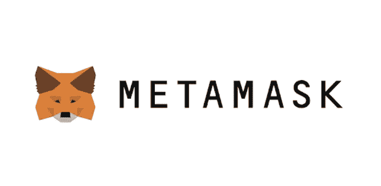
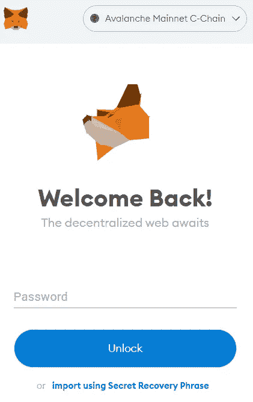
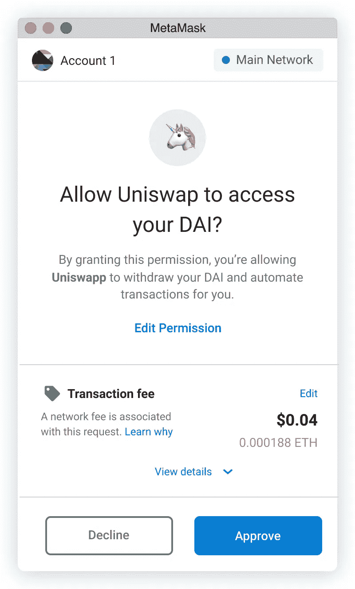
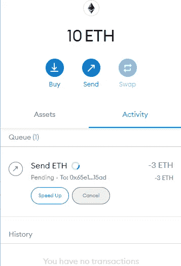
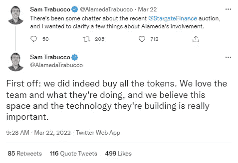
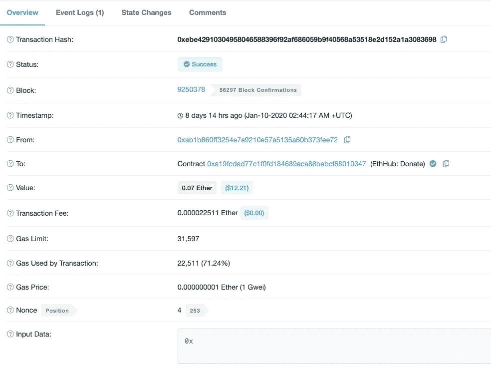

# 在 Metamask 上做交易会发生什么？对于非技术人员来说

> 原文：<https://medium.com/coinmonks/what-happens-when-you-make-a-transaction-on-metamask-for-non-technical-folks-f20e901f5371?source=collection_archive---------10----------------------->

Stay safe out there

当你点击 Metamask 钱包中的一个按钮时，幕后实际发生了什么？这似乎是一个常见的问题，但没有真正的答案，导致骗局发生。

> 注意:无论你在 Metamask 上做什么，千万不要把你的私钥透露给任何人，尤其是当他们声称他们支持 Metamask 的时候。有很多像这样的骗局正在发生！

# TLDR

1.  该事务在以太网(或另一个区块链网络)上广播，它几乎立即作为未决事务对其他节点可用，并被添加到公共队列中，但不被确认。
2.  在确认冻结之前，未决事务的顺序尚未决定。矿工按每份天然气的支付金额对交易进行分类(必须执行的计算单元功能)。
3.  当某个挖掘者发现一个块确认散列(从而确认该块中的所有事务)时(这往往每 20 秒发生一次)，事务被确认。

# 步骤 1:登录元掩码并执行任何事务

When you log in to your metamask, you are just merely giving access to the wallet. However, hackers will still be able to bypass this password and still hack into your wallet if you leave your private keys around. So never leave your private keys anywhere.

当您在 Metamask 上进行交易时，这可能是向另一个 wallet 发送令牌、批准交易等，所发生的是一个**交易**被发送到一个交易池，由节点进行验证。

> 什么是节点？它是一台连接到区块链网络的**计算机**，负责维护区块链并验证交易是否有效，然后将交易转发到区块链的其他计算机(节点)

An example of a transcation

如上所述，这是一种交易形式，尽管它是一个“批准”按钮。

# 步骤 2:待定事务的排序

Pending transcations

在事务被接受之前，即当您看到您的事务在元掩码中仍处于待定状态时，事务正在等待矿工接受该块。该事务进入一个未决事务池，也称为“[内存池](https://academy.binance.com/en/glossary/mempool)”。

在确认冻结之前，未决事务的顺序尚未决定。矿工按每份天然气的支付金额对交易进行分类(必须执行的计算单元功能)。

这可能导致这样的情况，即使一个交易被较早发送，它也可能比另一个交易晚被确认，因为支付了较少的汽油费。

这也解释了机器人如何能够抢先运行一些薄荷或释放，就像在 [Stargate](https://stargate.finance/) 拍卖与 [Alameda research](https://www.alameda-research.com/) 的情况下。

Tweet of front-run by management

> 先发制人:在内存池中通过不同的方式对事务进行重新排序，使得攻击者的事务可以先发制人，从而获得一些收益。

# 第三步:交易确认

当验证器发现一个块确认散列(从而确认该块中的所有事务)时(通常每 20 秒发生一次)，事务被确认。然后，此交易会广播到整个网络，这时您将在 Etherscan 上看到状态为“成功”。

基本上，挖掘器/验证器会验证您所做的交易，并且在区块链中正在“挖掘”或生成一个新的区块，您的交易就在该区块上。

对于这些人来说，当你点击 Metamask 上的一个按钮时会发生什么。

在外面注意安全，不要把你的私人钥匙放在网上或手机上。谢谢你的时间。

> 加入 Coinmonks [电报频道](https://t.me/coincodecap)和 [Youtube 频道](https://www.youtube.com/c/coinmonks/videos)了解加密交易和投资

# 另外，阅读

*   [如何购买 Monero](https://coincodecap.com/buy-monero) | [IDEX 评论](https://coincodecap.com/idex-review) | [BitKan 交易机器人](https://coincodecap.com/bitkan-trading-bot)
*   [CoinDCX 评论](/coinmonks/coindcx-review-8444db3621a2) | [加密保证金交易交易所](https://coincodecap.com/crypto-margin-trading-exchanges)
*   [红狗赌场评论](https://coincodecap.com/red-dog-casino-review) | [Swyftx 评论](https://coincodecap.com/swyftx-review) | [CoinGate 评论](https://coincodecap.com/coingate-review)
*   [Bookmap 点评](https://coincodecap.com/bookmap-review-2021-best-trading-software) | [美国 5 大最佳加密交易所](https://coincodecap.com/crypto-exchange-usa)
*   [如何在 FTX 交易所交易期货](https://coincodecap.com/ftx-futures-trading) | [OKEx vs 币安](https://coincodecap.com/okex-vs-binance)