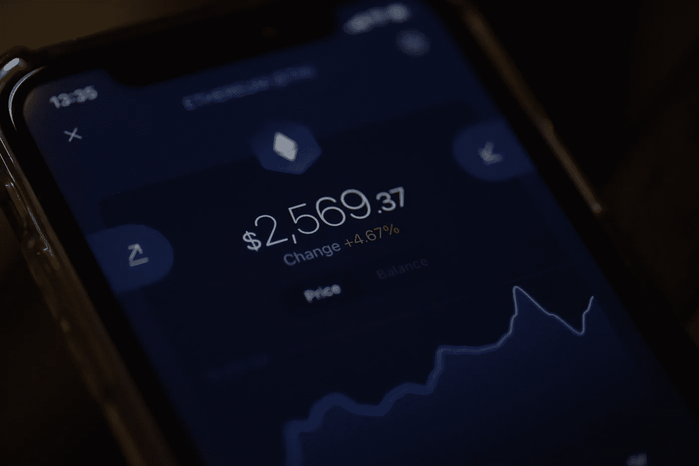

# 当你开始投资加密时会发生什么？

> 原文：<https://medium.com/coinmonks/what-happens-when-you-start-investing-in-crypto-cb2f87d7f9ba?source=collection_archive---------31----------------------->

成功的关键因素

Photo by [Brian Tromp](https://unsplash.com/@84media?utm_source=unsplash&utm_medium=referral&utm_content=creditCopyText) on [Unsplash](https://unsplash.com/s/photos/beginner-crypto?utm_source=unsplash&utm_medium=referral&utm_content=creditCopyText)

在我们说话的时候，加密货币市场的吸引力正在增加，所以难怪越来越多的人开始了解它。无论我们走到哪里，都能听到**【crypto】**的声音，在 2021 年的牛市中，我甚至不能打开车里的收音机，而不听到关于某些硬币的故事。