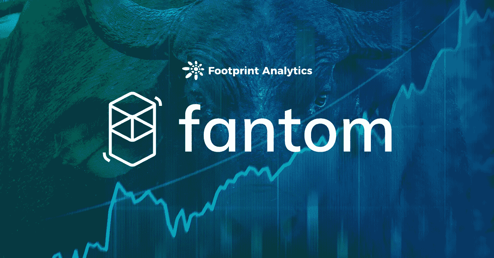
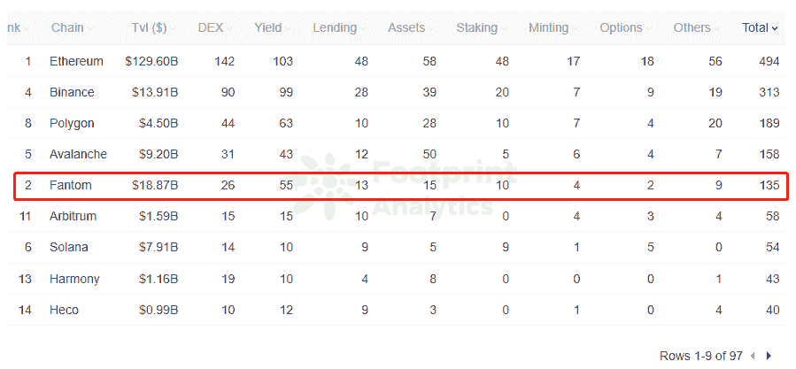
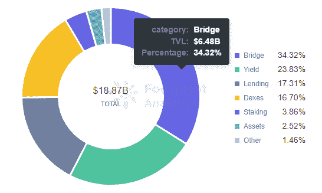
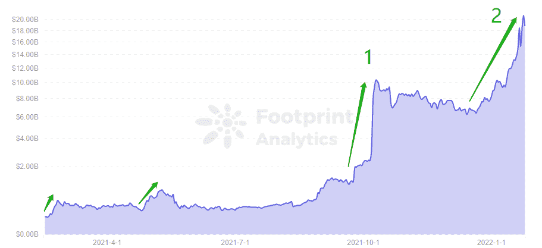
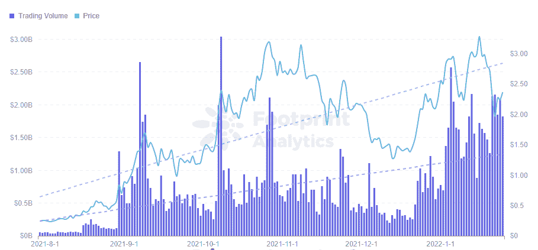

# 是什么导致了 Fantom 的起起落落？|足迹分析

> 原文：<https://medium.com/coinmonks/what-has-caused-fantoms-up-and-down-footprint-analytics-341d4084ea18?source=collection_archive---------13----------------------->

描述:Fantom 现在排名第二，还能继续增长吗？

2022 年 1 月，Grace@footprint.network

数据来源:足迹分析 [Fantom 仪表盘](https://www.footprint.network/guest/dashboard/fantom-dashboard-fp-b07e41f7-a3ab-4f64-a7f8-3e1b3587632d?channel=u-DnmMUY#secret=344B78AD73FE8B02A87BEF46A18CD643)

自 2022 年初以来，[比特币](https://www.footprint.network/guest/dashboard/liquidation-dashboard-btc-fp-6f6d6f35-6173-479b-85d6-7b998c3ed06e?date_filter=past30days&channel=u-DBc983#secret=DC7146918FE4D654D3135A5A5F08D63F)已经从 68000 美元跌至 34000 美元，几乎拖垮了整个加密市场。然而，Fantom 是一个例外，它继续增长其 TVL，并超过了币安智能链和 [Terra](https://www.footprint.network/guest/dashboard/terra-dashboard-fp-93068a5f-8263-4538-9471-216c65d27ea5?date_filter=past30days&channel=u-DBc983#secret=2A850FDE1103F24E5A14A87453D572F5) 。

以下是导致 Fantom 急剧上升的原因以及可能导致其下降的问题。

# Fantom 简介

## 概念

Fantom 是一个快速、高通量、易于扩展的第 1 层 [EVM](https://cryptoslate.com/will-a-non-evm-overtake-compatible-chains-in-2022/) 兼容公共链，于 2019 年 12 月推出。它是巨蝮属支持的第一个公共链，这是一个基于 DAG(有向无环图)的 aBFT(异步拜占庭容错)一致性算法。它最显著的特点是:

*   **交易成本低。**1000 万笔交易只需 1 美元左右的交易费。
*   **快速交易。**1-2 秒确认交易。
*   **高吞吐量。**每秒钟可以同时处理上万笔交易。

## 生态系统

Fantom 已经部署了 135 个协议，涵盖了 DEX、yield、lending、assets、staking、minting 和 derivatives。就协议而言，它是第五大公共链，仅次于 Polygon 和 Avalanche。

[*Footprint Analytics — Platforms Per Category by Chains*](https://www.footprint.network/guest/chart/platforms-per-category-by-chains-gg-fp-e9b25e7e-6608-489a-bff6-b243a58c7ce4?channel=u-DnmMUY#secret=B0062B2169FA8DED4B4EB67219699583)

然而，Fantom 的 TVL 比 Polygon 或 Avalanche 大得多，表明这是一个非常有前途的生态系统，有很大的发展空间。

今年 8 月，Fantom 宣布将投资 3.7 亿芬兰马克，以刺激连锁店的发展。

## 融资

Fantom 已经完成了五轮战略融资，并获得了包括 Alameda Research 在内的顶级风投的超过 1 亿美元投资。

## TVL

Fantom 的 TVL 已达到 188.7 亿，超过 Terra 和币安，成为第二大公共连锁店。对 TVL 贡献最大的是桥梁项目，占 34.32%，其次是收益项目，占 23.83%。在具体协议方面，Multichain(以前的 AnySwap)遥遥领先。

[*Footprint Analytics — TVL Category Share of Fantom*](https://www.footprint.network/guest/chart/tvl-category-share-of-fantom-fp-4de81fce-a341-4081-a859-92d936652e3b?channel=u-DnmMUY#secret=56C1B68D003C9B37640A0912646BEF60)

TVL 的积累有两个主要的快速增长期。

*   第一阶段:9 月 21 日至 10 月 11 日:增长 856.5%，达到 102.4 亿美元，超过 Tron、Avalanche 和 Terra，成为排名第四的公共连锁店，仅次于以太坊、BSC 和 Solana。

**快速增长的原因:** AnySwap 和艾斯特金融是帮助 Fantom 爆发的主要原因。随着公共链的竞争，桥梁需求的增加，AnyAwap 为 Fantom 贡献了 43%的 TVL。艾斯特金融公司的入股吸引了大量资本，持有 APY 14，580%的股份，为 Fantom 锁定了 TVL 34%的股份。

此外，Andre Cronje 宣布将向往金融迁移到 Fantom，给了玩家进入 Fantom 的 DeFi 项目的信心。

*   **第二阶段:**1 月 1 日至今。上涨 224%至 208.3 亿美元，超越 Terra 和 BSC 成为第二大公共连锁，仅次于以太坊。

**快速成长的原因:**这个阶段的主要原因是 Cronje 影响力的帮助。

1 月 1 日，Andre Cronje(渴望金融的创始人)宣布，他将在 Fantom 上发布一个新的协议，然后将其令牌空投到链上的前 20 个 TVL DeFi 协议。各大 DeFi 协议开始疯狂积累锁定的 TVL，尤其是 0xDAO，利用吸血鬼攻击锁定 TVL **。**最终，Fantom TVL 飙升，超过 Terra 成为第二大公共连锁店。

[*Footprint Analytics — TVL of Fantom*](https://www.footprint.network/guest/chart/tvl-of-fantom-fp-34164990-4761-4298-87cc-3aadd14bb75a?channel=u-DnmMUY#secret=50FC68AFFB586B4281285822A2422971)

## 投资潜力

Fantom 的 token 以 0.02 美元发行，高价 3.28 美元，投资回报率 16300%。目前的价格和市值没有其他公共链的令牌高，例如 Terra (LUNA)和 Solana (SOL)。

[*Footprint Analytics — Trading Volume & Price of FTM*](https://www.footprint.network/guest/chart/trading-volume-price-of-ftm-fp-62dc83e8-0adb-42dc-9b63-93542e14419c?channel=u-DnmMUY#secret=D78659D23A360ECAC14D8ED8D317C085)

然而，Fantom 的快速增长在 1 月 25 日空投结束时出现了转折点。为什么？

# 关于方顿当前问题的几点思考

## 过度依赖名人的影响力

Fantom 在过去几个月里经历了令人难以置信的增长。然而，它几乎完全是由 Cronje 的支持推动的。这使得他很容易受到攻击，以防事情对他不利。

## 缺乏生态系统吸引力

再者，虽然其性能不错，但 Fantom 上的新项目并不多。任何项目生态系统都需要源源不断的新项目来保持增长。

## 更少的验证器节点

Solana 有 1000 个验证器节点，Terra 有 100 个。Fantom 只有 50 家，在 Top 成熟的公共连锁店中相对较少。这导致了 Fantom 相对较低的全球性、无领导性和不可信任性。这意味着权力下放不足以吸引 DeFi 协议，这影响到 TVL。这就是 Fantom 需要添加验证器节点的原因。

总之，Fantom 要想坐上公链第二甚至第一的位置，以上问题都需要很好的解决。

**什么是足迹分析**

足迹分析是一个一体化的分析平台，用于可视化区块链数据和发现见解。它清理和整合链上数据，因此任何经验水平的用户都可以快速开始研究令牌，项目和协议。凭借一千多个仪表板模板和一个拖放界面，任何人都可以在几分钟内构建自己的定制图表。发掘区块链数据，利用足迹进行更明智的投资。

*足迹网址:*[*https://www . Footprint . network*](https://www.footprint.network/)

*不和:*[*https://discord.gg/3HYaR6USM7*](https://discord.gg/3HYaR6USM7)

*推特:*[*https://twitter.com/Footprint_DeFi*](https://twitter.com/Footprint_DeFi)

*电报:*[【https://t.me/joinchat/4-ocuURAr2thODFh】T21](https://t.me/joinchat/4-ocuURAr2thODFh)

*Youtube:*[*https://www.youtube.com/channel/UCKwZbKyuhWveetGhZcNtSTg*](https://www.youtube.com/channel/UCKwZbKyuhWveetGhZcNtSTg)

> 加入 Coinmonks [电报频道](https://t.me/coincodecap)和 [Youtube 频道](https://www.youtube.com/c/coinmonks/videos)了解加密交易和投资

## 也阅读

 [## 杠杆代币[多头代币]终极指南

### 杠杆化令牌是具有杠杆化风险敞口的 ERC20 令牌，不考虑保证金、要求、管理…

medium.com](/coinmonks/leveraged-token-3f5257808b22)  [## 最佳加密交易所| 2022 年十大加密货币交易所| CoinCodeCap

### 哪一个是最好的加密交换？在本文中，我们将根据多种加密货币列出 10 大加密货币交易所

coincodecap.com](https://coincodecap.com/crypto-exchange)  [## 2022 年 2 月值得关注的三大游戏代币| CoinCodeCap

### 排名前 3 位的游戏也占交易总量的 85%以上。Defi 王国、Axie Infinity 和 Pegaxy…

coincodecap.com](https://coincodecap.com/top-3-gaming-tokens-to-look-out-for-in-february-2022)  [## 2022 年最佳加密交换平台| CoinCodeCap

### 随着时间的推移，我们大多数人将转向 dex 以获得更好的安全性和隐私。因此。在这里，我们将讨论…

coincodecap.com](https://coincodecap.com/best-swap-platforms)  [## 10 大最佳在线赌场|赢得并赢取免费 BTC 2022 | CoinCodeCap

### 接收、支付和赚取加密货币| |有各种各样的最佳在线赌场可供选择，有可能…

coincodecap.com](https://coincodecap.com/best-online-casinos)  [## 2021 年最佳加密借贷平台| 6 大比特币借贷平台

### 获得比特币和其他加密货币的最佳贷款利率

medium.com](/coinmonks/top-5-crypto-lending-platforms-in-2020-that-you-need-to-know-a1b675cec3fa)  [## Pionex 评论 2021 |免费加密交易机器人和交换

### Pionex 是为交易自动化提供工具的后起之秀。Pionex 上提供了 9 个加密交易机器人…

medium.com](/coinmonks/pionex-review-exchange-with-crypto-trading-bot-1e459d0191ea)  [## 2022 年密码交易员的三大电报渠道

### 加密信号是来自专业交易者的交易想法，以特定的价格或价格买卖特定的加密货币

medium.com](/coinmonks/top-3-telegram-channels-for-crypto-traders-in-2021-8385f4411ff4)  [## 2022 年 5 个最佳免费加密投资组合追踪器

### 在这篇文章中，我们将带你通过一些最好的免费加密投资组合追踪器，让你选择最好的…

coincodecap.com](https://coincodecap.com/free-crypto-portfolio-trackers)