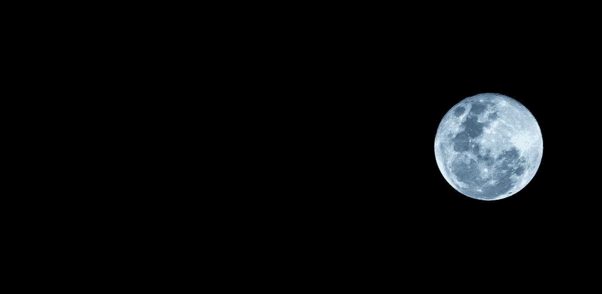

# 我从 Terra/Luna 坠机事件中学到的

> 原文：<https://medium.com/coinmonks/what-i-learned-from-the-terra-luna-crash-d73a3b63ee09?source=collection_archive---------26----------------------->

Photo by [Kevin Quezada](https://unsplash.com/@kevinqa?utm_source=medium&utm_medium=referral) on [Unsplash](https://unsplash.com?utm_source=medium&utm_medium=referral)

Terra/Luna 坠毁后我在 UST 损失了很多钱。但老实说，我很感激我的第一次重大损失发生在这么早的时候，这是一个非常宝贵的教训。

我认为我不是那种厌恶风险的人，我可以处理适度的大损失。总的来说，这确实是真的，因为我没有感觉到太多的感情投入。与 UST 脱钩后，我只觉得……很愚蠢。但是失去的是现在…