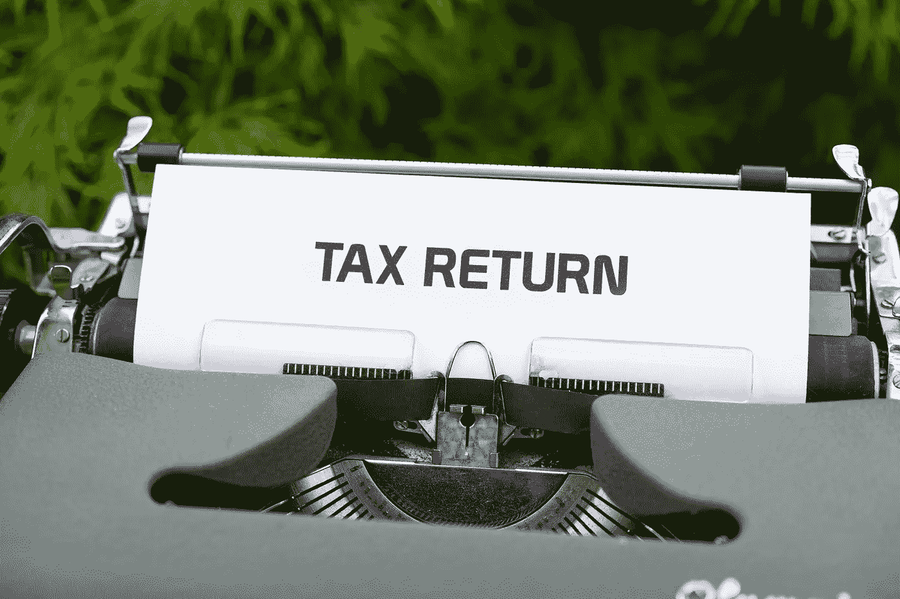

# 什么？我需要支付加密税吗？我如何跟上所有这些应税事件？！？！

> 原文：<https://medium.com/coinmonks/what-i-need-to-pay-taxes-on-crypto-how-can-i-keep-up-with-all-of-those-taxable-events-7cd5bf71cdc1?source=collection_archive---------9----------------------->

对对对。！！你需要交税，否则政府会来抓你，把你关进监狱，然后扔掉钥匙！—开个玩笑(我觉得)。但是说真的，当我第一次接触这个的时候，我的头几乎要爆炸了。以至于我开始把它放在一边，希望它会消失……我可以告诉你，没有！

一想到计算 10 万笔次美元交易的利润，我就做噩梦，在这些交易中，我用机器人以 5 倍的杠杆获得了 0.75%的利润。除此之外，我变得有点痴迷于产量农业，在币安智能链上购买早期启动硬币，创建 LP，分割 LP，下注，拆赌注以及所有其他与 Defi & Play-to-Earn 相关的事情。

我最近痴迷于物联网采矿，如 SCPrime、PlanetWatch、MXC、氦(我知道，我知道，我有点晚了！归咎于内布拉！)和一系列其他开始出现的项目(在接下来的几个月里，我将会发布关于这些项目的文章！).采矿收入在很多国家都是要纳税的，所以这也是我要考虑的因素。

我决定对税收情况做些什么，我看了看一些不同的工具，这些工具有望简化整个过程，但代价是什么呢？

我测试了 Koinly、CryptoTax 计算器、CoinTracker 和硬币跟踪

综上，硬币追踪为我赢了！(如果你在这里注册，你可以享受 10%的折扣)。为什么？

-它以合适的价格提供了我需要的一切。

-通过输入您的公共地址、使用 API 连接到您的交易所或 CSV 上传，它几乎涵盖了每一个交易所、钱包和区块链。

-当涉及到新发行的硬币及其价格时，它拥有非常优越的信息。

-搜索功能和批量编辑特定类型交易的能力减少了手动审查每笔交易所需的时间

-税务报告功能令人惊叹。它涵盖了每个国家和报告方法，您可以选择出口到第三方产品(TurboTax 等)。

-我不局限于拥有超过 100，000 笔交易的昂贵定制计划。

他们的计划范围从免费到无限，无限计划不会限制你的交易次数。如果你有比 Koinly 更多的交易，这种方法要便宜得多——koin ly 的顶层只包含 10，000 笔交易，每增加 1000 笔交易就要多花 10 美元！！这很快就会变得非常昂贵

缺点是什么？

首先，币安 API 不支持“将灰尘转化为 BNB”。这意味着你可以从币安获取年份数据，并以. csv 格式上传。网站上的所有说明会带你完成这个过程。

**免责声明** —尽管做好准备！在你输入灰尘之前。csv，它将预除尘量导入仪表板。这是雪上加霜，因为我意识到我在 BNB 用不到 20 美元换来的 20 AXS 现在价值 1200 美元！！

其次，界面不是很直观。它看起来不像其他的一些东西那么赏心悦目，但是如果你能克服它，真正理解这个平台提供的价值，那么这是一个非常小的缺点！

你可以注册所有这些提供商的免费计划或试用，以了解哪一个最适合你，我在下面提供了每个平台的链接。

1. [Cointracking.info](https://bit.ly/3tXXlLV) —使用此链接可享受九折优惠

2.[ko inly](https://bit.ly/39QSyW1)——使用此链接的任何计划优惠 20 美元

3. [CryptoTaxCalculator](https://cryptotaxcalculator.io/) —没有推荐，所以你没有奖金！

4.使用此链接的任何计划优惠 10 美元

我计划在未来几周内更深入地审查这些工具，我将为每个工具发布额外的媒体文章，但如果您对我审查的替代工具有任何建议，请留下评论，我会看一看。

**附属链接**

更多优惠还可以在这里找到:[https://linktr.ee/RealisticCrypto](https://linktr.ee/RealisticCrypto)

还有，如果你想请我喝杯咖啡或者啤酒:) :

BTC—BC 1 qaxaq 2 q 9 js 89 gyzhr 0202 sxt 6 hgchprqjga 5 px

基于 ETH、BNB、AVAX、SOL 和 FTM 的令牌—0 x3b 7b 843d 8125 Fe 7 EBA 541 e 1d 751 a4 a 73 f 0 cfad 4c

**免责声明**

这不是财务建议，我不是财务顾问或会计或税务专家。这是我对帮助过我的软件工具的体验，以及我使用它们的经历。

我在本指南中使用了推荐链接。使用这些工具有助于以后的文章，所以如果你觉得这篇文章有用，并且想看看我提到的工具，请使用它们。我还会叫出你在哪里打折——双赢对吧？

> 加入 Coinmonks [电报频道](https://t.me/coincodecap)和 [Youtube 频道](https://www.youtube.com/c/coinmonks/videos)了解加密交易和投资

# 另外，阅读

*   [AscendEx stating](https://coincodecap.com/ascendex-staking)|[Bot Ocean Review](https://coincodecap.com/bot-ocean-review)|[最佳比特币钱包](https://coincodecap.com/bitcoin-wallets-india)
*   [活壁审核](https://coincodecap.com/huobi-review) | [奥凯克斯融资融券交易](https://coincodecap.com/okex-margin-trading) | [期货交易](https://coincodecap.com/futures-trading)
*   [比特币基地 Staking](https://coincodecap.com/coinbase-staking)|[hot bit Review](/coinmonks/hotbit-review-cd5bec41dafb)|[ku coin Review](https://coincodecap.com/kucoin-review)
*   [7 种购买 Dogecoin 的最佳方式](https://coincodecap.com/ways-to-buy-dogecoin)|[zepay Review](https://coincodecap.com/zebpay-review)
*   [iTop VPN 审核](https://coincodecap.com/itop-vpn-review) | [曼陀罗交换审核](https://coincodecap.com/mandala-exchange-review)
*   [比特币基地 vs WazirX](https://coincodecap.com/coinbase-vs-wazirx)|[Bitrue Review](https://coincodecap.com/bitrue-review)|[Poloniex vs Bittrex](https://coincodecap.com/poloniex-vs-bittrex)
*   [美国最佳密码交易机器人](https://coincodecap.com/crypto-trading-bots-in-the-us) | [变化回顾](https://coincodecap.com/changelly-review)
*   [A-Ads 点评](https://coincodecap.com/a-ads-review) | [Bingbon 点评](https://coincodecap.com/bingbon-review) | [Mudrex Invest](https://coincodecap.com/mudrex-invest-review-the-best-way-to-invest-in-crypto)
*   [最好的卡达诺钱包](https://coincodecap.com/best-cardano-wallets) | [Bingbon 副本交易](https://coincodecap.com/bingbon-copy-trading)