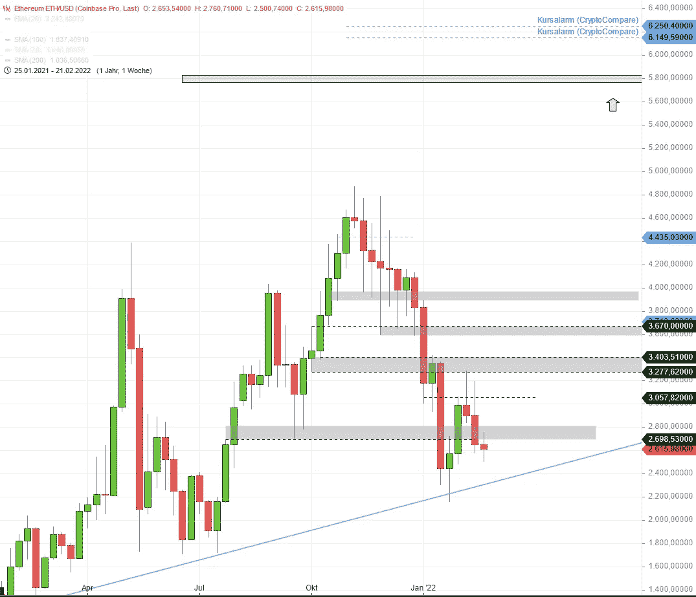

# 如果……以太坊开始了新的拉力赛呢？

> 原文：<https://medium.com/coinmonks/what-if-ethereum-started-a-new-rally-3eb39f644151?source=collection_archive---------49----------------------->

下一个价格目标是什么？

我们休息一下，开始思考如果以太坊向上反弹，开始新一轮的涨势，会发生什么？这次反弹会把我们带到什么水平？

# ETH/USD 的可能价格目标

我承认这是一个投机性的话题。目前，正如[今天以太坊](https://casual-klaus.medium.com/ethereum-big-picture-22-02-2022-d96511875864)的分析中所述，二级趋势指向下方，尚不清楚我们是继续处于调整中，还是开始进入非常悲观的区域。

但让我们想象一下，价格设法平静下来，新的买家进入市场，新的反弹开始了。第一个可能的价格目标是什么？

## 以太坊的第一个可能目标:5800 美元

Weekly chart: Possible price target for Ethereum

ETH/USD 的第一个可能目标可以通过查看以前的价格变动并预测其对未来时间框架的影响来确定。这实际上把我们带到了一个情况，从 2021 年 5 月的前一次 ATH，2021 年 11 月的最后一次 ATH 实际上是 Fibo 预测的 76.40%的水平。目前，价格遵循这一预测的水平，在 5800 附近留下 100%的目标。

## ETH/USD 的第二个可能目标:8300 美元

如果我们按照这个预测，第二个可能的目标(长期趋势)将是 8300 美元左右。要达到这一水平，价格必须突破以下中间目标:

*   6900 美元
*   7350 美元

像往常一样，我们看不到未来，也不能保证价格反弹后会达到这些水平。然而，市场参与者将价格推到相关的 Fibo 水平，然后相应地选择退出时机，这是很常见的。如果从长远来看，我们这里不会发生这种情况，那将是一个惊喜。缺少的是达到这些目标需要多长时间。我真的不知道。

*这不是财务顾问。自行承担风险。*

> 加入 Coinmonks [电报频道](https://t.me/coincodecap)和 [Youtube 频道](https://www.youtube.com/c/coinmonks/videos)了解加密交易和投资

# 另外，阅读

*   [本地比特币评论](/coinmonks/localbitcoins-review-6cc001c6ed56) | [加密货币储蓄账户](https://coincodecap.com/cryptocurrency-savings-accounts)
*   [什么是融资融券交易](https://coincodecap.com/margin-trading) | [成本平均法](https://coincodecap.com/dca)
*   [维护卡审核](https://coincodecap.com/uphold-card-review) | [信任钱包 vs MetaMask](https://coincodecap.com/trust-wallet-vs-metamask)
*   [Exness 点评](https://coincodecap.com/exness-review)|[moon xbt Vs bit get Vs Bingbon](https://coincodecap.com/bingbon-vs-bitget-vs-moonxbt)
*   [如何开始通过加密贷款赚取被动收入](https://coincodecap.com/passive-income-crypto-lending)
*   [BigONE 交易所评论](/coinmonks/bigone-exchange-review-64705d85a1d4) | [电网交易机器人](https://coincodecap.com/grid-trading)
*   [氹欞侊贸易评论](https://coincodecap.com/anny-trade-review) | [CoinSpot 评论](https://coincodecap.com/coinspot-review)
*   [新加坡十大最佳加密交易所](https://coincodecap.com/crypto-exchange-in-singapore) | [购买 AXS](https://coincodecap.com/buy-axs-token)