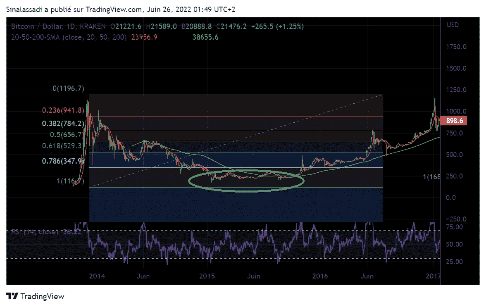
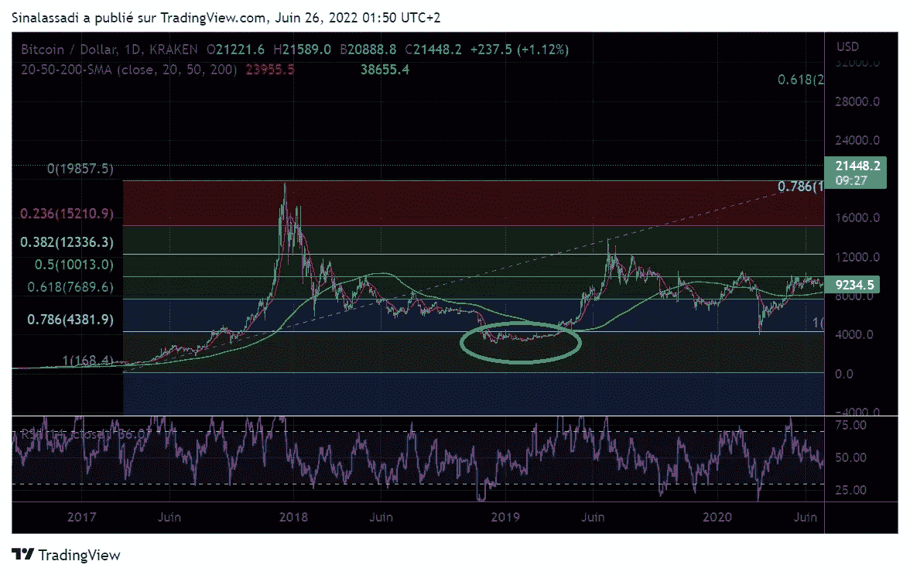
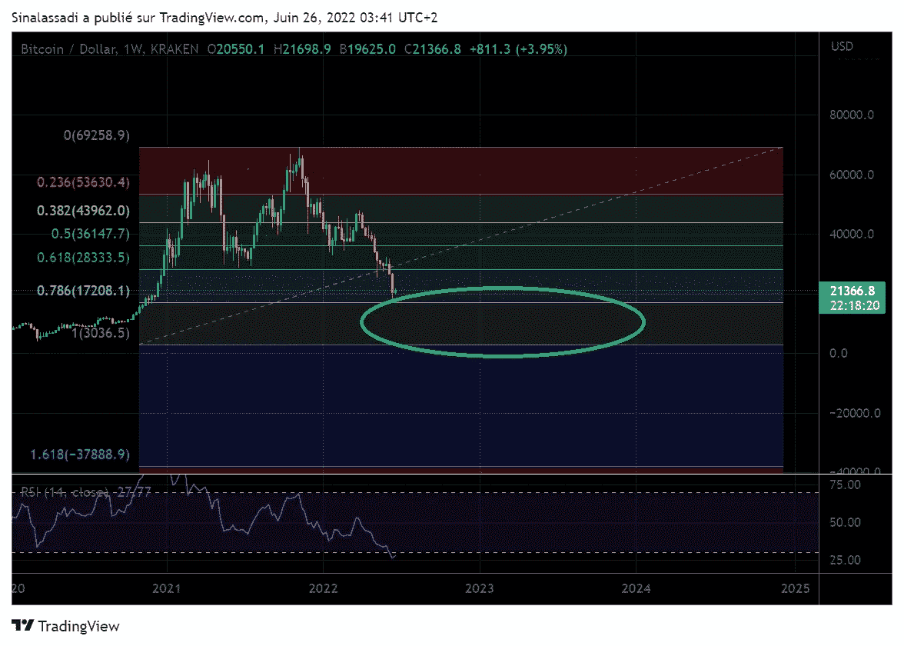
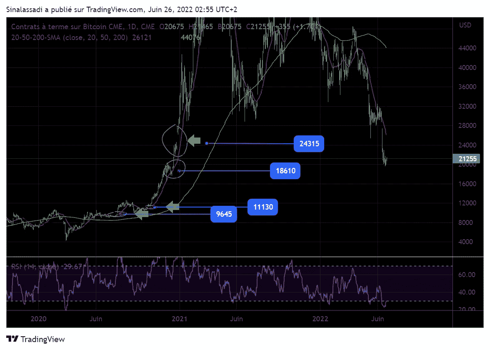

# 购买前我在关注什么

> 原文：<https://medium.com/coinmonks/what-im-watching-for-before-purchasing-273200329d5c?source=collection_archive---------30----------------------->

## 不要错过！

Photo by Andrea Piacquadio

*加密货币市场很年轻，只有 12 年。这就是为什么我们有它的高波动性。迄今为止，已经有三个完整的减半周期。*

*这个简单的数据给我们展示了正确的切入点。那是市场的最低价格区。*

> ***本文并非财务建议，仅提交给我***

我在这里分享五个简单的指标，在每个人的能力范围内进行监控。

**1)斐波纳契回撤:**

如下所示，在过去的两个周期中，斐波纳契回撤在 78.6%和 100%之间。

2014 Correction

2018 Correction

Correction in progress 2022

我们可以看到，我们已经从 78.6 的水平反弹。虽然这一举动是极端的，正如 RSI 所看到的，现在看到的上涨是一个技术反弹。看不到牛市。最低价应该经过 78.6 区域，这里用绿色圈出来的是 100。即**低于 17200 美元和 3000 美元**后才恢复长期上升趋势。

**2)缺口:**

据统计，缺口有 810 的机会被填补。我们来看看 CME 比特币期货合约。价格仍有可能**降至 9645 美元**。那么我们将接近 100%的斐波纳契回撤，这将是一个合理的进场价格。

GAPs already existing on BITCOIN CME FUTURES

**3)恐惧指数:**

这个指数说明了市场中投资者的恐惧。越是极端，越会是进入的信号。但是要注意，你不应该单独使用这个指数。我们经常连续几周看到过高的水平，而价格持续下降。
这里有两个链接可以关注这个指数。[恐惧和 gread 指数](https://alternative.me/crypto/fear-and-greed-index/)，[比特币情绪](https://www.augmento.ai/bitcoin-sentiment/)。

**4)美联储的货币政策:**

现实是，尽管比特币是作为系统的替代物而建立的，但它仍然与系统相关。**加密货币市场跟随 S & P 500** ，其本身与**货币政策**相关。只要利率上升，风险资产就不会出现牛市。

乌克兰的冲突

正如 2003 年的伊拉克战争影响了经济一样，乌克兰战争也有其重要性。

这场战争是一个重要的观察点。冲突接近尾声对市场来说是一件好事。

能源和大宗商品价格将随之下降，导致经济流动性:大宗商品价格下降，购买力上升，消费上升，失业率下降。然后财富在投资中回报。

相反，如果形势恶化，我们就有进一步下跌的风险。

当然，还有许多其他更具技术性的指标。这篇文章的目的是突出那些最容易阅读的。这样做的目的是，即使是最新手也能了解每日的市场状况。

我看好比特币的价格是 **13/14kUSD** 、 **11kUSD** ，然后是**9600 ksd**以增量进入。

综上所述，如果没有人再相信比特币。如果市场让每个人沮丧，让他们愤怒。如果你看到一个将军，放弃。

假设我们访问接近 9600 美元的地区。或者它已经打过电话了。

假设我们能在乌克兰看到希望。美联储政策的改变。那么对我来说，这将是一个买入信号。

记住，发生的时候是不可能定义底部的。因此，相反，我们通过图表的行为和随后的指数来确定低点。

> 加入 Coinmonks [电报频道](https://t.me/coincodecap)和 [Youtube 频道](https://www.youtube.com/c/coinmonks/videos)了解加密交易和投资

# 另外，阅读

*   [OKEx vs KuCoin](https://coincodecap.com/okex-kucoin) | [摄氏替代品](https://coincodecap.com/celsius-alternatives) | [如何购买 VeChain](https://coincodecap.com/buy-vechain)
*   [币安期货交易](https://coincodecap.com/binance-futures-trading)|[3 comas vs Mudrex vs eToro](https://coincodecap.com/mudrex-3commas-etoro)
*   [如何购买 Monero](https://coincodecap.com/buy-monero) | [IDEX 评论](https://coincodecap.com/idex-review) | [BitKan 交易机器人](https://coincodecap.com/bitkan-trading-bot)
*   [CoinDCX 评论](/coinmonks/coindcx-review-8444db3621a2) | [加密保证金交易交易所](https://coincodecap.com/crypto-margin-trading-exchanges)
*   [红狗赌场评论](https://coincodecap.com/red-dog-casino-review) | [Swyftx 评论](https://coincodecap.com/swyftx-review) | [CoinGate 评论](https://coincodecap.com/coingate-review)
*   [Bookmap 点评](https://coincodecap.com/bookmap-review-2021-best-trading-software) | [美国 5 大最佳加密交易所](https://coincodecap.com/crypto-exchange-usa)