# 区块链到底是什么？

> 原文：<https://medium.com/coinmonks/what-in-the-world-is-blockchain-72bd06b7dfcb?source=collection_archive---------10----------------------->

## 终极 2000 字指南

U 尽管过去几年你一直躲在一块岩石下，但我相信你已经遇到了流行词汇——密码货币和非密码货币，并且听到人们谈论被称为**区块链**的潜在的*变革性*技术。

在过去的几年里，围绕 Blockchain 技术的炒作变得异常热烈。截至 2022 年，crypto 已经吸引了全球超过 3 亿用户，超过 18，000 家企业已经开始接受 cryptocurrency 付款。此外，NFT 现在以数百万美元的价格出售。

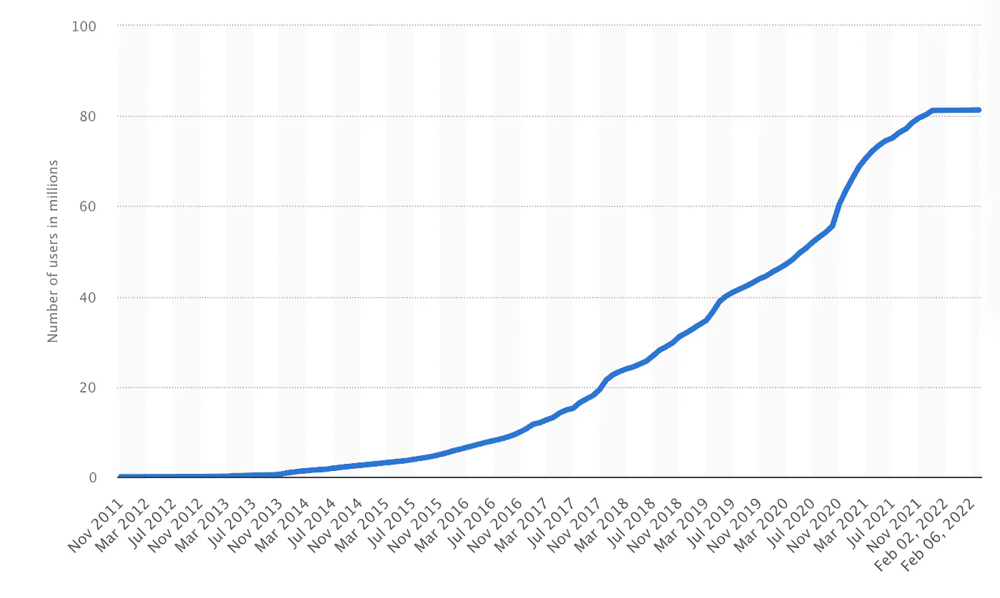

[Number of Blockchain wallet users worldwide from November 2011 to February 7, 2022 (in millions)](https://www.statista.com/statistics/647374/worldwide-blockchain-wallet-users/)

嗯，如果你和我一样，在某个时候，你可能会想，“**block chain 到底是什么？！**”

本文将为您解答这个问题。

# 嵌段链的起源

1991 — 2008 年标志着 Blockchain 技术的早期阶段。1991 年，Stuart Haber 和 W. Scott Stornetta 提出了这个想法，他们描述了加密保护的块链，在这个链中，没有人可以篡改文档的时间戳。

1992 年，他们更新了他们的系统，通过在一个块上收集更多的文件来提高效率。

然而，直到 2008 年，Blockchain 技术才真正开始获得相关性，当时中本聪(化名)发布了一份建立 Blockchain 模型的白皮书。

最后，在 2009 年，中本聪发布了第一个 Blockchain 的真实应用程序**比特币** 的[白皮书。](https://bitcoin.org/bitcoin.pdf)

# 好吧，但是我们为什么需要 Blockchain？

为了理解 Blockchain，让我们首先认识到它所解决的问题。

就拿我来说吧，我要去国外旅行，万一有紧急情况，我需要你帮我转 1500 美元。考虑到您愿意转账，我们来看看这笔交易是如何运作的。

当前系统:

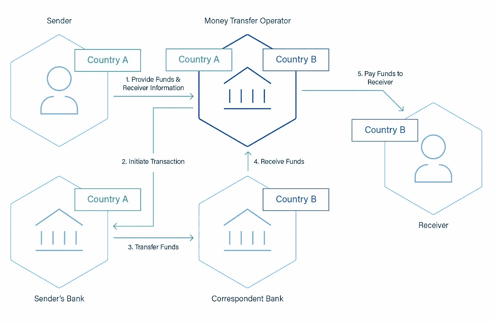

[Oversees Money Transfer Process](https://images.app.goo.gl/jWWkz9QAhUNKHa5A8)

您愿意在多大程度上打赌您是否彻底检查了整个过程？让我猜猜，你没有。别担心，我明白。整个过程很麻烦。

虽然，正如你可能注意到的，一些非常有趣的事情刚刚发生。你我信任对方，信任*银行*。等等，让我换个说法:

您和我依靠**中介**相互信任，中介会收取处理我们交易的费用(从您的钱中赚钱)，花几天时间给我汇款，并且在这个过程中绝对没有透明度。

这就是问题所在。我们依靠第三方来建立彼此之间的信任。

> ***如果我们有一个分布式的全球货币，在一个点对点的网络中，我们不需要把我们所有的信任都放在一个中介上，该怎么办？***

好吧，我的朋友们，正是 Blockchain 提供给我们的。

它是比特币和以太坊等革命性加密货币背后的驱动技术。

# 那么，区块链又是什么？

区块链，顾名思义，就是区块的链。我没开玩笑，事实就是如此。好吧，让我们深入研究一下。

> *注:块包含数据。*

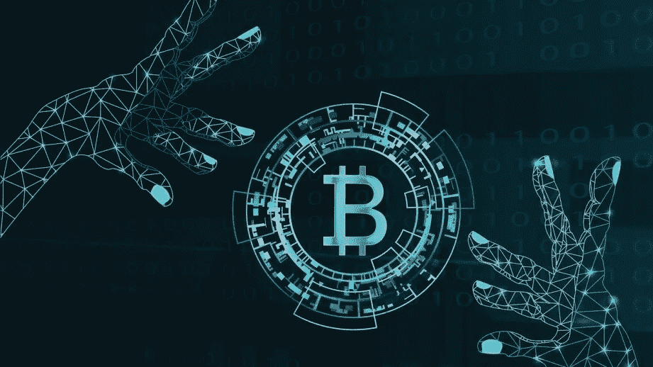

用更专业的术语来说，区块链是一个去中心化、分布式的数据库。

你可以把它想象成一个谷歌文档，存储着所有人共享和控制的信息，除了它更酷。

让我们来分解一下:

**去中心化&分布式**:这意味着没有单一的个人或实体对区块链拥有控制权。它是完全分散的，这意味着它由多个参与者控制，并分布在整个网络中。这种技术被称为分布式账本技术(DLT)。

**数据库:**数据库是有组织的数据集合，通常以电子方式存储在计算机系统中。虽然区块链被认为是一个数据库， ***数据库不是区块链*。**区块链和数据库的主要区别是中心化。数据库上的所有记录都是集中的，而如上所述，区块链是完全去中心化的。

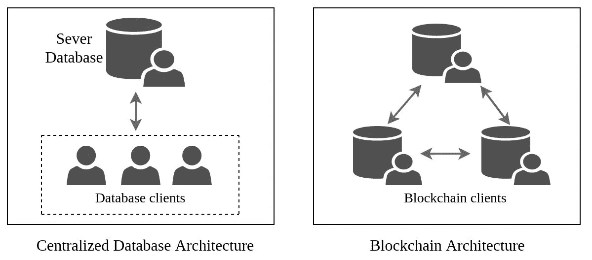

# 有意思，那么是什么让区块链与众不同呢？

区块链的设计方式和工作原理超级迷人。所以，事不宜迟，让我们来探讨一下它的一些关键特性:

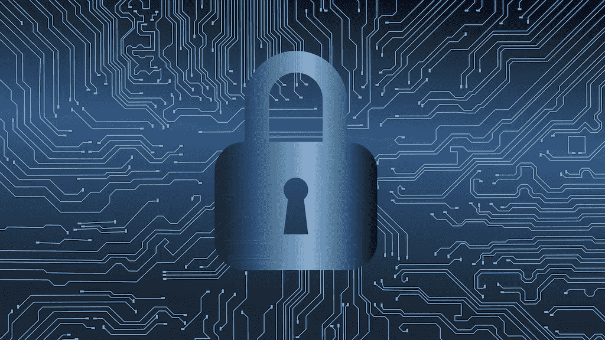

## **不变性**:

这是一个区块链分类账保持永久的，不可磨灭的，不可更改的数据历史的能力。简单地说，数据一旦放到区块链上，就不能简单地被更改。

## 透明度:

公共区块链本质上是无权限的，这意味着任何人都可以加入网络并查看其中的信息。例如，在加密货币的情况下:所有用户都可以查看交易历史。

是不是超级酷？

> *来看看:* [***这个网站***](https://www.blockchain.com/btc/unconfirmed-transactions) *可以让你查找区块链和以太坊的交易。*

## 增强的安全性和隐私性:

区块链本质上是安全的，因为它基于密码学的原理。区块链利用密码术来**加密交易**，并在网络内提供安全性。此外，区块链网络不受网络攻击和欺诈的影响。

## 快速处理:

通过消除中介以及取代交易中的剩余流程，区块链处理交易的速度比大多数传统方法快得多。在某些情况下，区块链可以在几秒钟或更短的时间内处理一笔交易。

# 好吧好吧，区块链到底是怎么工作的？

好了，现在我们已经探索了区块链的一些超级酷的功能，让我们了解一下它到底是如何工作的。

> *概述:区块链上的每一条数据都存储在一个块中，所有的数据块都链接在一起。(区块链，看到了吗？)*

你和我在一起吗？好的，很好。

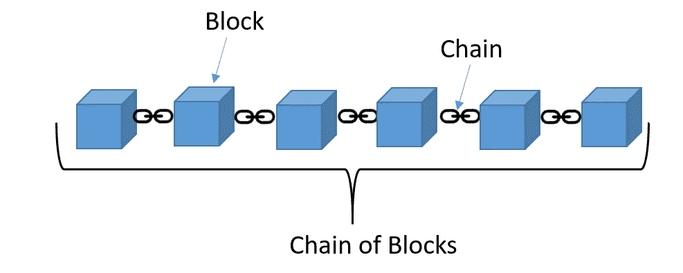

## 那么街区是什么样子的呢？

每个模块包含 3 个关键要素:

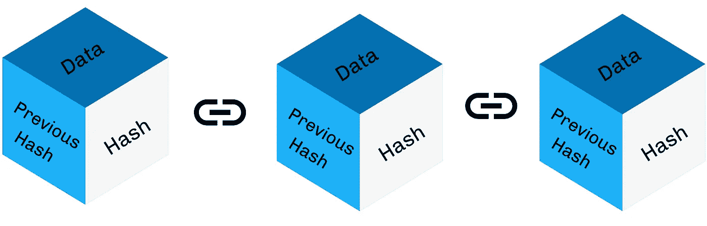

**数据:**这是*信息*，将永久保存在公共账本上。例如:当交易发生时，块将包含关于发送者、接收者、时间戳等的信息。

**哈希:**密码哈希，简单来说就是将存储在数据块上的大数据转换成一组固定长度的*唯一字母和数字*。这就像是特定数据的数学指纹。

> 想找点乐子吗？在这里 *为你的数据做散列* [*！*](https://xorbin.com/tools/sha256-hash-calculator)

**前一个块的散列:**链中的下一个块也将包含前一个块的散列。

## **但是，为什么要磕磕碰碰呢？**

现在你可能想知道，为什么我们首先需要数据的散列？原因是，如果有人篡改了块中的任何数据，在链中的任何地方，都会立即使该块记录的散列结果*与数据*不匹配。

请记住，已被篡改的数据的哈希也存在于下一个数据块中**。**

这使得篡改数据不可能不被其他人立即发现，因为顺序散列“没有意义”。

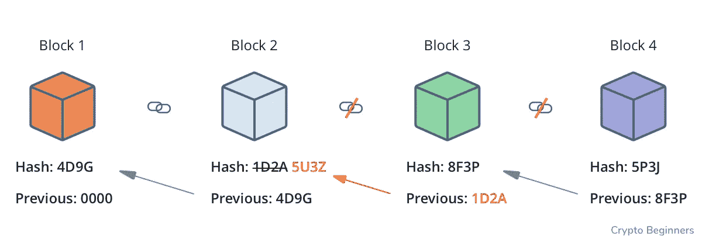

If the hash of the previous block is changed, the sequential hashing won’t add up.

## 好的，那么区块是如何加入区块链的呢？

一旦用户同意交易，在将交易添加到区块之前，需要先对其进行授权。

对于一个上市的区块链来说，将一项交易加入交易链的决定是由**共识**做出的。这意味着大多数“节点”(网络中的计算机)必须同意交易是有效的。

区块链共识算法的目的是*维护系统内的安全性和完整性*。

> **一致算法**:计算机科学中的一个过程，用于在分布式进程或系统中就单个数据值达成一致。

区块链中使用的两种主要共识算法:工作证明和利益证明。

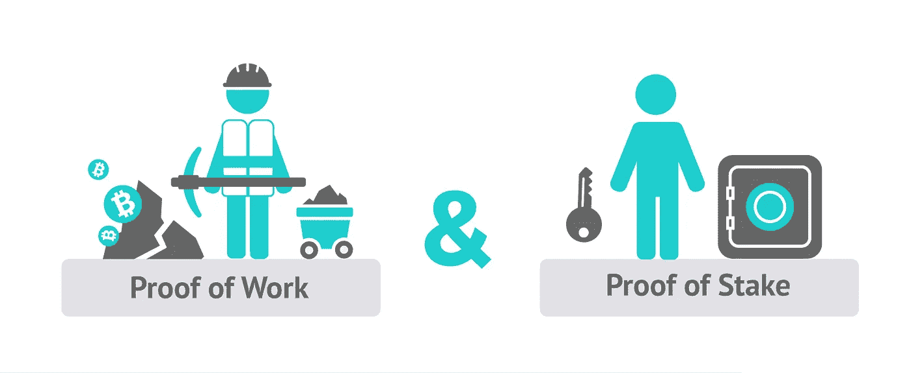

Proof of Work & Proof of Stake

1.  **工作证明(PoW):** 工作证明要求网络中拥有计算机的人解决一个复杂的数学问题，以便能够向链中添加一个块。这些“矿工”相互竞争，看谁能先解决这个问题。获胜的“矿工”获得奖励，通常是一定数量的密码。通过这种机制，网络需要巨大的处理能力。
    目前，比特币和以太坊等加密货币使用这种机制。
2.  **股份证明(PoS)** :在股份证明中，参与者必须在区块链中拥有股份，通常是通过拥有一些加密货币——以换取验证新交易、更新区块链并获得奖励的机会。这节省了计算能力资源，因为不需要挖掘。
    目前，像 Cardano、Avalanche、Solana 等加密货币都使用这种机制。

> **以太坊 2 (ETH 2.0)** 是对当前以太坊网络的升级，旨在通过采用**利益证明机制**来提高网络的安全性和可扩展性。

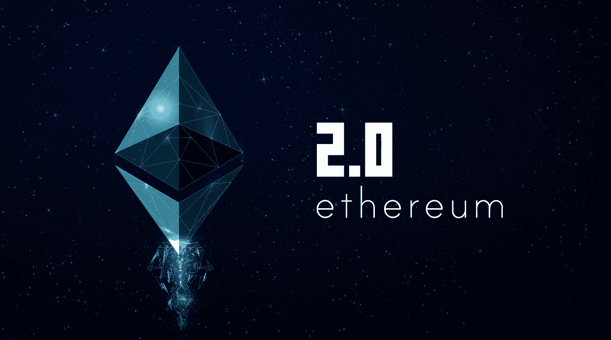

## 区块链交易简而言之:

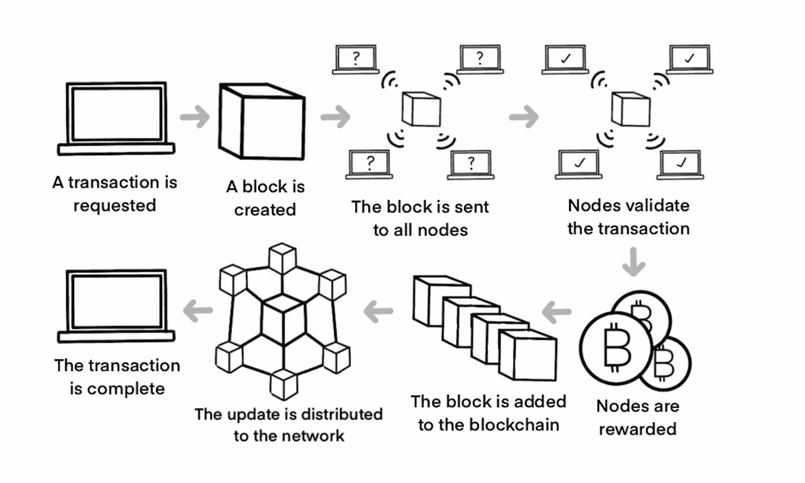

# 有意思，那么区块链什么时候工作？

希望现在你已经理解了区块链上的交易是如何运作的，并且明白为什么它是完全去中心化和安全的。但是，下一个要问的实际问题是:“**这些事务什么时候执行？**

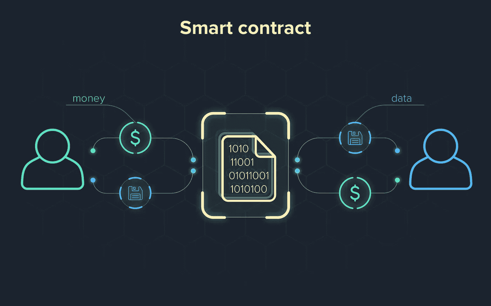

## 智能合同

智能契约是自动执行的契约，用户之间的 *协议的*条款被直接写入代码行。如果你是程序员，可以把它想象成由 **if-then 语句**组成的代码。任何人都可以编写智能合同并将其部署到网络中。**

所以基本上是一个合同，只是更聪明。

> 但是，当我们已经有了传统的合同时，为什么还需要智能合同呢？

坚持这个想法。让我们看一个例子:

你和我赌 50 美元明天温哥华的天气。我打赌会下雨(当然会，这是温哥华)，你打赌不会。

让我们来看看一些我们可以用来处理这笔交易的传统方式:

1.  我们可以相信失败者会付出代价。如果赌注是在朋友之间，这很好，但是你会把这种信任放在对陌生人的赌注上吗？不，它不是最佳的。
2.  我们可以起草一份法律合同。好吧，有一个问题——如果输家不付钱，赢家现在已经承受了法律诉讼费用的压力，对于 50 美元的赌注来说，这是一个漫长的过程。所以这也不是最优的。
3.  我们可以信任中立的第三方来为我们管理交易。我们每个人可以给“中间人”50 美元。还是那句话，只有一个问题——如果他们把钱放错了地方怎么办？或者更糟——带着钱跑路？不，不是最佳的。

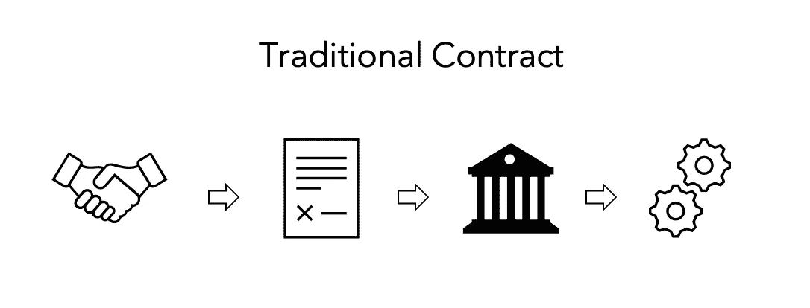

那我们该怎么办？易天才，我们用一个 ***智能契约*** 。

它将如何工作？回忆:如果-那么语句。

简单来说:如果明天下雨，那就把钱转给 x 方，否则，把钱转给 y 方。

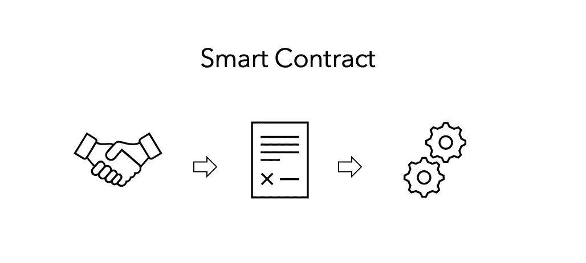

## 分散式应用程序

好吧，dApps 与其他应用类似，除了它们更酷——它们是*去中心化的、安全的*,并且通常*存在并运行在区块链*上。dApps 允许用户与部署在区块链上的智能合约进行交互。

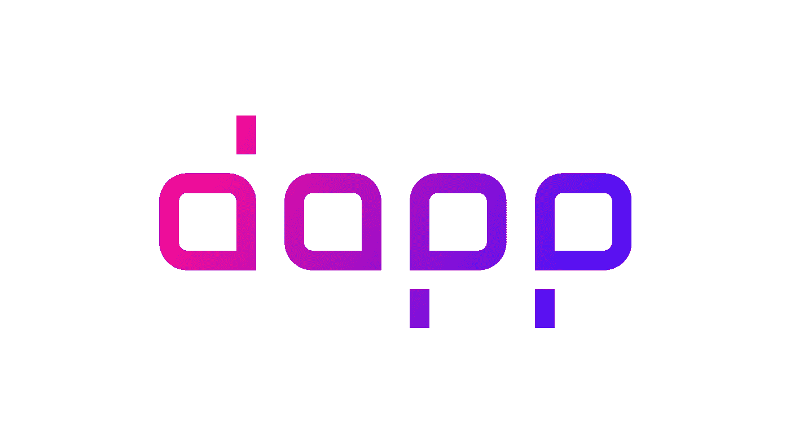

好吧，但为什么是 dApps？

**缺乏审查:**没有单一实体控制 dApp，任何人、个人或政府都很难控制或限制对 dApp 的访问。

**透明性**:因为 dApps 是开源的，所以数据是透明的，任何人都可以查看，以验证开发者对它所做的事情的声明。

**降低成本:** dApps 提供更高的交易速度，这意味着降低成本。与集中式系统不同，组织不必安装笨重的服务器，也不必雇佣专家来管理和维护他们的服务器和数据。

# 超级爽！区块链有哪些现实应用？

很高兴你问了。区块链技术是 21 世纪最伟大的创新之一。让我们看看是什么让它如此伟大。看看 2022 年真正的公司在用区块链做什么:

## 以太坊:加密货币

当然，你已经知道了！[以太坊](https://ethereum.org/en/)是一个基于区块链的软件平台，可以使用其本地加密货币以太坊在全球范围内发送和接收价值。

## 投票链:投票

[BallotChain](https://www.reply.com/en/content/ballotchain) 解决方案的基本思想是将比特币交易与选民投票匹配，以支持选民选择的候选人。

> 我最近在区块链领域做了一个类似的项目。查看我的网站[T21【这里】T22](https://aarna-09-arora.typedream.app)！

## Aetsoft:房地产

[Aetsoft](https://aetsoft.net/solutions/blockchain-real-estate/?gclid=EAIaIQobChMIzej11sG98wIVIQaICR07ewIAEAAYAiAAEgISqvD_BwE) 为多个行业和垂直行业开发定制的区块链产品，并准备创建和推出基于 DLT 的房地产解决方案。他们旨在通过减少管理负担、自动执行尽职调查、建立可靠的所有权记录以及遵守区块链房地产解决方案来提高生产率。

## Aetsoft:医疗保健

[Aetsoft](https://aetsoft.net/solutions/blockchain-healthcare/?gclid=EAIaIQobChMI9frM5sS98wIVip6zCh1NrgdMEAAYASAAEgKBzvD_BwE) 还致力于创建和推出区块链医疗保健解决方案，以应对行业挑战、简化您的工作流程并满足最终客户的需求。借助区块链医疗保健解决方案，您可以轻松检测假药和伪造处方，跨机构跟踪患者的病历，并消除数据阻塞。

> *当然这些只是少数但是可以随意探索更多区块链的真实世界应用* [*这里*](https://blockgeeks.com/guides/blockchain-applications/) *。*

而且现在你比以前更了解区块链技术。我非常兴奋地看到我们用它实现了更多！如果这篇文章有帮助，请随意与可能从中受益的人分享:)

如果你直接滚动到底部(哈哈，没关系，我也这样做)，或者想回到一个主题，这里有一个**TL；博士:**

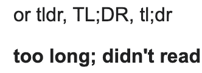

I didn’t know what the abbreviation stood for until I wrote my article, so here. You’re welcome.

[区块链的起源](#be36)

[我们为什么需要区块链？](#80c6)

[什么是区块链？](#aeab)

[区块链有哪些关键特性？](#9cf3)

[区块链是如何工作的？](#a49e)

什么是智能合约和 dApps？

[区块链有哪些现实世界的应用？](#903f)

> 加入 Coinmonks [电报频道](https://t.me/coincodecap)和 [Youtube 频道](https://www.youtube.com/c/coinmonks/videos)了解加密交易和投资

# 另外，阅读

*   [3 商业评论](/coinmonks/3commas-review-an-excellent-crypto-trading-bot-2020-1313a58bec92) | [Pionex 评论](https://coincodecap.com/pionex-review-exchange-with-crypto-trading-bot) | [Coinrule 评论](/coinmonks/coinrule-review-2021-a-beginner-friendly-crypto-trading-bot-daf0504848ba)
*   [莱杰 vs n rave](/coinmonks/ledger-vs-ngrave-zero-7e40f0c1d694)|[莱杰 nano s vs x](/coinmonks/ledger-nano-s-vs-x-battery-hardware-price-storage-59a6663fe3b0) | [币安评论](/coinmonks/binance-review-ee10d3bf3b6e)
*   [Bybit 交易所评论](/coinmonks/bybit-exchange-review-dbd570019b71) | [Bityard 评论](https://coincodecap.com/bityard-reivew) | [Jet-Bot 评论](https://coincodecap.com/jet-bot-review)
*   [3 commas vs crypto hopper](/coinmonks/3commas-vs-pionex-vs-cryptohopper-best-crypto-bot-6a98d2baa203)|[赚取加密利息](/coinmonks/earn-crypto-interest-b10b810fdda3)
*   最好的比特币[硬件钱包](/coinmonks/hardware-wallets-dfa1211730c6) | [BitBox02 回顾](/coinmonks/bitbox02-review-your-swiss-bitcoin-hardware-wallet-c36c88fff29)