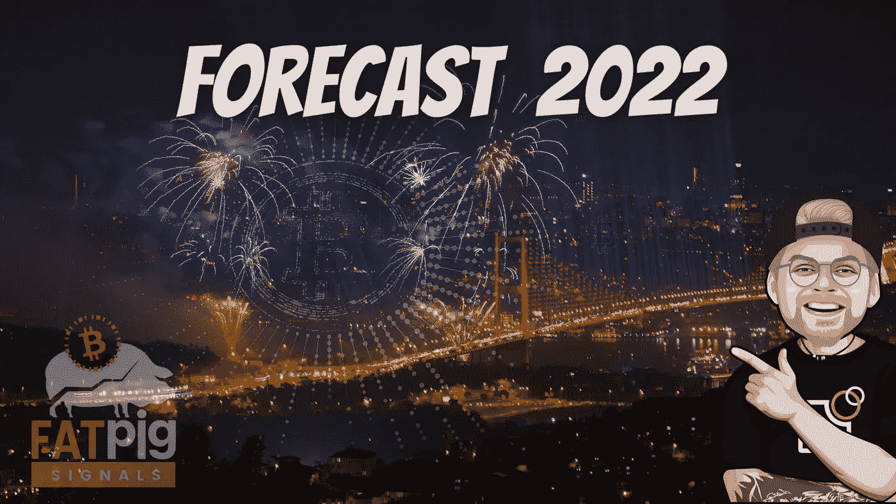

# 2022 年密码市场投资者需要警惕什么

> 原文：<https://medium.com/coinmonks/what-investors-need-to-watch-out-for-in-the-crypto-market-in-2022-231923018842?source=collection_archive---------6----------------------->

2021 年听起来不温不火——但 2022 年应该会令人兴奋。等待加密投资者和比特币爱好者的是什么？有可能出现什么趋势？我和 Fatpigsignals 会看一下，然后给你一个预测！

比特币和大多数大型加密货币在 2022 年开局疲软:预期的年终牛市未能实现，市场在很大程度上…