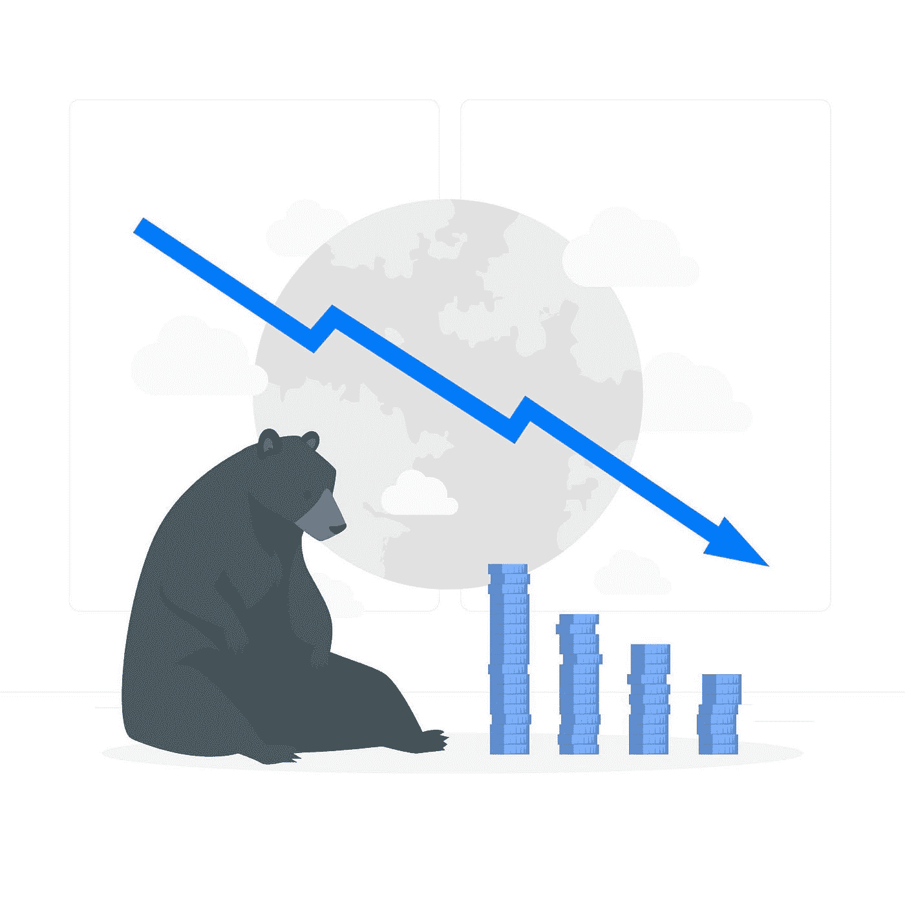

# 什么是熊市？——初学者指南。

> 原文：<https://medium.com/coinmonks/what-is-a-bear-market-a-beginners-guide-a5fb58f38c74?source=collection_archive---------45----------------------->

What is a bear market? — A beginners guide by ValorExchange.

每个市场都和趋势一起运作；无论是加密货币市场，房地产市场等，它们都跟随趋势。市场上有两种趋势。有牛市趋势，也有熊市趋势。

市场趋势是市场前进的方向。熊市是最具挑战性的时期之一。在熊市中，加密货币市场中的货币价格正在下降。

本文将讨论熊市，它们是如何运作的，它们的指标，以及你能做些什么。

# 什么是熊市？

这可以被描述为金融或[加密货币市场](https://valorexchange.com/blog/post?slug=what-is-a-cryptocurrency-a-beginners-guide)的资产价格正在下降的时期。这可能是由于通货膨胀等经济因素造成的。这个时期对交易来说是危险和挑战的。可能会导致大量损失，这可能会严重影响新密码交易员的信心。

What is a bear market? — A beginners guide. Photo credits: stories

# 我如何知道自己处于熊市？

有几个迹象表明你正处于熊市。

**外汇流入:**熊市的一个明确指标是，每个人似乎都在出售或清算他们的加密货币。这表明了对加密货币市场的负面情绪。当交易者想要抛售他们的加密货币时，资金就会流入交易所。当他们买入 [HODL](https://valorexchange.com/blog/post?slug=hodl-history-meaning-risks-and-benefits) 时，情况正好相反，这在牛市中很常见。

当不活跃的钱包突然变得活跃的消息开始流传时，这通常是熊市的一个指标。休眠地址是指长时间没有任何交易的区块链账户。突然使用这些地址通常意味着市场正在发生变化。

# 熊市期间如何交易？

在熊市中，交易者用来投资的最直接的策略之一是存进稳定的硬币。如果你对加密货币市场等高度波动和高风险的市场感到不舒服，那么这些市场适合你。你可以把你的加密货币作为稳定的硬币，直到市场转向。

# 我如何得到稳定的硬币？

泰瑟(USDT)是世界上最大的稳定硬币。它也是继比特币和以太网之后的第三大加密货币。如果你想了解更多关于[系绳(USDT)](https://valorexchange.com/blog/post?slug=what-is-tether-and-how-does-it-work) 的信息，那就看看我们之前的文章吧。

你可以在 [ValorExchange](https://account.valorexchange.com/) 上快速安全地获得 USDT。你可以用你的现金或任何有价值的东西来交换系绳，只需轻按一个按钮。

# 最后

熊市风险很高，对于市场中的新手交易者来说，可能会出现某些复杂情况。将现金存入稳定的硬币是规避市场风险的简单方法。

你可以在[我们的电报社区](https://t.me/valorexchangecommunity)上学习如何在熊市中保护你的加密货币，使用你的密码不仅仅是为了交易，还有更多。在那里加入我们，它是完全免费的。