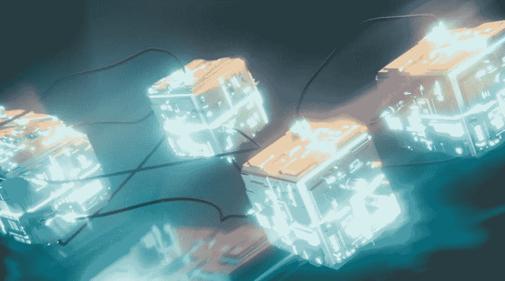

# 区块链的街区是什么？简单解释了一下！

> 原文：<https://medium.com/coinmonks/what-is-a-block-in-blockchain-explained-simply-b4730a189473?source=collection_archive---------18----------------------->

区块链由一系列的积木组成，每一个积木都与前一个相连，构成了整个区块链的骨架。

块是一种数据结构，在将事务提交给区块链进行验证之前，它包含这些事务的集合。

**块特征:**

*   它是区块链中存储和加密信息的地方
*   它包括来自先前块的加密交易信息和新的交易信息
*   创建的每个新块都包含对其父块的引用，并且它们创建了链
*   在可以创建新的块之前，块内的数据必须由网络验证
*   完整的块是先前事务和新事务的永久记录
*   没有先前散列的第一个块被称为起源块
*   共识机制负责验证事务并向网络添加新的块

# 什么是块结构？

每个街区都有四个基本组成部分，构成了整个区块链的骨架:

*   **数据:**您想要安全存储在块中的任何信息
*   **散列:**分配给一个特定块的唯一标识符
*   **前一个块的散列:**包括前一个散列值构造块的结构

第一个块没有前一个，因此不包含前一个块哈希。

块 2 包含块 1 的散列。

块 3 包含块 2 的散列。

因此，所有块都包含先前块的散列。

如果攻击者试图改变块 2 中的数据，那么块的散列将会改变。但是块 3 仍然包含块 2 的旧散列，这使得新块 2 无效。网络会拒绝它，这就是为什么区块链不能轻易被黑客攻击或改变。

这是保证区块链安全的方法。

# 区块是如何创建的？

当挖掘器或块验证器成功验证加密信息时，会创建块，这将提示创建新的块。

**创建块的步骤:**

1.  用户请求交易
2.  创建一个表示该事务的块
3.  该块被发送给网络中的每个参与者(用于工作一致性的证明)
4.  网络内的参与者验证交易
5.  一旦获得批准，新数据块将被添加到现有的区块链中，并在网络中分发

# 共识机制适合在哪里？

共识机制是区块链节点(运行区块链并跟踪所有交易的计算机)达成可靠协议的标准化方法。

因此，共识过程确保所有计算机彼此同步，并且所有计算机在将块添加到区块链之前都同意该块是有效的。区块链定义了如何根据其使用的共识方法来确认区块。共识机制有几种类型，但工作证明(PoW)和利益证明(PoS)是最常见的。

**工作证明(PoW)** :交易发送到所有计算机(矿工)进行验证。计算机(矿工)正在相互竞争解决一个数学难题，这个难题产生了当前块和之前块之间的加密链接。获胜者创建新的区块，并与网络的其余部分共享，从而获得奖励。

**利害关系证明(PoS):** 交易被发送到随机选择的计算机(验证器)进行验证。验证器通过标记其加密令牌来参与网络。验证者验证交易，创建新的块，与网络的其余部分共享并获得奖励。

> 加入 Coinmonks [电报频道](https://t.me/coincodecap)和 [Youtube 频道](https://www.youtube.com/c/coinmonks/videos)了解加密交易和投资

# 另外，阅读

*   [AscendEx 保证金交易](https://coincodecap.com/ascendex-margin-trading) | [Bitfinex 赌注](https://coincodecap.com/bitfinex-staking) | [bitFlyer 审核](https://coincodecap.com/bitflyer-review)
*   [Bitget 回顾](https://coincodecap.com/bitget-review)|[Gemini vs block fi](https://coincodecap.com/gemini-vs-blockfi)cmd |[OKEx 期货交易](https://coincodecap.com/okex-futures-trading)
*   [AscendEx Staking](https://coincodecap.com/ascendex-staking)|[Bot Ocean Review](https://coincodecap.com/bot-ocean-review)|[最佳比特币钱包](https://coincodecap.com/bitcoin-wallets-india)
*   [霍比评论](https://coincodecap.com/huobi-review) | [OKEx 保证金交易](https://coincodecap.com/okex-margin-trading) | [期货交易](https://coincodecap.com/futures-trading)
*   [网格交易机器人](https://coincodecap.com/grid-trading) | [Cryptohopper 审查](/coinmonks/cryptohopper-review-a388ff5bae88) | [Bexplus 审查](https://coincodecap.com/bexplus-review)
*   [7 个最佳零费用加密交易平台](https://coincodecap.com/zero-fee-crypto-exchanges)