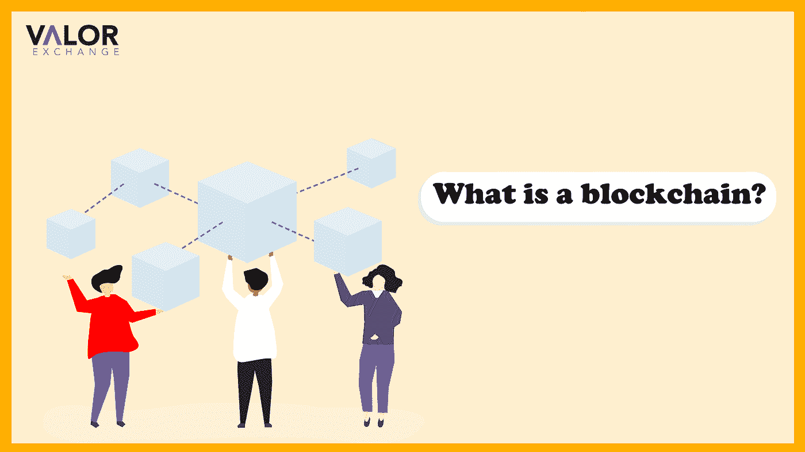

# 什么是区块链？——初学者指南。

> 原文：<https://medium.com/coinmonks/what-is-a-blockchain-a-beginners-guide-307d87e15dcc?source=collection_archive---------44----------------------->

区块链是所有加密货币的核心。当在加密交易所或通过 p2p 买卖加密货币时，它们必须得到确认，并被添加到区块链的一个新区块中。这确保了它的副本存在于世界各地的不同计算机上。这是因为区块链是分散的，没有人能决定删除一项交易或关闭整个区块链。这就像试图删除或摧毁互联网。

虽然分散技术主要用于加密行业，但它在其他领域也有很大的潜力。

**什么是区块链？**

根据定义，这是一个不可更改的分散式分类账，为加密货币网络存储数据。数据的性质无关紧要；如果它存在于加密网络中，它就存在于区块链上。

区块链是分散的，这意味着没有一个中央权力机构来监督或控制它。把它想象成一个电子表格，每个人都可以看到，但没有人可以编辑或重新排列。

*photo credits: juststartinvesting*

**区块链是如何工作的？**

区块链一词是按字面意思使用的。顾名思义，区块链是链接在一起形成信息库的块的集合。比如说，在以太坊区块链进行交易时，它必须通过一个验证过程。这样做是为了确保区块链上的数据不是伪造的。一旦这一点得到验证，信息就被添加到一个块和一个区块链中。

**区块链的 4 种用途**

区块链有多种用途，例如:

**加密货币:**区块链技术旨在与加密货币一起工作。[比特币、](https://valorexchange.com/blog/post?slug=what-is-bitcoin-a-brief-introduction)以太和 USDT 都必须存在于区块链网络中，它们才能发挥应有的功能。这就是赋予他们分散属性的原因。否则，它们就会像其他法定货币一样。

**资产转移:**您可以使用区块链记录和转移 NFT、数字货币等资产。这不仅限于数字资产，一些现实世界的资产，如车辆、房地产等。，也在此列表中。许多公司已经开始在业务中采用区块链。

[**智能合约:**](https://valorexchange.com/blog/post?slug=what-are-smart-contracts-and-how-do-they-work) 区块链的另一个创新特性是它能够托管自动化合约。智能合同是在满足特定条件后立即自动执行的合同。点击此处，您可以阅读我们关于智能合约的深入文章。

**投票** : 一些专家认为，分散式账本技术可以纳入政府投票系统，以减少欺诈和其他弊端。由于区块链是不可变的，它将成为一个更有效的投票统计和信息平台。

**如何进入区块链科技**

你不能投资区块链技术，因为它只是一个存储数据或信息的系统。然而，你可以决定将资金投入到基于区块链技术的技术或项目中。

许多人已经开始看到使用加密货币带来的好处。[在 ValorExchange 上，](https://account.valorexchange.com/)如果你愿意，你可以用加密货币存钱，但你还可以做更多。你可以进行支付、跨国转账、从头开始学习密码，并在平台上创建账户时加载更多内容。ValorExchange 免费、简单、直接。