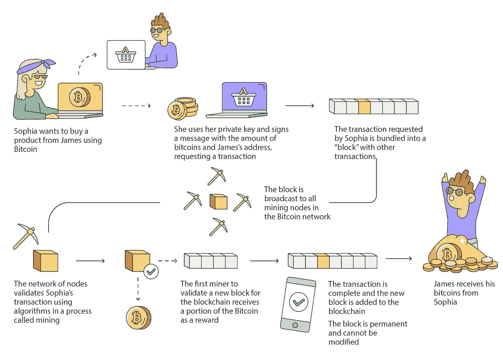
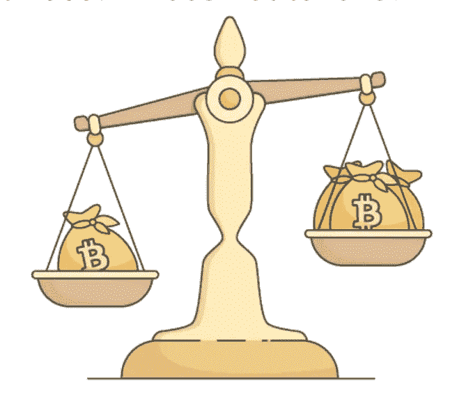

# 什么是区块链？

> 原文：<https://medium.com/coinmonks/what-is-a-blockchain-eda7e2a7bef3?source=collection_archive---------64----------------------->

在我们的 YouTube 上观看视频的同时，享受这个流的资源！

YouTube:[https://youtu.be/j5mwpI64Q3s](https://youtu.be/j5mwpI64Q3s)

不和:【https://discord.gg/J73qhkj7kr】T2

推特:【https://twitter.com/CryptoverseDAO】

linktree:[https://linktr.ee/cryptoversedao](https://linktr.ee/cryptoversedao)

-

什么是区块链？

从表面上看，区块链技术似乎无法理解，任何定义通常都伴随着大量术语。然而，如果我们退一步，用简单的术语来看区块链技术，它变得更容易掌握。

区块链是一个分发到网络上每台计算机的数据库，而不是连接到中央服务器。这是有利的，因为这使得区块链几乎不可能被拿下。该数据库包含网络上发生的每一次交易的数据，每次有新的交易发生时，它都会被添加到数据库中。

为什么叫区块链？

数据/事务被分成可管理的“块”，每个块包含一个事务时间戳和一个到前一个块的链接。这种数据链因此被称为区块链。在新添加的块被填充后，所有额外的信息被组合成一个新的块，然后被添加到链中。

因为每个区块都必须由网络上的每台计算机验证，所以不可能伪造交易，从而产生一个包含每笔交易的防篡改分类账。区块链技术依靠密码术来保护这些交易，并且在许多类型的密码的情况下，挖掘硬币和代币。

是什么让区块链如此安全？

区块链运行在一个分散的计算机网络上，称为节点，它实现了一种共识(点对点)确认的形式，可以推动更快、更安全的交易。因此，与传统的记录保存系统相比，区块链的分布式自治特性使得欺诈和复制更加困难。

速度、安全和透明的结合不仅推动了加密货币在全球的发展，许多其他行业也在探索区块链的用途。

下图显示了上面解释的整个过程:

为什么使用区块链:

下面列出了区块链的一些使用案例，但是，我们的主要关注点将更倾向于前 2 名。

加密货币交易所
NFT 市场
跨境支付
投票机制
供应链和物流监控
医疗数据的安全共享

当前货币体系的问题:

代表价值的信任中介
集中式系统

通过加密货币的解决方案:

不可信
分散系统
代表值

集中式与分散式

我们当前的货币体系存在许多问题，它没有给予用户太多或任何对其资产的控制权。例如，当在我们当前的货币系统中进行交易时，我们需要几个中介机构参与，如银行。

当有更多的中介参与交易时，信任交易的过程就变得更加困难。例如，BTC 解决的一个主要问题是“重复支出”问题。这方面的一个例子是确保你刚收到的 10 英镑不会被你的汇款人在另一笔交易中花掉。目前，我们必须信任某人来记录存款和取款，通常要么是处理数字资产的银行，要么是从你的钱包中离开并且永远不会回来的人。

加密货币的核心目的是尽可能地消除中介，创建一个点对点(P2P)支付系统，使整个过程去中心化。

为了解决信任问题，区块链的使用允许用户没有中间人，这意味着系统由个人控制，并且有计算机设置的规则和特定流程无法被打破。这意味着，由于政府和中央当局的分散性质，资金的流动可以不受它们的控制。

为了解决我们当前货币系统中交易数据不可用的问题，在区块链上使用加密货币为用户提供了访问数据的方法，只需检查所需区块链上的 block-scanner 即可。例如，要检查 BTC 的交易是否真实，您可以访问以下链接([https://www.blockchain.com/explorer](https://www.blockchain.com/explorer))。

拥有这种开放系统允许用户拥有自己的数据，并且数据不会被更改，因为它对探索块扫描器的任何人都是公开可用的，这反过来显示了价值的真实表示。

> 加入 Coinmonks [电报频道](https://t.me/coincodecap)和 [Youtube 频道](https://www.youtube.com/c/coinmonks/videos)了解加密交易和投资

# 另外，阅读

*   [瓦济里克斯 NFT 评论](https://coincodecap.com/wazirx-nft-review) | [比茨盖普 vs 皮奥克斯](https://coincodecap.com/bitsgap-vs-pionex) | [坦吉姆评论](https://coincodecap.com/tangem-wallet-review)
*   [如何使用 Solidity 在以太坊上创建 DApp？](https://coincodecap.com/create-a-dapp-on-ethereum-using-solidity)
*   [最好的卡达诺钱包](https://coincodecap.com/best-cardano-wallets) | [Bingbon 副本交易](https://coincodecap.com/bingbon-copy-trading)
*   [氹欞侊贸易评论](https://coincodecap.com/anny-trade-review) | [Paybis 评论](https://coincodecap.com/paybis-review) | [Keevo 钱包评论](https://coincodecap.com/keevo-wallet-review)
*   [印度最佳 P2P 加密交易所](https://coincodecap.com/p2p-crypto-exchanges-in-india) | [柴犬钱包](https://coincodecap.com/baby-shiba-inu-wallets)