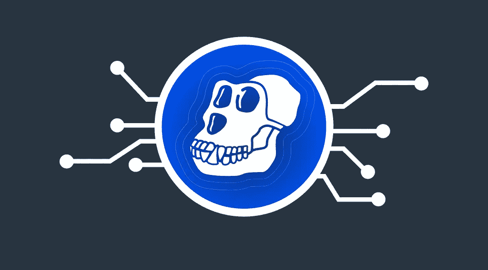
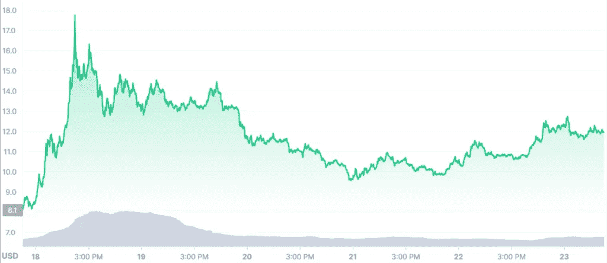

# 什么是无聊的猿 NFT？如何购买 Apecoin Crypto？

> 原文：<https://medium.com/coinmonks/what-is-a-bored-ape-nft-how-to-buy-apecoin-crypto-9cb661631311?source=collection_archive---------69----------------------->

在各大交易所上市后，ApeCoin 吸引了全世界的目光。令牌的市值从零增长到 41.52 亿美元，其价格增长了 100%(在撰写本文时)。在新的 [StealthEX](https://stealthex.io/) 文章中，我们为读者提供了猿 NFT 硬币的简要概述。

# 什么是无聊的猿 NFT？

无聊猿游艇俱乐部是目前存在的最成功和最著名的 NFT 项目之一。估计价值 50 亿美元。这家奢华迷人的俱乐部深受帕丽斯·希尔顿和贾斯汀·布伯等名人的喜爱。俱乐部徽章是漫画式的“无聊的猴子”。俱乐部的精英性质由 25 万美元的高额会员费证明，申请人必须投资于 NFTs。

俱乐部发行的不可替代代币的数量已经超过了 10K，并且还在不断增长。该项目的创造者可以夸耀他们的作品在苏富比以 2440 万美元的价格售出，其中一只猴子还出现在《滚石》杂志的封面上。

这个俱乐部笼罩着一层神秘的面纱:它的成员人数和创始人人数都不为人知。据信有四个创始人。他们中只有两个人的名字为人所知:他们是威利·阿罗诺夫和格雷格·索拉诺。然而，该俱乐部 50 亿英镑的估值表明，其成员中有金融界的头面人物。

如果我们谈论俱乐部的商业活动，这里知道更多。宇迦实验室正在积极开发，最近，除其他外，获得了 Meebits 和 CryptoPunks 的知识产权。

现在，BAYC 的创造者正在寻求扩大他们的影响范围。今年 2 月，他们为 NFT 持有者创建了一个约会服务，3 月，他们推出了自己的加密货币。

# 硬币密码

一个来自无聊猿游艇俱乐部的新令牌被命名为 ApeCoin(猿)。有趣的是，NFT 猴子的创造者拥有的宇迦实验室正试图与 Ape crypto 保持距离。后者将由去中心化组织 ApeCoin DAO 管理，ApeCoin 所有者可以加入。

ApeCoin DAO 包括 Reddit 的联合创始人 Alexis Ohanian，FTX 的发言人 Amy Wu，Sound Ventures 的董事 Maaria Bajwa，以及 Animoca 的 Yat Siu 和 Horizen Labs 的 Dean Steinbeck。他们都不是宇迦实验室的员工或经理。

此外，BAYC 的所有者还创建了一个名为 APE 基金会的基金，负责监督该组织的工作。其成员将每六个月改选一次。APE 基金会将做出与 ApeCoin 相关的关键决定，但代币持有者也将能够参与讨论。

最初，ApeCoin 应该只是一种游戏内货币。然而，现在的创造者将代币定位为所有产品和服务的通用工具。他们建议用它来“在 Web 3.0 的前沿创建一个去中心化的社区”，特别是对于游戏和商业交易。它应该是宇迦实验室的 BAYC 生态系统和未来项目的主要资产。

Ape 令牌的发射量是十亿单位。硬币已经分发给投资者和其他参与者。宇迦实验室获得 9.75%，四位创始人获得 8%，各种初创公司参与者获得 14%，简·古德波尔遗产基金会将获得 6.25%。出售新加密货币的资金将用于各种活动，如 NFT 市场和区块链游戏开发。

# 猿币价格

总供应量中，15%给了 BAYC 和 MAYC·NFT 的持有者。他们很可能会尽快套现，所以如果供大于求，价格就会下跌。在撰写本文时，每枚硬币的价格为 11.99 美元。

因此，更明智的做法是暂时保持观望，继续观察价格走势，直到价格触底。一些分析师认为，每枚 Ape 硬币低于 6 美元的价格是合理的购买价格。但不要把这当成投资建议，这只是一种可能。

# 如何购买 Apecoin？

ApeCoin 已经在许多加密交易所上市，但收购资产的最佳平台是免托管的加密交易所 [StealthEX](https://stealthex.io/) 。它提供了无限转换 400 多种加密货币资产的机会，无需注册，也没有额外或隐藏的费用。

只需去 [StealthEX](https://stealthex.io/?from=btc&to=ada&amount=0.1) 并遵循这些简单的步骤:

1.  选择兑换的货币对和金额。例如，[的 BTC](https://stealthex.io/coin/btc) 到[的猿](https://stealthex.io/coin/ape)币。
2.  按下“开始交换”按钮。
3.  提供硬币将被转移到的收件人地址。
4.  移动你的加密货币进行交易。
5.  接受你的硬币。

# 结论

Ape 加密货币有用吗？目前，它似乎是 NFT 社区的象征。然而，考虑到社区的增长速度，它可能有许多用例。即使在加密货币领域，Web 3.0 和 NFT 的概念也相对较新，BAYC 已经证明在这一领域取得了成功。该项目的目标是雄心勃勃的。它已经成为不可替代的令牌行业的主要参与者，并且可以期待进一步的增长。

在 [Medium](https://stealthex-io.medium.com/) 、 [Twitter](https://twitter.com/Stealthex_io) 、 [Telegram](https://t.me/StealthEX) 、 [YouTube](https://www.youtube.com/channel/UCeES_XBesX76ge7xf1meuSw) 和 [Reddit](https://www.reddit.com/user/Stealthex_io) 上关注我们，获取 [StealthEX.io](https://stealthex.io/) 更新和关于密码世界的最新消息。

在购买任何密码之前，不要忘记做自己的研究。此处表达的观点和意见仅代表作者个人。

**非常欢迎您来参观**[**StealthEX exchange**](https://stealthex.io/)**看看**有多快多方便。

> 加入 Coinmonks [电报频道](https://t.me/coincodecap)和 [Youtube 频道](https://www.youtube.com/c/coinmonks/videos)了解加密交易和投资

# 另外，阅读

*   [加密复制交易平台](/coinmonks/top-10-crypto-copy-trading-platforms-for-beginners-d0c37c7d698c) | [Coinmama 评论](/coinmonks/coinmama-review-ace5641bde6e)
*   [印度加密交易所](/coinmonks/bitcoin-exchange-in-india-7f1fe79715c9) | [比特币储蓄账户](/coinmonks/bitcoin-savings-account-e65b13f92451)
*   [OKEx vs KuCoin](https://coincodecap.com/okex-kucoin) | [摄氏替代品](https://coincodecap.com/celsius-alternatives) | [如何购买 VeChain](https://coincodecap.com/buy-vechain)
*   [币安期货交易](https://coincodecap.com/binance-futures-trading)|[3 commas vs Mudrex vs eToro](https://coincodecap.com/mudrex-3commas-etoro)
*   [如何购买 Monero](https://coincodecap.com/buy-monero) | [IDEX 评论](https://coincodecap.com/idex-review) | [BitKan 交易机器人](https://coincodecap.com/bitkan-trading-bot)