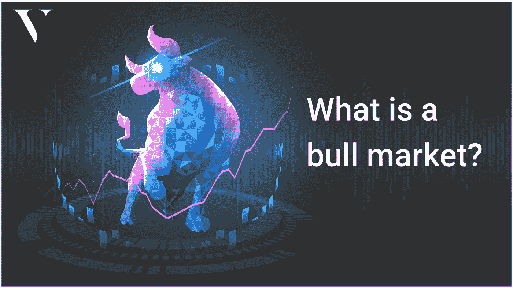
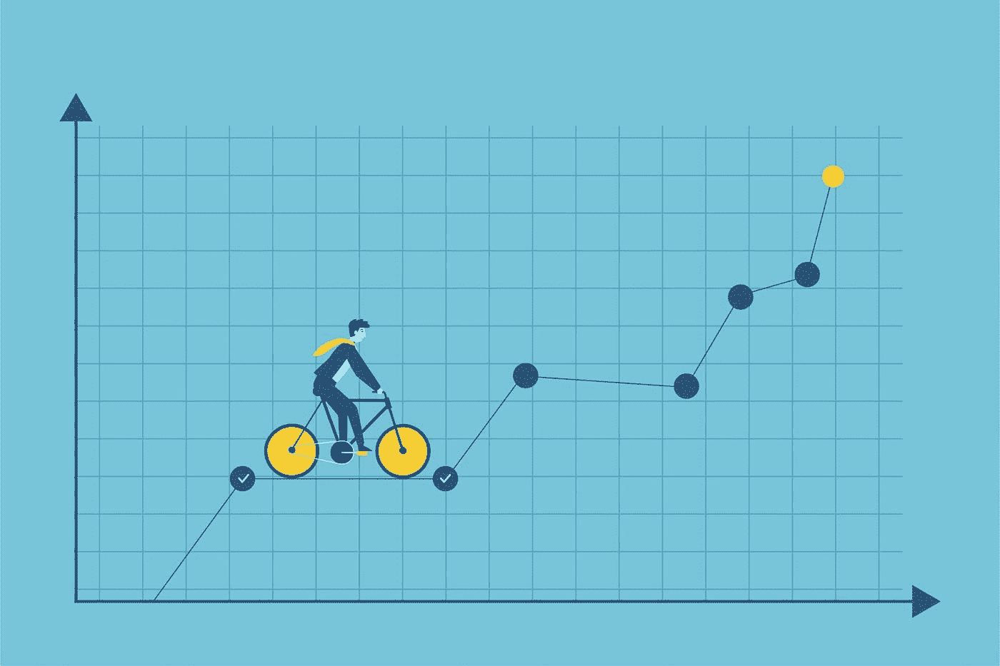

# 什么是牛市？—初学者指南。

> 原文：<https://medium.com/coinmonks/what-is-a-bull-market-a-beginners-guide-3f68affd3919?source=collection_archive---------65----------------------->

每个金融市场都在变化；这只是事物的本质。根据维基百科，市场趋势是指随着时间的推移，金融市场朝着特定方向发展的感知趋势。换句话说，市场趋势是资产或金融市场的走向。分析师和交易员可以通过预测这些趋势，对未来资产的涨跌形成明智的看法。

牛市通常被视为最有利的交易条件。即使是市场上的初学者也有合理的机会看到他们的密码货币升值。2021 年是许多密码货币增长的一年。像比特币这样的密码货币增长到超过 64，000 美元。

那么，什么是牛市，为什么它很重要，你如何识别牛市？我们将在本文中讨论这个问题。

**什么是牛市？**

牛市，也被称为牛市，是一种资产、隐货币等价格上涨的状态。体验成长。最初，这个术语主要用来指股票市场。然而，它现在被用于外汇、房地产、[密码货币、](https://valorexchange.com/blog/post?slug=what-is-a-cryptocurrency-a-beginners-guide)以及更多用途。

理解这一点至关重要，因为牛市并不意味着资产价格不会波动。牛市不一定意味着会有一段很长的最佳交易机会。相反，这只是意味着价格正在上涨，并预计将继续上涨。

Photo credits: storyset

**牛市特征**

大多数时候，分析师会寻找具体数据，并对他们是否处于牛市做出结论性的猜测。这些数据可以被视为信号，因为它们有助于对市场的性质做出明确而有根据的猜测。对于初学者，这里有两个指标需要注意。

**经济:**如果经济健康，你可能会进入牛市。积极的经济增长并不总是必需的，但它经常与牛市同时发生。这意味着将会有更低的失业率，强劲的 GDP，以及对新业务、技术甚至是人的大量投资。

**市场情绪:**牛市期间，更多人愿意购买隐形货币。那些提前购买的人会以更高的价格转售他们的密码货币。这将导致密码货币的价格随着时间的推移而上涨。

这可能很危险，因为它会让人们忘记加密货币从一开始是为了什么而产生的。许多加密货币不仅可以用于投资计划。在之前的文章中，我们讨论了 USDT 等加密货币的一些重要用途。

**牛市例子**

历史上有几次重大的牛市趋势。根据火箭总部的说法，上一次持续了大约 11 年，但大约在冠状病毒疫情开始时结束。根据一些说法，这可能是历史上最长的牛市。

**总之**

牛市是获得潜在高收益的最有利的投资市场。虽然他们的开始和结束很难预测，但也不是不可能。

您可以加入我们的 Telegram，在这里您可以[从头开始学习加密货币](https://valorexchange.com/blog/post?slug=five-things-you-need-to-know-before-you-get-into-crypto)，获得最新的新闻、工具和资源。让我们帮助您正确开始。