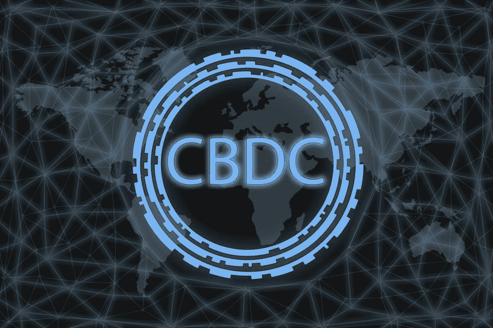

# 什么是央行数字货币？

> 原文：<https://medium.com/coinmonks/what-is-a-central-bank-digital-currency-6607a09df8fb?source=collection_archive---------26----------------------->

Source: Forbes

中央银行数字货币(CBDC)，是由特定国家的中央银行发行的数字货币。这意味着它受到政府的支持，并与一国的货币挂钩。CBDCs 的引入使得我们在全球转移资金的方式发生了转变。

在撰写本文时，9 个政府已经正式启动了 CBDC，15 个处于试点阶段，16 个处于开发阶段，40 个处于研究阶段，2 个已经取消开发([大西洋理事会](https://www.atlanticcouncil.org/cbdctracker/))。

# 什么是 CBD

虽然 CBDC 被归类为数字货币，但它与今天你能找到的许多加密货币有很大不同。例如，与许多其他加密货币不同，CBDCs 是集中式的。这意味着中央权力机构(如中央银行或政府)对其拥有控制权。

加密货币和 CBDCs 的另一个关键区别是*隐私*。由于中央银行/政府支持 CBDCs，所有用户都由中央实体记录，每个人的交易也是如此。虽然许多加密货币交易可以被跟踪，但它们的整体性质允许一定程度的匿名性。

***两种类型的 cbdc***

有两种类型的商业发展中心:零售和批发。

零售商业汇票向公众发行，消费者可以在钱包或账户中拥有该货币。消费者可以使用该 CBDC 进行各种不同的支付。这使得消费者可以进行支付，而无需依赖典型的银行服务或应对缓慢的交易速度。你可以把零售 CBDCs 想象成任何人都可以使用的数字现金。

批发 CBDCs 主要是为银行和其他金融机构设计的。这种类型的 CBDC 通过提高国内和跨境交易的交易速度和安全性来帮助银行。

# 为什么 CBD 如此重要

随着时间的推移，世界变得越来越数字化，这并不奇怪。有些人甚至会说，最近的新冠肺炎·疫情事件加速了这一趋势。只有货币跟随才有意义。

首先，CBD 表明政府愿意学习和采用数字资产。几年前，这种想法可能是不可想象的，但它肯定正在成为现实。

CBDCs 通过提高交易速度提供了大量的价值。它们允许用户从任何地方通过银行账户向任何地方快速汇款。

值得注意的是，CBDCs 可能永远不会完全取代现金和现在的工作方式。但是他们不需要。这种类型的资产有各种各样的用例，但是它也有一定程度的缺点。例如，一个支持者认为，CBDCs 允许客户直接使用央行，但这给了央行所有的控制权。

## CBDCs 的目标

根据美联储的数据，大约 5%的美国成年人没有银行账户，另外 13%的人有银行账户，但仍然使用昂贵的替代服务，如现金支票服务。

CBD 旨在通过使货币使用更容易、更便宜、更快捷来解决这一问题。与其他许多波动性很大的数字货币不同，CBDCs 将提供稳定的价值，降低家庭和金融机构的压力。

随着世界越来越依赖互联网和技术，CBD 是向前迈出的自然一步。这种类型的数字资产提高了金融领域的效率、速度和包容性。值得注意的是，隐私、安全和财务结构是始终需要解决的几个关键方面。很明显，全世界都在关注这项技术的发展。只有时间能告诉我们最聪明的人会如何利用这个机会。

> 加入 Coinmonks [电报频道](https://t.me/coincodecap)和 [Youtube 频道](https://www.youtube.com/c/coinmonks/videos)了解加密交易和投资

# 另外，阅读

*   [如何匿名购买比特币](https://coincodecap.com/buy-bitcoin-anonymously) | [比特币现金钱包](https://coincodecap.com/bitcoin-cash-wallets)
*   [币安 vs FTX](https://coincodecap.com/binance-vs-ftx) | [最佳(SOL)索拉纳钱包](https://coincodecap.com/solana-wallets)
*   [比诺莫评论](https://coincodecap.com/binomo-review) | [斯多葛派 vs 3Commas vs TradeSanta](https://coincodecap.com/stoic-vs-3commas-vs-tradesanta)
*   [Capital.com 评论](https://coincodecap.com/capital-com-review) | [香港的加密借贷平台](https://coincodecap.com/crypto-lending-hong-kong)
*   如何在 Uniswap 上交换加密？ | [A-Ads 评论](https://coincodecap.com/a-ads-review)
*   [WazirX vs CoinDCX vs bit bns](/coinmonks/wazirx-vs-coindcx-vs-bitbns-149f4f19a2f1)|[block fi vs coin loan vs Nexo](/coinmonks/blockfi-vs-coinloan-vs-nexo-cb624635230d)