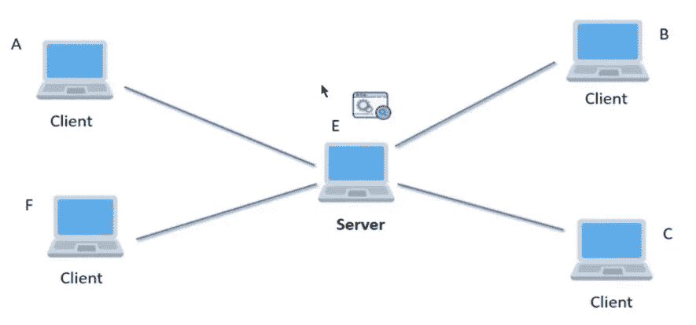

# 什么是集中式应用程序？

> 原文：<https://medium.com/coinmonks/what-is-a-centralized-application-96762bee4ca3?source=collection_archive---------81----------------------->

Photo by [William Hook](https://unsplash.com/@williamtm?utm_source=medium&utm_medium=referral) on [Unsplash](https://unsplash.com?utm_source=medium&utm_medium=referral)

**那么，这究竟是什么呢？**

**首先**，我们先来说说什么是*应用*。

一个*应用*是一个带有界面的计算机程序，使人们能够使用计算机作为工具来完成一项特定的任务。也就是说，通过互联网满足我们需求的工具。就是这样。

**对于 eg** 来说，如果你想从网上商店购买一部手机，那么你必须需要一个平台来购买它。这可能来自你的手机或电脑。对吗？这个平台被称为*应用*。假设，你想网购一部 iPhone 13，那么你需要先找到一个提供网购的平台。让我们从*亚马逊*说起，这里的*亚马逊*就是你用来购物的*平台*。所以，*亚马逊*就是*应用*。

了解什么是应用程序吗？

**牛逼**！

现在，让我们了解一下什么是集中式应用程序。

*集中式应用*，是一个*应用*，其中数据和功能(业务逻辑)都驻留在一个由单一实体拥有和控制的服务器上。这个实体可以是组织，也可以是个人。

变得困惑？

酷！

简而言之，它是一个由公司或组织管理的*应用*，他们可以完全控制这个*应用*及其功能。

你从*亚马逊*购买了一部 iPhone，对吗？让我们借此探索更多。

当你要在亚马逊上开一个账户时，你要给它提供个人信息，比如姓名、电子邮件、好友等等。你的详细信息存储在亚马逊的数据库中。在这里，*亚马逊*可以查看你的数据，可以查看你的订单历史，同样*亚马逊*可以修改它(很可能他们没有)。亚马逊可以完全访问你的数据。所以，这里*亚马逊*充当了*集中式应用*。

像这样，我们再来看一个应用。例如，当您通过 IRCTC 应用程序预订火车票时，您将向 IRCTC 提供您的个人数据(*姓名、mob、旅程详情等*)。IRCTC 可以完全访问您的数据。所以，这里 IRCTC 充当了*集中式应用*。

**这里是*集中应用*的结构。**

在这张图片中，你可以说服务器是亚马逊，而客户端是你，你进行了购买。让我们结束这一切…

*   在*集中式应用*中，数据由服务器拥有和控制。
*   功能由服务器拥有和控制。
*   它利用了星型网络模型(如图所示)。

**现在**，我们到达了什么是*集中应用*的尽头。我敢肯定，你现在已经清楚地了解了*集中申请*。

谢谢你把这个读出来。如果你喜欢这篇文章，请给我一颗心。

**我们很快会看到一篇新文章！**

与我联系[***LinkedIn***](https://www.linkedin.com/in/sarojvrc/)*[***Twitter***](https://twitter.com/iamsarojb)*

> *加入 Coinmonks [电报频道](https://t.me/coincodecap)和 [Youtube 频道](https://www.youtube.com/c/coinmonks/videos)了解加密交易和投资*

# *另外，阅读*

*   *[Coldcard 评论](https://coincodecap.com/coldcard-review) | [BOXtradEX 评论](https://coincodecap.com/boxtradex-review)|[unis WAP 指南](https://coincodecap.com/uniswap)*
*   *[比特币基地评论](/coinmonks/coinbase-review-6ef4e0f56064) | [德里比特评论](/coinmonks/deribit-review-options-fees-apis-and-testnet-2ca16c4bbdb2) | [FTX 评论](/coinmonks/ftx-crypto-exchange-review-53664ac1198f)*
*   *[Unocoin 评论](https://coincodecap.com/unocoin-review) | [最佳加密赌注硬币](https://coincodecap.com/best-crypto-staking-coins)*
*   *[如何使用 MetaMask Wallet 获得 KCC 地址？](https://coincodecap.com/kcc-address-metamask)*
*   *[如何获得自己的。XYZ 领域？](https://coincodecap.com/xyz-domain)*
*   *[最佳加密交换平台](https://coincodecap.com/best-crypto-swap-platforms) | [最佳加密交易所](https://coincodecap.com/crypto-exchange)*