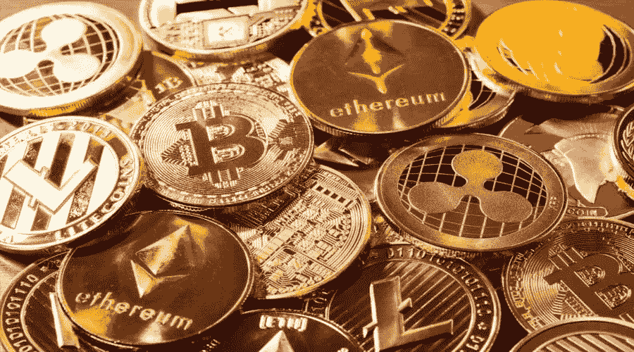

# 什么是加密哈希，加密挖掘器如何找到目标哈希？

> 原文：<https://medium.com/coinmonks/what-is-a-crypto-hash-and-how-do-crypto-miners-find-the-target-hash-3c28d2ed2f00?source=collection_archive---------15----------------------->

加密货币有很多种，它们的挖掘协议略有不同。所以，我们将坚持比特币，在这一部分，我们将更详细地讨论比特币挖掘。

**加密挖掘**将新硬币带入流通领域，并对正在进行的交易进行认证。它使用密码术来检查伪造和重复消费。

要了解采矿，您必须首先了解区块链的工作原理。

假设你用比特币从 Overstock 买餐具。

你会怎么做？很简单，将您的产品添加到购物车中，并使用比特币作为您的首选支付方式。

在后台，您的事务与其他等待验证的条目一起进入验证队列，并被添加到下一个块中。最后一个块继续接收条目，直到满为止。每个块目前被限制为 1MB 的数据。

形成一个区块并验证其中的交易是对矿工的奖励。毕竟他们利用自己的资源(读电，设备等。)来解决复杂的数学问题，从而在区块链上完成交易。

这个“复杂的数学问题”包括寻找一个 64 位十六进制数，称为哈希。

奖励通常以加密货币本身支付。但是并不是所有的矿工都有工资。只有第一个找到正确散列的人才会得到奖励。其他人只收到一张电费账单。

因此，这个过程是有风险的，有时也是卓有成效的。如果你没有一台功能强大的电脑，这可能是浪费时间。

尽管我们已经对加密挖掘过程有了一个概述，但是是时候发现一些隐藏的技术细节了。

首先是区块链安全的基础:哈希。

# **什么是加密哈希？**

如上所述，您需要找到散列来执行一个事务块。

每个块都有一个与之相关联的唯一散列。无论交易数据如何，它始终是一个 64 位数字。

对单个事务的任何修改都会生成不同的散列。因此，交易一旦被记录下来，就不会被篡改。

此外，每个块的散列与其前一个块的散列相关联。这增加了区块链的不变性。

因为任何在单个块中改变任何东西的努力都将颠倒所有后续块的散列，它最终将从那个确切的改变点开始一个分叉，一个不同的区块链。

根据字符串的长度，这可能需要巨大的计算能力。这个过程如此乏味(而且昂贵),以至于最终从中得到任何东西都变得毫无意义。

不是所有的分叉都是坏演员发起的。还有几个系统生成的分叉，可以考虑升级。例如，以太坊上的伦敦硬叉子是合法的。它发生在 2021 年 8 月 5 日下午 12:33:42+UTC。12,965,000.

这种利用散列来保护区块链交易的健壮过程被称为**密码术。**

> 另读:[新手如何挖掘以太坊](/coinmonks/how-to-mine-ethereum-for-beginners-12daf0b0de87) | [如何轻松增加以太坊挖掘 Hashrate](https://cryptospix.com/how-to-increase-ethereum-mining-hashrate/)|[加密量子飞跃回顾](/coinmonks/crypto-quantum-leap-review-april-2022-is-it-scam-or-legit-and-worth-buying-966597cae7b2) | [6 种用加密货币赚钱的方法](/coinmonks/6-ways-to-make-money-with-cryptocurrency-2022-a947c6f43f6e)

# 加密挖掘器如何找到目标散列？

目标散列是由网络每 2016 个块决定的数值。目标是保持开采难度，使得平均每 XNUMX 分钟开采一个区块。

这是散列块头的目标值。

块头是 80 字节的数据字符串，用作各个块的 id。它包含特定于块的信息，如比特币版本号、以前的块哈希、时间戳等。

因此，挖掘过程只不过是执行算法( **SHA-256** 用于比特币挖掘的散列算法)，将块头散列到低于目标的值。

第一个这样做的人赢得总奖励。就像中了彩票一样。

2009 年，采矿很容易。你可以用你的个人电脑来挖掘。

有趣的是，随着比特币越来越受欢迎，它的价值也在增加，越来越多的人开始专业采矿。

这增加了采矿的难度，目前，你需要高处理能力的专用机器来获得区块奖励。

> 加入 Coinmonks [电报频道](https://t.me/coincodecap)和 [Youtube 频道](https://www.youtube.com/c/coinmonks/videos)了解加密交易和投资

# 另外，阅读

*   [Bookmap 评论](https://coincodecap.com/bookmap-review-2021-best-trading-software) | [美国 5 大最佳加密交易所](https://coincodecap.com/crypto-exchange-usa)
*   最佳加密[硬件钱包](/coinmonks/hardware-wallets-dfa1211730c6) | [Bitbns 评论](/coinmonks/bitbns-review-38256a07e161)
*   [新加坡十大最佳加密交易所](https://coincodecap.com/crypto-exchange-in-singapore) | [购买 AXS](https://coincodecap.com/buy-axs-token)
*   [红狗赌场评论](https://coincodecap.com/red-dog-casino-review) | [Swyftx 评论](https://coincodecap.com/swyftx-review) | [造币厂评论](https://coincodecap.com/coingate-review)
*   [投资印度的最佳密码](https://coincodecap.com/best-crypto-to-invest-in-india-in-2021)|[WazirX P2P](https://coincodecap.com/wazirx-p2p)|[Hi Dollar Review](https://coincodecap.com/hi-dollar-review)
*   [加拿大最佳加密交易机器人](https://coincodecap.com/5-best-crypto-trading-bots-in-canada) | [库币评论](https://coincodecap.com/kucoin-review)