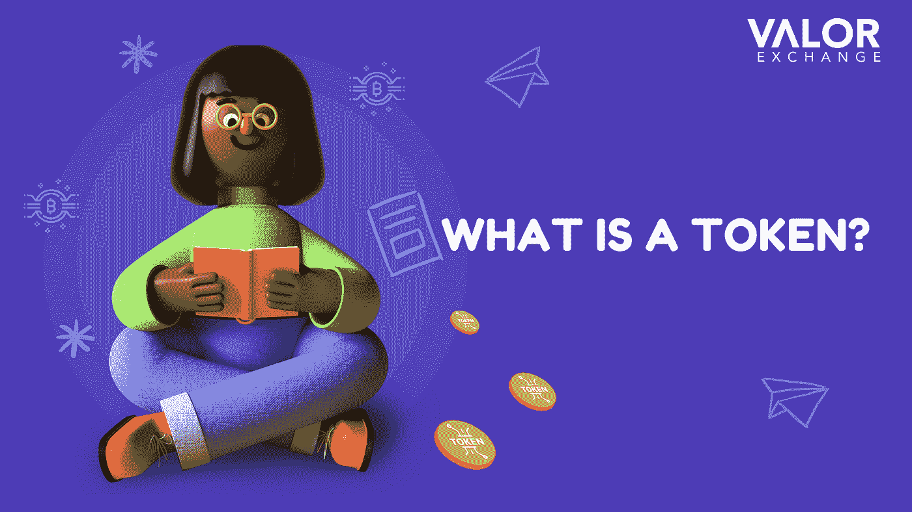

# 什么是加密令牌？—初学者指南

> 原文：<https://medium.com/coinmonks/what-is-a-crypto-token-a-beginners-guide-3ad327e82d11?source=collection_archive---------59----------------------->

术语硬币、代币和货币都代表加密资产。加密货币和加密令牌之间的区别在于，令牌是在现有的区块链上运行的，而不是作为唯一令牌的重要组成部分。

例如，以太是以太坊区块链的重要组成部分，而像 [Tether](https://valorexchange.com/) 这样稳定的硬币作为一种独立的加密货币存在于以太坊的区块链。

使用加密令牌，您可以访问产品或服务(实用令牌)，买卖数字艺术品(NFT)，甚至投资现实世界的资产(安全令牌)。

那么，**什么是加密令牌？**根据 Investopedia，代币是一种

加密货币或一个单位。

**加密令牌是如何工作的？**

加密货币令牌可以像其他加密货币一样在加密钱包中购买、出售或存储。

所有的代币交易都由他们操作的区块链处理。加密令牌除了作为交换手段之外，还有许多用途，例如:

政府代币:这些代币给予买家在即将到来的或现有的加密项目中的投票权。顾名思义，这些令牌持有者可以对提案进行投票，以决定项目的未来。你持有的代币越多，你的投票权就越大。这和买一家公司的股票很像。如果你买了足够多的股票，你就能对公司的运作产生重大影响。

**分散融资(Defi)令牌:**这些是指分散的

基于区块链技术的金融系统。他们提供分散的

金融服务。例如，如果桑尼需要贷款，他可以拿出他的

在 Defi 平台上作为抵押品的代币，根据平台，他

选择，他最有可能得到贷款。

**奖励代币:**这是针对之前提到的 Defi 平台的。这些代币是给贷款人的奖励。因此，如果你借出你的金融资产，你会得到一定数量的加密令牌作为奖励。这些令牌可以在 Defi 平台中使用，在某些情况下，也可以在平台之外使用。

**不可替代的代币:**这种代币代表资产的所有权。所有权信息存储在令牌中。把它想象成一份财产契约。该资产可以是书籍、CD 等任何东西。

**安全代币**:类似于稳定硬币，这些代币代表现实世界的资产。购买安全令牌类似于购买现实世界资产的一部分，如房地产、债券、股票等。这是一种记录资产所有权的方式。

**实用令牌:**这种类型的令牌是为了资助加密项目的开发而创建的，以后可以用来购买令牌发行者提供的商品和服务。

**加密货币 vs 比特币 vs 代币**

我们经常听到人们混淆这些术语，所以下面是它们的定义。

[**加密货币**](https://valorexchange.com/blog/post?slug=what-is-a-cryptocurrency-a-beginners-guide) 是一种去中心化的数字货币。它存在于区块链

并且使用密码进行操作。

[**a altcoin**](https://valorexchange.com/blog/post?slug=introduction-to-altcoins-for-beginners)**是发行后出现的任何加密货币**

**2009 年的比特币。altcoin 这个词是由两个词组合而成的。替代如在**

**加密货币中的替代货币和硬币。**

****加密令牌**是一种不拥有区块链的加密货币或其单位。它建立在先前存在的区块链上。**

**通过加入 telegram 上的[社区，你可以了解更多关于加密货币的信息，以及如何使用它们来改善你的生活。我们共享工具、资源等来帮助您最大化您的加密之旅。](https://t.me/valorexchangecommunity)**