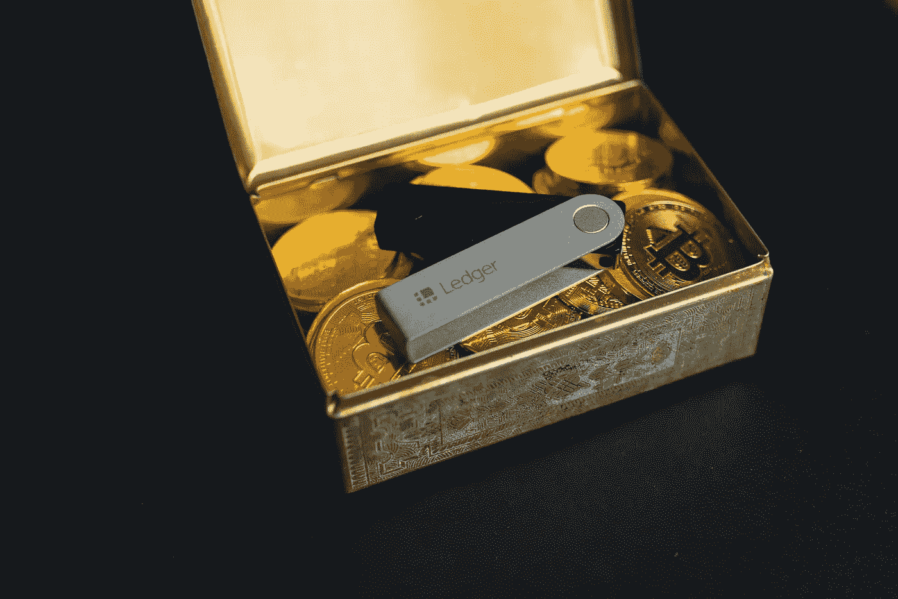

# 什么是加密钱包，它是如何工作的？

> 原文：<https://medium.com/coinmonks/what-is-a-crypto-wallet-and-how-does-it-function-780507a0822c?source=collection_archive---------52----------------------->

# 什么是加密钱包？

乍一看，加密钱包似乎很简单。对于外行人来说，合乎逻辑的结论是，加密钱包是存储加密货币的数字钱包。但这并不完全正确，因为你的密码资产位于区块链。那么，加密钱包意味着什么呢？好吧，加密钱包保存你的钥匙，而不是加密货币。

此时，解释一下这些键是什么可能会有所帮助。“密钥”是一串字母数字字符，用于接收和发送加密货币。它就像是你银行账户的账号，但是它没有附加任何个人信息。它们证明了你对数字货币的所有权，并允许你进行交易。这些密钥可以是公钥，也可以是私钥。公钥允许您接收加密货币交易。任何人都可以向公钥发送交易，但你需要私钥来证明你是交易中收到的加密货币的所有者。

# 为什么加密钱包很重要？

答案很简单:安全。这是因为您的私钥证明了您的所有权，并且因为没有附加个人信息，所以您希望尽可能地保持它的安全性和可访问性。请始终记住，如果您丢失了您的私钥，您将无法使用您的资金！

# 如何使用加密钱包？

## #1:第一步是找到你想使用的加密货币钱包。

加密货币钱包主要有三种类型:

*   纸质钱包:钥匙写在纸上，存放在安全的地方。这将是最安全的选择，但不是最实用的，因为它使使用您的加密变得困难。
*   **硬钱包:**密钥保存在一个硬件设备上，保存在一个安全的地方，只有当你需要使用密码时，才与电脑连接。这里的主要目标是在安全性和便利性之间取得平衡。
*   **软钱包:**钥匙存储在应用程序或其他软件中。这比其他两个选项安全性低，因为它更容易被黑客攻击，但它对用户更友好，你不必担心钱包放错地方。

## #2:第二步是按照提供商的指示，按照指示设置您的钱包。

## #3:第三步也是最后一步是开始发送和接收加密！

# 为什么要自己试一试呢？

最好是实际使用加密钱包，而不是阅读如何使用它。这是因为你将能够理解什么是真正拥有一个加密钱包，并能够亲身体验它。您还可以了解更多关于钱包的不同功能，以及它们是如何工作的。

 [## 你准备好迎接加密经济了吗？加密派

### 每次你打开新闻，阅读报纸，或者浏览你的推特，你很可能会看到一些故事…

www.thecryptopie.com](https://www.thecryptopie.com/)