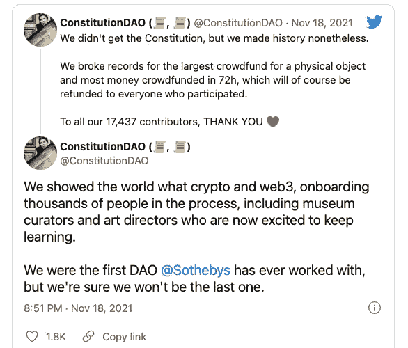
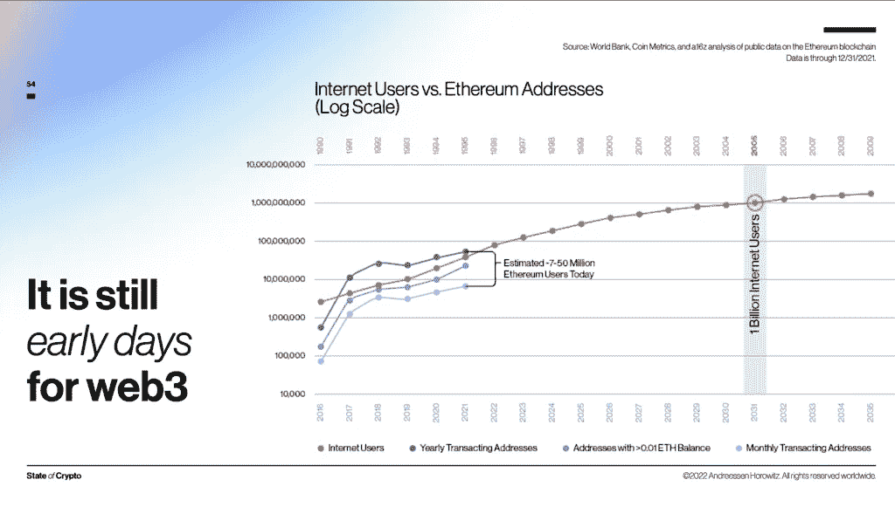

# ✋What 是个“道”，一群人怎么会差点买了美国宪法？

> 原文：<https://medium.com/coinmonks/what-is-a-dao-and-how-did-a-random-group-of-people-almost-buy-the-u-s-constitution-a14f43e930f1?source=collection_archive---------42----------------------->

# TL/DR:DAO 是一个拥有共同目标的分散的团队

**预计阅读时间:** 2 分 40 秒

在经历了一周的重大头条新闻之后，例如…

*   $LUNA 从 4 月份创纪录的 120 美元[跌至实际上的 0 美元](https://www.coindesk.com/markets/2022/05/12/terras-luna-has-dropped-997-in-under-a-week-thats-good-for-ust/)，
*   a16z 发布了他们的第一份年度“[加密状态报告](https://a16z.com/wp-content/uploads/2022/05/state-of-crypto-2022_a16z-crypto.pdf)”，
*   或者这份令人惊叹的时事通讯的订阅人数在 4 周内增长了超过 **500%** ！

有很多可谈的。但是，让我们挡住所有的噪音，一头扎进 DAOs…

# **什么是刀？**

DAO，即“分散自治组织”，是一个由社区领导的分散实体。

一个 DAO 是完全自主和透明的:智能合约建立基本规则，执行一致同意的决定、提议、投票，甚至代码本身可以在任何时候公开审计。

**像我 5 版**一样解释:DAO 是一种完全由其成员管理的业务结构，而不是由一个人发号施令。

DAO 的成员通常有一个共同的目标。

这个目标可以包括作为一个团体经营一家企业，购买宪法，甚至为道成员举办专门的社交活动。

可能性是无限的。

# DAO 与传统组织的不同之处是什么？

没有等级之分。道的每个成员对该组织的未来方向都有平等的发言权。

传统组织通常有总裁或首席执行官负责做出关键决策，而 DAO 两者都没有。

相反，DAOs 的规则和交易都记录在区块链上。没有人能够编辑道的规则，任何改变都必须由小组投票决定。

成员收到令牌，这些令牌使他们能够就他们认为 DAO 应该如何运行进行投票。

# 目前有哪些 Dao 的例子？

ConstitutionDAO 是一个在 ETH 众筹了 4700 万美元的项目，目的是在苏富比拍卖会上购买一份罕见的第一版美国宪法。

由于苏富比不允许 DAO 直接出价，ConstitutionDAO 与一家密码交易所合作，将他们的密码转换成美元。他们也能够与代表他们投标的非营利组织合作。

虽然他们最终失败了，但他们能够作为一个团体走到一起并筹集数百万美元的事实令人印象深刻。

其他几个例子包括:

*   [PleasrDAO](https://pleasr.org/) :哪个投资稀有的 NFT
*   [Seed 俱乐部](https://www.seedclub.xyz/):帮助在 Web 3 中建立社区
*   Uniswap :最大的 DAO，是一个去中心化的交易所，用户可以在这里交易加密货币。

# Dao 的其他真实用例是什么？

1.  慈善机构和非营利组织可以成为 Dao。所有成员都可以投票决定如何分配他们的金钱和时间。
2.  **不需要众筹平台。**希望为一家公司筹集资金的人可以简单地创建一个 DAO，允许他们的用户也拥有该公司的一部分。
3.  **生意可以当道来经营。**会员可以对企业的战略进行投票。

# 在一个 DAO 中可能会出现哪些问题？

因为在一个道中没有一个单独的领导者，所以有很大的出错空间。一些主要的缺点包括:

*   **安全性:**虽然 Dao 受到区块链的保护，但编码时的错误会导致灾难性的黑客攻击，就像 2016 年的[事件](https://www.bloomberg.com/news/articles/2022-02-22/attacker-behind-record-2016-crypto-hack-might-have-been-found#:~:text=One%20of%20the%20most%20significant,decentralized%20fund%20known%20as%20TheDAO.)
*   **代币集中度:**由于用户用代币投票，一小组用户理论上可以获得代币的多数股权
*   **缺乏批判性思维:**由于 Dao 大多是自动化的，需要多数人批准才能进行更改，因此它们可能无法及时控制发生的极端情况

# 我们还是那么早…

我想说的是，对于 Web 3 来说，现在还为时尚早。

目前，Web 3 用户数量(1000-5000 万)与 1995 年的互联网用户数量相当。

基于这个数据，我们太早了，以至于杰夫·贝索斯还会在他的车库里运行亚马逊，而 Web 3 的谷歌还没有被发明出来。

感谢你阅读《像我 5 岁一样解释》。如果你发现每周阅读一次这些文章很有价值，请点击这里订阅。

# 另外，阅读

*   [加密套利](/coinmonks/crypto-arbitrage-guide-how-to-make-money-as-a-beginner-62bfe5c868f6)指南| [如何做空比特币](/coinmonks/how-to-short-bitcoin-568a2d0b4ae5)
*   [如何在加拿大购买加密货币？](https://coincodecap.com/how-to-buy-cryptocurrency-in-canada)
*   [无聊猿游艇俱乐部(BAYC)回顾](https://coincodecap.com/bored-ape-yacht-club-bayc-review) | [拜比特 vs 比特币基地](https://coincodecap.com/bybit-vs-coinbase)
*   [5 款最佳加密交易终端](https://coincodecap.com/crypto-trading-terminals) | [最佳 DeFi 应用](https://coincodecap.com/best-defi-apps)
*   [比特币基地 vs 瓦济克斯](https://coincodecap.com/coinbase-vs-wazirx) | [比特鲁点评](https://coincodecap.com/bitrue-review) | [波洛涅克斯 vs 比特鲁](https://coincodecap.com/poloniex-vs-bittrex)
*   [德国最佳加密交易所](https://coincodecap.com/crypto-exchanges-in-germany) | [Arbitrum:第二层解决方案](https://coincodecap.com/arbitrum)