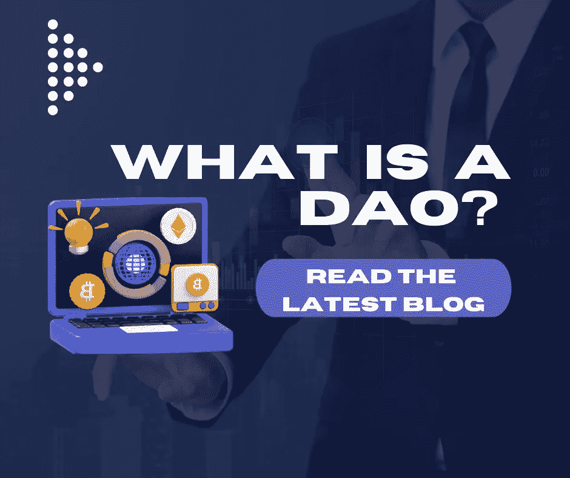

# 什么是 DAO(去中心化自治组织),它们是如何工作的？

> 原文：<https://medium.com/coinmonks/what-is-a-dao-decentralised-autonomous-organisation-and-how-do-they-work-d80677af5654?source=collection_archive---------54----------------------->

在本周的[理解加密播客](https://tinyurl.com/whatisadao)中，我和合作者 Captain Crypto aka[Paul Abercrombie](https://www.instagram.com/paulabercrombie/)谈论 DAO 是什么，它们如何工作，以及如何将 DAO 添加到您的业务中，*如果它适合您。*

**什么是刀，它是如何工作的？**

维基百科称，DAO(去中心化自治组织)是“一个由编码为计算机程序的规则所代表的组织，它是透明的，由组织成员控制，不受中央政府的影响”。在旧世界*(嗯，我想我们现在实际上仍然处于这个世界)*这与传统的合作社或社交俱乐部的想法类似，社区成员聚集在一起实现共同的目标。

**在 DAO** 中没有等级或集中的领导，因为它类似于一个成员拥有的社会，旨在成为人们在保持匿名的情况下进行合作的空间。它也可以是人们承诺资金的空间，因为企业实体存在于区块链的智能合同中。在某些情况下，DAO 的成员通过治理令牌或 NFT 在业务的决策过程中被赋予权利。

通常，你拥有的代币越多，你拥有的投票权就越多，如果组织是以治理作为组织效用的核心组成部分的话。

从各种意图和目的来看，一个“道”可以像一个公司一样运作，*但没有障碍和繁文缛节*，而这种障碍和繁文缛节可以由一个具有扁平管理结构的无边界实体创建。DAO 可以拥有自己的加密钱包，其行为非常像银行账户，免去了开立传统银行账户的冗长官僚程序。

一个道可以负责一个钱包地址，这个钱包地址就是“金库”，无论集体事业是什么，人们都可以贡献他们的资金。“道”可以通过多种方式获得资金，一种流行的模式是:出售代币，出售代币产生的钱(或出售代币产生的加密货币)进入共享金库或共享钱包。向 DAO 付费的社区可以投票决定如何花费或使用这些钱。

因此,**一个"一体行动"有助于社区快速有效地为其项目提供资金。**

最近创造了一把刀来购买美国宪法的原版。他们筹集了 4700 万美元，参与了苏富比对这件标志性艺术品的拍卖。令人遗憾的是，他们的出价高于对手，但这是一个很好的例子，说明了一个有着单一焦点和明确定义的结果的集体如何能够快速整合他们的购买力。他们筹集了大部分资金，试图在短短几周内完成收购！

“道”的另一个著名例子是“利益之友”，这是一个旨在成为社区主导的文化和 web3 技术结合的实体。

**本质上，人们从世界各地走到一起，通过 DAOs 汇集他们的资产来实现更大的承诺。**

许多加密项目和业务都内置了一些 DAO 元素。如果你想知道这有什么真实的商业案例，让我们看看这个例子；一群来自世界各地的软件工程师可能在一个项目上一起工作，但是他们不能开立银行账户来接收付款，因为他们不能证明受益所有权。如果合作者试图在传统金融机构开立账户，那么作为没有等级制度的“虚拟同事”的合作者将无法完成各种尽职调查和 KYC(了解你的客户)类型的检查。“一刀”打破了这些跨境支付的壁垒，因为支付可以在“一刀”钱包中加密进行。

在上面的例子中，另一个非常有用的方法是做决策。假设一个 web3 软件项目最终像火箭一样起飞*(现在发生了很多)*DAO 的系统和设置可以允许 DAO 的所有贡献者在推动组织前进的进程和决策中拥有投票权。

一个正常的企业层级就像一个金字塔，领导者做出的决策通过企业向下渗透。相比之下，刀的结构是扁平的。你有一个扁平的层级，没有人负责；集体投票说了算，社区集体投票决定方向。此外，根据预先确定的协议，您可以启用一个系统，一旦投票超过一定水平，它就会根据智能合同中的规则和结构触发决策。

**道的利弊**

但是，尽管扁平化管理、自主化、分散化的“道”梦想听起来好得难以置信，但让我们现实点吧，**不是每个企业都能像“道”一样运营。在传统企业中，创始人会期望因建立企业而获得经济回报。在 DAO 中没有明确的方法来做到这一点，因为就其本质而言，它是去中心化的，没有一个人可以单独管理。代币销售筹集的资金通常被锁定在流动性池中，由社区投票决定如何使用。作为一名创始人，如果智能合同没有以正确的方式建立，你会很容易地发现，你对组织的方向几乎没有控制权，即使你创造了“道”，并投入了数小时的工作来使其成功。**

另一方面，慈善机构和非营利组织可以采用 DAO 结构，很少出现问题。事实上，使用 DAO 将有助于他们避开许多官僚机构，并迅速动员起来。**区块链消除了很多摩擦，道的概念以及它们如何工作的结构将会很大**。

> 加入 Coinmonks [电报频道](https://t.me/coincodecap)和 [Youtube 频道](https://www.youtube.com/c/coinmonks/videos)了解加密交易和投资

# 另外，阅读

*   [SmithBot 评论](https://coincodecap.com/smithbot-review) | [4 款最佳免费开源交易机器人](https://coincodecap.com/free-open-source-trading-bots)
*   [杠杆代币](/coinmonks/leveraged-token-3f5257808b22) | [最佳密码交易所](/coinmonks/crypto-exchange-dd2f9d6f3769) | [Paxful 点评](/coinmonks/paxful-review-4daf2354ab70)
*   [加密套利](/coinmonks/crypto-arbitrage-guide-how-to-make-money-as-a-beginner-62bfe5c868f6)指南| [如何做空比特币](/coinmonks/how-to-short-bitcoin-568a2d0b4ae5)
*   [币安期货交易](https://coincodecap.com/binance-futures-trading)|[3 commas vs Mudrex vs eToro](https://coincodecap.com/mudrex-3commas-etoro)
*   [如何购买 Monero](https://coincodecap.com/buy-monero) | [IDEX 评论](https://coincodecap.com/idex-review) | [BitKan 交易机器人](https://coincodecap.com/bitkan-trading-bot)