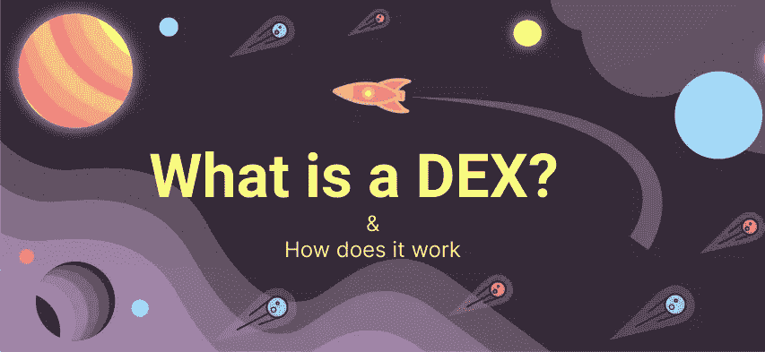

# 什么是分散交换(DEX ),它是如何工作的？

> 原文：<https://medium.com/coinmonks/what-is-a-decentralized-exchange-dex-how-does-it-work-c114a7d9ea20?source=collection_archive---------33----------------------->

比特币、以太坊和加密货币交易所都是区块链行业的主要参与者。推动不同技术的大量采用和用例。加密货币交易所在加密应用中扮演了许多角色，包括代币的可用性和交互、代币买卖的便利性、资金转移、存款和取款。

随着区块链技术的发展，越来越多的工具出现在分散交易中。

当你听到用电子邮件注册的时候，集中的交换会出现在你的脑海里；使用强密码，确认您的密码，并验证您的帐户。

分散式交易所的结构并非如此；他们消除了注册和验证帐户。所有交易都直接发生在两个用户钱包或交易者之间，不需要第三方的帮助。

本文将集中讨论什么是分散式交换以及它是如何工作的。

## 什么是分散式交易所(DEX)

分散交易所(DEX)是一个点对点的市场，在这里密码交易者直接进行交易，而不需要第三方。这些交易通过称为智能合同的自动执行协议来实现。

智能合约只是存储在区块链上的程序，在满足预定条件时运行。它们通常用于自动化协议的执行，以便在没有中间人参与或时间损失的情况下立即确定结果。

我们在各种区块链网络上有不同的分散式交换。

以太坊网络— Uniswap、Sushiswap
Avax 网络— Traderjoe、穿山甲
Terraluna 网络— Terraswap
币安智能链— pancakeswap

分散交易所正在蓬勃发展，2021 年第一季度，2170 亿美元的交易通过分散交易所流动。这项技术的数量和使用案例已经有了巨大的增长。

## 分散式交易所是如何运作的？

分散式交换类似于集中式交换，但在某些方面有很大的不同。有几种不同类型的分散式交换机可供用户使用。我们有订单簿 DEX、自动做市商和 DEX 聚合器。

1.**订单簿 DEX**
汇总特定资产对的所有未平仓买卖订单。
买入指令表示以特定价格买入资产的指令，而卖出指令表示以特定价格卖出资产的指令。
订单簿有两种类型，链上订单簿和链下订单簿。

a. ***链上订书***
一切，至于这种类型的 DEX，都是链上的。所有订单都记录在区块链号上。这种订单簿是最值得信赖和透明的方法，因为不涉及第三方。这个订单簿的系统是有缺陷的，因为一个节点记录了每一笔订单和交易。每笔交易都有收费；这也很麻烦且费时，因为矿工必须在区块链上添加每个消息。

b. ***非连锁订单本***
它们在某种意义上仍然是分散的，但比连锁订单本更集中。它们不是记录区块链上的订单，而是托管在某个地方

> 什么！，哪里？

那得看情况；集中的交换机可以负责订单簿。

这些交易所可能允许交易者通过从贷方借入资金来平衡他们的头寸。杠杆交易增加了交易的盈利潜力，同时也增加了平仓的风险，因为它增加了借入资金的头寸规模。

## 2.自动做市商(AMM)

这个系统使用智能合约和智能报价来解决流动性问题，并确保用户参与。
这些分散式交易所的智能合约不是匹配买卖订单，而是使用被称为流动性池的预先注资资产池。其他用户为资金池提供资金，然后他们有权根据协议收取在该对上执行交易的交易费。流动性池使交易者能够在不需要许可或信任的情况下管理订单或赚取利息。
自动化做市商更加用户友好，因为 metamask 和 trust wallets 等钱包被用于在区块链结算交易。

## 3.DEX 聚合器

该系统使用不同的协议和机制来解决流动性问题。他们从各种分散的交易所收集数据，并帮助交易提供尽可能好的价格。许多计算都是为了在几秒钟内给交易者最好的掉期价格。

## 使用 DEX 的优势

1.代币的可用性使交易者可以提前入场。

2.强有力的安全措施

3.用户拥有对资产的完全控制权。

## 使用 DEX 的缺点

1.智能合同漏洞，并被用于自私的目的

2.需要使用钱包的具体知识来保证资金安全。

3.未经验证的代币会让没有经验的交易者暴露在骗局中。

分散式交易所随着如此多的创新和用例不断发展。闪贷的未来看起来很有希望，即在一次交易中获得并支付贷款。

分散式交易所的结构并非如此；他们消除了注册和验证帐户。所有交易都直接发生在两个用户钱包或交易者之间，不需要第三方的帮助。

> 加入 Coinmonks [电报频道](https://t.me/coincodecap)和 [Youtube 频道](https://www.youtube.com/c/coinmonks/videos)了解加密交易和投资

# 另外，阅读

*   [币安 vs FTX](https://coincodecap.com/binance-vs-ftx) | [最佳(SOL)索拉纳钱包](https://coincodecap.com/solana-wallets)
*   [比诺莫评论](https://coincodecap.com/binomo-review) | [斯多葛派 vs 3Commas vs TradeSanta](https://coincodecap.com/stoic-vs-3commas-vs-tradesanta)
*   [Capital.com 评论](https://coincodecap.com/capital-com-review) | [香港的加密借贷平台](https://coincodecap.com/crypto-lending-hong-kong)
*   [如何在 Uniswap 上交换加密？](https://coincodecap.com/swap-crypto-on-uniswap) | [A-Ads 审查](https://coincodecap.com/a-ads-review)
*   [WazirX vs coin dcx vs bit bns](/coinmonks/wazirx-vs-coindcx-vs-bitbns-149f4f19a2f1)|[block fi vs coin loan vs Nexo](/coinmonks/blockfi-vs-coinloan-vs-nexo-cb624635230d)