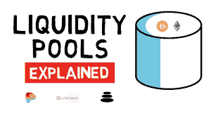

# 什么是流动性池？

> 原文：<https://medium.com/coinmonks/what-is-a-liquidity-pool-5ae795ec5c06?source=collection_archive---------54----------------------->

流动性池将是在精明的协议中获得的代币池，这些协议在分散的交易所中提供流动性，试图限制此类框架的非流动性规则所带来的问题。流动性池是另外一个名称，指的是订单的集中，这使得成本水平——一旦达到——看到资源选择是继续上升还是下降。

影响流动性池的分散式交易所正是利用基于自动化做市商的框架的交易所。在这样的交换阶段，传统的请求书被用于交换对的两种资源的预先补贴的链上流动性池所取代。

What is Liquidity Pool?

利用流动资金池的好处是，它不需要买方和卖方选择以给定的成本交换两种资源，并且进一步考虑使用预先补贴的流动资金池。这考虑了在任何情况下发生的受限滑动的交换，对于流动性最差的交换匹配，无论有足够大的流动性池多长时间。

流动性池中持有的资产由不同的客户提供，这些客户同样通过根据他们提供的流动性池的水平交换费用来获得其商店的经常性自动收入。最早提出这种框架的分散式交易所很可能是基于以太坊的交易所框架 Bancor，但在 Uniswap 提出后，它在该领域得到了广泛应用。

**你能在任何时候提供流动性吗？**

每当绝大多数人考虑流动性时，他们都会考虑分散式交易所交易中使用的流动性。总的来说，大多数流动性供应商只是向 AMMs 提供流动性，到目前为止，大多数现有的数字货币流动性都被用来控制这些阶段。

无论如何，股指期货都不是人们贡献流动性的主要渠道。随着分散融资(DeFi)场景的复杂性和种类的增加，曾经纳入的收益范围现在有了分散的对应方——大量对应方允许客户贡献流动性以协助活动。

以下是客户可以定期提供流动性的不同阶段的一部分:

**开放借贷协议:**像 Compound 和 Aave 这样的去中心化借贷协议最近有了很大的发展，并且可靠地跻身于支持链上最著名的 DeFi 协议之列。这些主要由客户贡献的流动性池控制，用于为抵押信贷融资。一般来说，流动性提供者从借款人支付的贷款费用中获得相应的部分，有时也获得额外的补偿作为管理令牌。

**DAO:**随着去中心化自治组织名声大振，它们对进入 moment capital 的要求也随之提高 moment capital 可用于支持 DAO 的收购、支付任务费用，而这只是冰山一角。在这些方面，大量的 Dao 目前都有本地支持的存储库，由本地的个人来填充。一般来说，那些向存管机构提供流动性的机构可以在他们选择的任何时间提取资产，并将获得他们出资期间的补偿。

**分散保护协议:**随着 DeFi 无处不在，客户保护自己免受黑客攻击、盗窃和其他意外事件的要求也越来越高。DeFi 保护阶段的另一个范围目前允许客户在确定的情况下购买包含计划，并通常利用来自所谓“保护金融家”的汇集流动性。这些资产可能用于支付任何有效的包含案例，流动性供应商获得保险分期付款的公平份额(以及可能的额外管理象征性奖励)。

**Decentralized Protection Protocols**

越来越多的跨锚跨度允许客户向至少一个链上的池贡献流动性，以帮助跨链进行一致和快速的令牌交换。作为贡献流动性的一种权衡，有限合伙人通常会收取一小部分“跨链费用”，即客户将资源从一个链转移到另一个链所支付的费用，通常占交易所规模的 0.05%至 0.1%。

**个人究竟出于什么原因提供流动性？**

流动性安排正在成为 DeFi 领域中一个非常著名的行动，可能最著名的分散式交易所单独就有大量的流动性供应商。总来说，全世界有超过 100，000 家令人感兴趣的特定 DeFi 流动性供应商。

通常，大多数流动性供应商都在寻找某种东西——利益。根据他们加入的人才库和他们感兴趣的舞台，从几乎没有任何东西到超过 100%的 APY 收购任何地方都是可行的。毫无疑问，根据 APY.vision 的信息显示，自成立以来，最具生产力的资金池已经为会员创造了超过 1000%的 APY，而即使是不太出名的资金池也可以提供超出银行的收益率。

一般来说，到目前为止，大多数个人提供流动性是基于这样的假设，即他们将从自己的商店中获得公平的收益——无论是流动性费用、培养收益还是行政象征性奖励。在一小部分情况下，客户可能只是提供流动性来帮助支持他们的#1 活动，因为扩大的流动性有助于保护任务代币免受疯狂成本发展的影响，同时允许新客户获得对新硬币/代币的开放，而不会经历过多的滑动。

**您会如何管理 LP 代币？**

正如我们刚才提到的，LP 代币主要用于解决特定流动性池中的单一股份。因此，他们可以被持有，直到恢复他们的储存资源以及任何收集的利益(或完成的不幸)的单一要求，所以，总而言之，他们可以将他们返回到阶段，这将消耗他们并返回他们的资源。

**LP Tokens**

无论如何，这并不是它们可以利用的一切。这里，我们研究 LP 令牌的几种不同用途。

**在人与人之间转移:** LP 代币解决了在相关流动性池中担保代币的责任。因此，持有这些 LP 代币的任何人都可以被视为这些代币的所有者。沿着这些路线，LP 代币基本上可以在人与人之间移动，允许受益人在他们选择的任何点上保证代币，并获得他们创造的任何利益。有时，向受益人发送 LP 代币而不是隐藏代币往往更有效，尤其是假设受益人打算在获得资产后添加到类似的池中。

产量培养实际上是 LP 标记最广为人知的应用。这包括在至少一个产出分支中标记 LP 标记，以在可选标记中获取额外的产出原因。例如，SushiSwap 允许客户用他们的 SushiSwap LP 代币来换取寿司等额外补偿。

**向他们赊账:**越来越多的分散贷款协议开始允许客户将他们的 LP 令牌作为贷款担保。这允许客户继续购买他们的 LP 代币的补偿，同时可以选择将资本从他们的财产中分离出来，而不期望出售他们的基本 LP 代币。Abracadabra.money 和 1Pool Finance 就是提供这种用途的两个阶段。考虑到所有的事情，客户需要考虑这样做的开门成本，因为他们永远不会再涉及这些 LP 代币的产量培养。

**消费代币:**有时，为代币提供流动性的项目所有者可以选择“消费”他们相关的 LP 代币。这包括将他们的 LP 令牌物理地发送到一个已知的“消费地址”,毫无希望地交付它们。这样做保证了代币无论如何将持续具有一些流动性，并且通常被用作防止“地板覆盖物拉动”的防护措施。

**隐含着什么危险？**

当执行准确并利用赌博相反的技术，流动性安排可以给会员带来一定的回报和可靠的收入流。

无论如何，它并不是没有合理的危险。其中最主要的是黑客的赌博。随着 DeFi 协议的使用和它们的 tvl 的增长，它们越来越受到程序员的关注，这些程序员将努力利用该约定来抢夺客户储备。

可悲的是，这在 2022 年是很平常的，几乎每个月都会有一场 DeFi 大会在黑客攻击中损失大量美元。然而，目前有各种分散的保护选择作为一项规则，这些是选择性的，没有多少流动性供应商在没有回报之前采取安排。

短暂的不幸是另一个经常被忽视的风险。这基本上是客户可能面临的不幸，假设他们的流动性下降的价值低于万一客户基本上持有他们的代币而不给予他们流动性的价值。如果交易费用收入的收益足够充足，那么 ILs 通常可以被抵消，但通常情况并非如此，许多流动性供应商在计算其收益时忽略了这一点。

最终，这是一场令牌崩溃的赌博。当分散流动性池中的一个(或两个)代币失去其大部分价值时，这可能会发生，这可能会引发流动性供应商的耸人听闻的不幸——这归因于大多数机械化市场生产者使用的稳定项目配方。这通常发生在流动性池的某一边是一个非常不可预测的令牌，其价值意外下降的时候。幸运的是，这有点耐人寻味，大多数流动性供应商不会遇到完全象征性崩溃的情况。

# CoinDCXPathbreaker