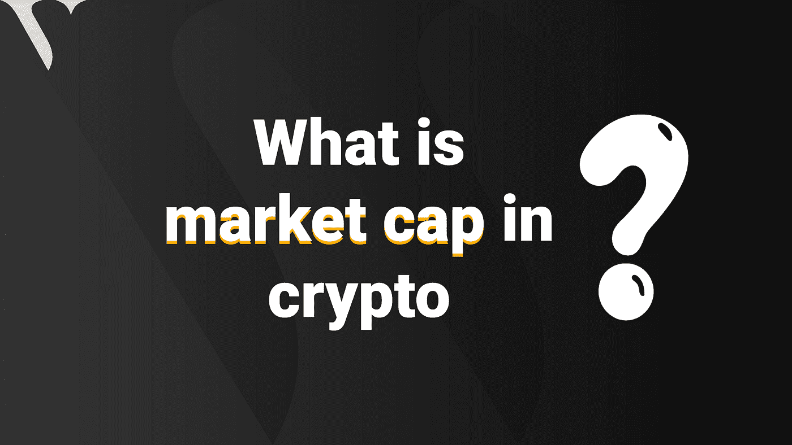
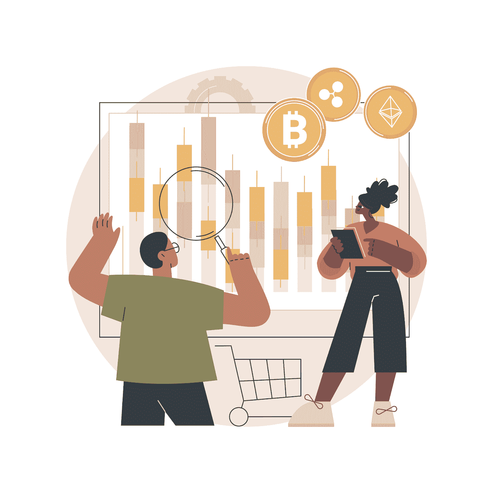

# 什么是 crypto 的市值？

> 原文：<https://medium.com/coinmonks/what-is-a-market-cap-in-crypto-6cd5822ca879?source=collection_archive---------61----------------------->

What is market cap in crypto? ValorExchange

你可能听说过这个词指的是股票市场，并想知道它与加密货币行业有什么关系。

市值是市场资本总额的缩写，对于股票市场，它通常代表一家公司所有现有股票的价值。加密行业的工作方式有所不同，我们将通过这篇文章来了解这一点。

我们将讨论密码行业的市值。它是什么，它是如何工作的？我们会详细讨论这一点。

**什么是加密货币市值？**

这与股票市场的定义非常相似。它代表一种加密货币的总价值。

比方说，有一种叫做 ValorExc 的硬币。它现存 2000 件，每件售价 5 先令。为了获得市值，你必须将每枚硬币的成本乘以流通中的加密货币总数，即 N5 乘以 2000。等式中的总价值就是 ValorExc 的市值。

**市值的类型？**

*photo credits: vectorjuice*

有不同类型的市值，每一种都有自己的优点和缺点。

**小市值:**这些加密货币的市值低于 10 亿美元，通常容易受市场情绪影响而出现价格波动。将这些加密货币转换为法定货币有时是一个问题，因为很少有人用它们进行交易。

**中等市值:**这些类型的加密货币的市值在 10 亿至 100 亿美元之间。他们有很大的增长潜力，但通常是高风险的。

**大市值:**市值大的加密货币通常是更重要和更受欢迎的加密货币，如[比特币](https://valorexchange.com/blog/post?slug=what-is-bitcoin-a-brief-introduction)和[以太坊。这些类别的价值超过 100 亿美元。他们有更高的交易量，并且最不可能在加密市场完全崩溃。](https://valorexchange.com/blog/post?slug=ethereum-a-beginners-guide-to-ether-how-it-works-and-why)

您还可以使用它们在 [ValorExchange 上进行全球范围的转账、支付或汇款。你所需要的只是一个账户，只需一封电子邮件和一个电话号码就可以开始使用。它快速、安全、轻松，因为这就是我们在 ValorExchange 上的工作方式。](https://account.valorexchange.com/)

**总之**

每种加密货币都有一个市场上限，尽管有些可能很小，但随着时间的推移，仍有可能呈指数增长。这并不是说购买它们没有风险，而是更成熟或更大的硬币更安全。加密市值是有价值的信息，你可以用它在你的加密之旅中做出正确的决定。

我们希望与您分享更多。[加入我们的 Telegram，](https://t.me/valorexchangecommunity)在这里，你可以学习加密、交易加密，并获得如何做到这两者的免费资源。您可以从加密货币中获得更多价值，我们希望与您分享。在我们的社区里都是免费的。