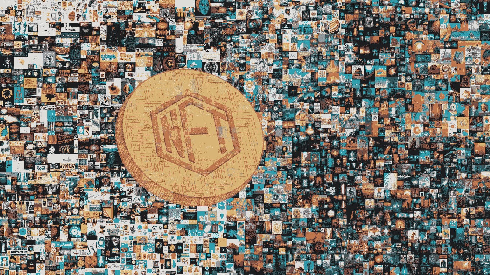

# 什么是 NFT？

> 原文：<https://medium.com/coinmonks/what-is-a-nft-8ec8d282d260?source=collection_archive---------26----------------------->

不可替代令牌(NFT)是存储在区块链(一种数字分类账形式)上的唯一且不可互换的数据单位。

NFT 可以与可复制的数字文件相关联，例如照片、视频和音频。NFT 使用数字分类帐来提供真实性的公共证书或所有权证明，但不限制底层数字文件的共享或复制。缺乏可互换性(可替代性)是 NFT 与区块链加密货币(如比特币)的区别。

由于验证区块链交易的能源成本和碳足迹，以及在艺术品诈骗中的频繁使用，NFT 受到了批评。进一步的批评质疑了在一个通常不受法律约束的市场中建立所有权证明的有用性。

NFT 是存储在数字账本上的数据单位，称为区块链，可以出售和交易。NFT 可以与特定的数字或物理资产(例如文件或物理对象)以及将该资产用于特定目的的许可证相关联。

NFT(以及相关的使用、复制或展示基础资产的许可)可以在数字市场上交易和出售。NFT 交易的法外性质通常导致资产所有权的非正式交换，这种交换没有强制执行的法律依据，通常只不过是一种身份象征。

NFT 的功能类似于加密令牌，但与比特币或以太坊等加密货币不同，NFT 不可互换，因此不可替代。虽然所有比特币都是平等的，但每个 NFT 可能代表不同的基础资产，因此可能具有不同的价值。当区块链将加密哈希记录(标识一组数据的一组字符)串到先前的记录上，从而创建可识别的数据块链时，就创建了 NFT。

该加密交易过程通过提供用于跟踪 NFT 所有权的数字签名来确保每个数字文件的认证。然而，指向艺术品存放地点等细节的数据链接可能会消失。

**版权**

NFT 的所有权并不固有地授予该令牌所代表的任何数字资产的版权或知识产权。虽然有人可能会出售代表其作品的 NFT，但当 NFT 的所有权发生变化时，买方不一定会获得版权特权，因此原所有者被允许为同一作品创建更多的 NFT。从这个意义上说，NFT 仅仅是所有权的证明，与版权是分开的。

法律学者丽贝卡·图什内(Rebecca Tushnet)表示，“从某种意义上说，购买者获得了艺术界认为他们已经获得的任何东西。除非明确转让，否则他们绝对不拥有基础作品的版权。”实际上，NFT 的购买者一般不会获得相关艺术品的版权。

**技术应用**

NFT 的唯一身份和所有权可以通过区块链总账来验证。NFT 的所有权通常与使用基础数字资产的许可相关联，但通常不授予买方版权。一些协议仅授予个人非商业使用许可，而其他许可也允许基础数字资产的商业使用。

**数字艺术**

一些数字艺术 NFT，像这些像素艺术字符，是生成艺术的例子。

数字艺术是 NFTs 的早期用例，因为区块链能够确保 NFTs 的唯一签名和所有权。艺术家迈克·温克尔曼(专业称为毕普)的数字艺术作品《每一天:前 5000 天》在 2021 年以 6930 万美元的价格售出。这是在世艺术家作品的第三高拍卖价，分别排在杰弗·昆斯和大卫·霍克尼的作品之后。

区块链技术还被用于公开注册和认证预先存在的实物艺术品，以将其与赝品区分开来，并通过物理跟踪器或标签验证其所有权。

2021 年 3 月，另一个名为“十字路口”的 Beeple 作品在 Nifty Gateway 以 660 万美元的价格售出，这是一个 10 秒钟的视频，展示了动画行人走过唐纳德·特朗普的身影。

古玩卡，一套 30 张独特的数字卡片，被认为是区块链以太坊上的第一批 NFT 艺术收藏品，在佳士得战后拍卖会上以 120 万美元的价格售出。拍品包括卡片“17b”，一个数字“印刷错误”(一系列错误)。

一些 NFT 的收藏，包括以太石和密码朋克都是生成艺术的例子，其中许多不同的图像可以通过以不同的组合组装一系列简单的图片组件来创建。

2021 年 3 月，区块链公司 Injective Protocol 从英国涂鸦艺术家班克斯那里购买了一幅价值 9.5 万美元的名为“Morons (White)”的原创丝网版画，并拍摄了有人用打火机燃烧它的视频，该视频被制作成 NFT 并出售。摧毁艺术品的人自称“被烧毁的班克斯”，称这一行为是将实物艺术品转移到 NFT 空间的一种方式。2021 年 6 月，苏富比举办了“Natively Digital”，这是该拍卖行首次策划 NFT 拍卖会。

**游戏**

NFTs 可以用来表示游戏中的资产，比如数字土地，它们由用户而不是游戏开发者控制。NFT 允许资产在第三方市场交易，无需游戏开发商的许可。

2021 年 10 月，开发者 Valve 禁止使用区块链技术或 NFTs 从其 Steam 平台交换价值或游戏工件的应用程序。

**音乐**

区块链和支持网络的技术为音乐人提供了将他们的作品标记为不可替代的标记并发布的机会。随着 NFT 在 2021 年越来越受欢迎，艺术家和巡回音乐家使用它们来恢复因 2020 年新冠肺炎疫情而失去的收入。据报道，2021 年 2 月，NFTs 在音乐行业创造了约 2500 万美元的收入。2021 年 2 月 28 日，电子舞蹈音乐人 3LAU 以 1170 万美元的价格出售了 33 张 NFT 的合集，以纪念他的 Ultraviolet 专辑三周年。

2021 年 3 月 3 日，摇滚乐队列昂之王(Kings of Leon)成为第一个宣布发行新专辑《当你看到自己》(When You See Yourself)的 NFT，据报道该专辑的销售额为 200 万美元。其他使用 NFTs 的音乐家包括美国说唱歌手 Lil Pump，视觉艺术家 Shepard Fairey 与唱片制作人麦克·迪恩合作，以及说唱歌手 Eminem。

**电影**

2018 年 5 月，20 世纪福克斯公司与 Atom Tickets 合作，发布了限量版《死侍 2》数字海报，以推广该电影。它们可从 OpenSea 和 GFT 交易所获得。2021 年 3 月，亚当·本辛(Adam Benzine)2015 年的纪录片《克洛德·朗兹曼:纳粹浩劫的幽灵》成为第一部被拍卖为 NFT 奖的电影和纪录片。

电影行业使用 NFTs 的其他项目包括宣布将为哥斯拉大战金刚发布独家 NFT 艺术作品集，导演凯宾·史密斯在 2021 年 4 月宣布他即将上映的恐怖电影《kill Roy Here》将作为 NFT 发布。2021 年的电影《零距离接触》由里克·达戴尔执导，安东尼·霍普金斯主演，也获得了 NFT 奖。

2021 年 4 月，由格雷格·伦纳德(Gregg Leonard)作曲的电影《凯旋》(Triumph)的配乐获得了 NFT 奖，成为第一个获得剧情片配乐的 NFT 奖。

2021 年 11 月，电影导演昆汀·塔伦蒂诺发布了七部基于低俗小说未删节场景的 NFT。米拉麦克斯随后提起诉讼，声称他们的电影权利受到侵犯。

**其他用途**

许多网络迷因都与非功能性词汇有关，这些词汇是由它们的创造者或主体创造并出售的。例子包括 Doge，一只柴犬的图像，其 NFT 在 2021 年 6 月以 400 万美元的价格出售，以及 Charlie Bit My Finger，Nyan Cat 和灾难女孩。

一些私人在线社区已经围绕某些 NFT 版本的确认所有权而形成。

一些虚拟世界，通常以 metaverses 的名义销售，已经将 NFTs 作为交易虚拟物品和虚拟房地产的一种手段。

尽管 NFT 市场对色情材料的敌意给创作者带来了严重的不利影响，但一些色情作品仍被当作非功能性出版物出售。

2021 年 5 月，加州大学伯克利分校宣布将拍卖两项诺贝尔奖获奖发明的专利披露的 NFT:CRISPR-cas 9 基因编辑和癌症免疫疗法。大学将继续拥有这些发明的专利，因为 NFTs 仅与大学专利披露表相关，这是大学供研究人员披露发明的内部表格。

任何类型活动的门票都被建议作为 NFTs 出售。此类提议将使活动组织者或表演者能够从转售中获得版税。

第一个被认可的政治抗议 NFT(“摧毁象征当代立陶宛的纳粹纪念碑”)是 Stanislovas Tomas 教授在 2019 年 4 月 8 日拍摄的视频，并于 2021 年 3 月 29 日铸造。在视频中，托马斯用一把大锤摧毁了立陶宛科学院纪念纳粹战犯乔纳斯·诺莱卡的国家资助的立陶宛牌匾。

区块链的标准

已经创建了特定的令牌标准来支持各种区块链用例。以太坊是第一个通过 ERC-721 标准支持 NFTs 的区块链，目前使用最广泛。随着 NFT 越来越受欢迎，许多其他区块链已经添加或计划添加对 NFT 的支持。

**以太坊**

ERC-721 是在以太坊区块链上代表不可替代的数字资产的第一个标准。ERC-721 是一个可继承的 Solidity 智能合约标准，这意味着开发人员可以通过从 OpenZeppelin 库中导入它们来创建新的符合 ERC-721 的合约。ERC-721 提供了允许跟踪唯一标识符的所有者的核心方法，以及所有者将资产转移给其他人的许可方式。

ERC-1155 标准提供了“半可替代性”，并提供了 ERC-721 功能的超集(这意味着 ERC-721 资产可以使用 ERC-1155 来建造)。与 ERC-721 的唯一 ID 代表单一资产不同，ERC-1155 令牌的唯一 ID 代表一类资产，还有一个额外的数量字段来代表特定钱包拥有的该类资产的数量。同一类别下的资产可以互换，用户可以将任意数量的资产转让给他人。

因为以太坊目前有很高的交易费(称为燃气费)，以太坊的第 2 层解决方案已经出现，它也支持 NFTs:

*   不可变 X——不可变 X 是以太坊的第 2 层协议，专门为 NFTs 设计，利用 ZK 汇总来消除交易的汽油费。
*   Polygon-以前被称为 Matic Network，Polygon 是一个由 OpenSea 等 NFT 主要市场支持的区块链。

**其他区块链**

*   比特币现金——比特币现金支持 NFTs，并为琼格 NFT 市场提供动力。
*   Cardano——Cardano 在其 2021 年 3 月的更新中引入了本机令牌，支持在没有智能合约的情况下创建 NFT。卡尔达诺 NFT 市场包括 CNFT 和 Theos。
*   流-使用利益相关共识模型证明的流区块链支持 NFTs。CryptoKitties 计划未来从以太坊转向 Flow。
*   GoChain——GoChain 是一款自称“环保”的区块链，为 Zeromint NFT 市场和 VeVe 应用提供支持。
*   索拉纳-索拉纳区块链也支持不可替换的令牌。[83]
*   te zos——te zos 是区块链的一个网络，以股权证明为基础运营，支持 NFT 艺术品的销售

**早期历史(2014–2017)**

在 DEVCON 1 上演示 Etheria。2015 年 11 月 13 日:

第一个已知的“NFT”是量子，由凯文·麦考伊和阿尼尔·达什在 2014 年 5 月创作，由麦考伊的妻子詹妮弗制作的视频剪辑组成。麦考伊在区块链的名字上注册了这个视频，并在纽约新博物馆举行的七对七会议的现场演示中以 4 美元的价格卖给了 Dash。McCoy 和 Dash 将这项技术称为“货币化图形”。

一个不可替代、可交易的区块链标记通过链上元数据(由 Namecoin 支持)与一件独特的艺术品明确关联。这与其他区块链和交易对手的多单位、可替换、无元数据的“彩色硬币”形成对比。

2015 年 10 月，第一个 NFT 项目 Etheria 在英国伦敦举行的第一次开发者大会 DEVCON 1 上推出并演示，这是在以太坊区块链推出三个月后。Etheria 的 457 种可购买和可交易的六边形瓷砖中的大部分在五年多的时间里都没有卖出去，直到 2021 年 3 月 13 日，人们对 NFT 的兴趣重新燃起，引发了购买狂潮。在 24 小时内，当前版本和先前版本的所有瓷砖，每个硬编码为 1 ETH(在推出时为 0.43 美元)，总共售出了 140 万美元。

“NFT”一词只是在 ERC-721 标准中流行起来，该标准于 2017 年通过以太坊 GitHub 首次提出，同年推出了各种 NFT 项目。其中包括古董卡、CryptoPunks(一个交易独特卡通人物的项目，由以太坊区块链的美国工作室幼虫实验室发布)和分散平台。所有这三个项目在最初的提案中都有提及，还有罕见的佩佩交易卡。

**公众意识(2017 年末至 2021 年)**

NFTs 的公众意识始于 CryptoKitties 的成功，这是一款在线游戏，玩家可以收养和交易虚拟的猫。发布后不久，该项目就像病毒一样传播开来，筹集了 1250 万美元的投资，一些小猫的售价超过了每只 10 万美元。[94][95][96]在其成功之后，CryptoKitties 被添加到 ERC-721 标准中，该标准于 2018 年 1 月创建(并于 6 月完成)，并确认使用术语“NFT”来指代“不可替代的令牌”。

2018 年，总部位于区块链的虚拟世界“分散之地”于 2017 年 8 月首次出售代币，通过首次发行硬币筹集了 2600 万美元，截至 2018 年 9 月，内部经济规模为 2000 万美元。继 CryptoKitties 的成功之后，另一款类似的 NFT 在线游戏 Axie Infinity 于 2018 年 3 月推出，随后在 2021 年 5 月成为最昂贵的 NFT 系列。

2019 年，耐克为一种名为 CryptoKicks 的系统申请了专利，该系统将使用 NFTs 来验证实体运动鞋的真实性，并向客户提供虚拟版本的鞋子。

2020 年初，CryptoKitties 的开发商 Dapper Labs 发布了 NBA TopShot 的测试版，这是一个出售 NBA 集锦的令牌化收藏品的项目。该项目建立在 Flow 之上，与以太坊相比，Flow 是一种更新、更高效的区块链。当年晚些时候，该项目向公众发布，截至 2021 年 2 月 28 日，总销售额超过 2.3 亿美元。

NFT 市场在 2020 年经历了快速增长，其价值增长了两倍，达到 2.5 亿美元。在 2021 年的前三个月，超过 2 亿美元被用于非正规金融服务。

<this material="" is="" documented="" from="" wikipedia="" and="" uses="" quotes="" there=""></this>

> *加入 Coinmonks* [*电报频道*](https://t.me/coincodecap) *和* [*Youtube 频道*](https://www.youtube.com/c/coinmonks/videos) *了解加密交易和投资*

# 另外，阅读

*   [3 商业评论](/coinmonks/3commas-review-an-excellent-crypto-trading-bot-2020-1313a58bec92) | [Pionex 评论](https://coincodecap.com/pionex-review-exchange-with-crypto-trading-bot) | [Coinrule 评论](/coinmonks/coinrule-review-2021-a-beginner-friendly-crypto-trading-bot-daf0504848ba)
*   [莱杰 vs n 格拉夫](/coinmonks/ledger-vs-ngrave-zero-7e40f0c1d694) | [莱杰纳诺 s vs x](/coinmonks/ledger-nano-s-vs-x-battery-hardware-price-storage-59a6663fe3b0) | [币安评论](/coinmonks/binance-review-ee10d3bf3b6e)
*   [Bybit Exchange 审查](/coinmonks/bybit-exchange-review-dbd570019b71) | [Bityard 审查](https://coincodecap.com/bityard-reivew) | [Jet-Bot 审查](https://coincodecap.com/jet-bot-review)
*   [3 commas vs Cryptohopper](/coinmonks/3commas-vs-pionex-vs-cryptohopper-best-crypto-bot-6a98d2baa203)|[赚取加密利息](/coinmonks/earn-crypto-interest-b10b810fdda3)
*   最好的比特币[硬件钱包](/coinmonks/hardware-wallets-dfa1211730c6) | [BitBox02 回顾](/coinmonks/bitbox02-review-your-swiss-bitcoin-hardware-wallet-c36c88fff29)
*   [block fi vs Celsius](/coinmonks/blockfi-vs-celsius-vs-hodlnaut-8a1cc8c26630)|[Hodlnaut 审核](/coinmonks/hodlnaut-review-best-way-to-hodl-is-to-earn-interest-on-your-bitcoin-6658a8c19edf) | [KuCoin 审核](https://coincodecap.com/kucoin-review)
*   [Bitsgap 审查](/coinmonks/bitsgap-review-a-crypto-trading-bot-that-makes-easy-money-a5d88a336df2) | [Quadency 审查](/coinmonks/quadency-review-a-crypto-trading-automation-platform-3068eaa374e1) | [Bitbns 审查](/coinmonks/bitbns-review-38256a07e161)
*   [加密复制交易平台](/coinmonks/top-10-crypto-copy-trading-platforms-for-beginners-d0c37c7d698c) | [Coinmama 评论](/coinmonks/coinmama-review-ace5641bde6e)