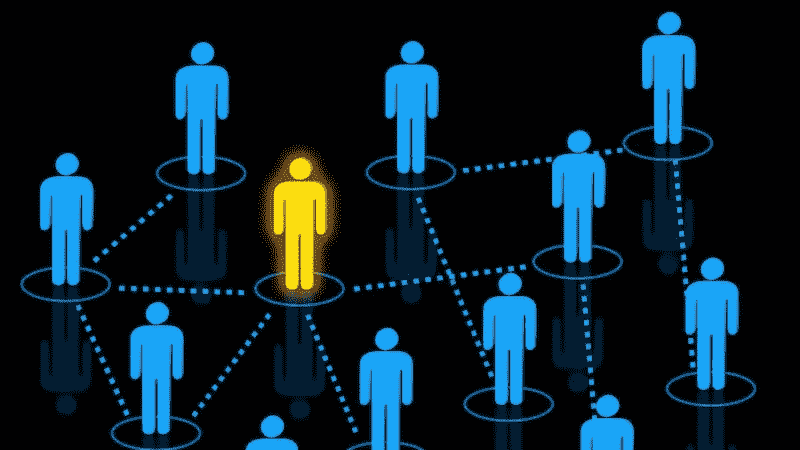
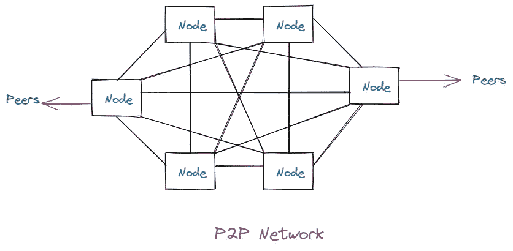

# 什么是区块链中的对等(P2P)网络？

> 原文：<https://medium.com/coinmonks/what-is-a-peer-to-peer-p2p-network-in-blockchain-3fe4417dfba2?source=collection_archive---------15----------------------->

**大家好，**

希望一切都很好！

今天我要提出一个我们在区块链网络中必须知道的新概念，即**点对点( *P2P* 网络。**

那么，什么是对等网络或 P2P 网络呢？

知道吗？

酷毙了。

开始吧！

**在本文中，我们将了解比特币网络如何作为 P2P 网络模型工作。**

比特币的结构是互联网上的点对点网络架构。术语“对等”或“P2P”是指参与网络的所有计算机都是对等的，它们都是平等的，没有“*特殊的*”或“*中心的*”节点，所有节点都分担提供网络服务的负担。

迷惑？

**我们试着用一个形象来理解。**

如上图所示，所有节点(对等节点)都是相互连接的，没有中心节点或特殊节点。网络节点在具有“扁平”拓扑的网状网络中互连。网络中没有服务器，没有集中式服务，也没有层级结构。P2P 网络中的节点同时提供和消费服务，互惠作为参与的动机。P2P 网络天生具有弹性、分散性和开放性。

P2P 网络架构的最好例子是早期的互联网本身，其中 IP 网络上的节点是平等的。今天的互联网架构更加层次化，但是互联网协议仍然保留了它的平面拓扑模型。

我希望现在你对*点对点(P2P)* 网络有了一些了解。

**太好了！**

**现在，我们来看看所有类型的 P2P 网络。**

1.  非结构化 P2P 网络
2.  结构化 P2P 网络
3.  混合 P2P 网络

**1。非结构化 P2P 网络**

在这种类型的网络中，节点没有特定的组织。参与者随机地相互交流。此外，这种类型的网络在本质上是健壮的。

**2。结构化 P2P 网络**

它允许节点精确搜索文件，即使内容不可用。这种类型的网络效率更高。而且需要更高的维护。

**3。混合 P2P 网络**

这种类型结合了传统的客户机-服务器模型和 P2P 架构的一些事实。它还提高了整体性能。

这是点对点或 P2P 网络的基本概念。我肯定，你对此有所了解。

**其实太棒了！**

希望你喜欢这篇文章。很快会看到你的新文章。

> 加入 Coinmonks [电报频道](https://t.me/coincodecap)和 [Youtube 频道](https://www.youtube.com/c/coinmonks/videos)了解加密交易和投资

# 另外，阅读

*   [比特币基地僵尸程序](/coinmonks/coinbase-bots-ac6359e897f3) | [AscendEX 审查](/coinmonks/ascendex-review-53e829cf75fa) | [OKEx 交易僵尸程序](/coinmonks/okex-trading-bots-234920f61e60)
*   [如何在印度购买比特币？](/coinmonks/buy-bitcoin-in-india-feb50ddfef94) | [WazirX 审查](/coinmonks/wazirx-review-5c811b074f5b)
*   [CryptoHopper 替代品](/coinmonks/cryptohopper-alternatives-d67287b16d27) | [HitBTC 审查](/coinmonks/hitbtc-review-c5143c5d53c2)
*   [CBET 评论](https://coincodecap.com/cbet-casino-review) | [库科恩 vs 比特币基地](https://coincodecap.com/kucoin-vs-coinbase)
*   [折叠 App 审核](https://coincodecap.com/fold-app-review) | [Kucoin 交易机器人](/coinmonks/kucoin-trading-bot-automate-your-trades-8cf0ca2138e0) | [Probit 审核](https://coincodecap.com/probit-review)