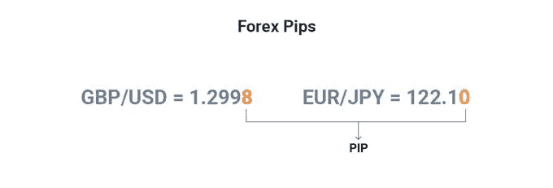
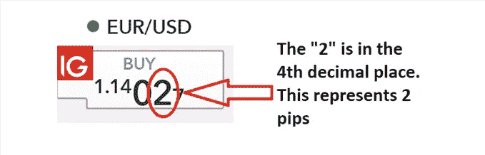
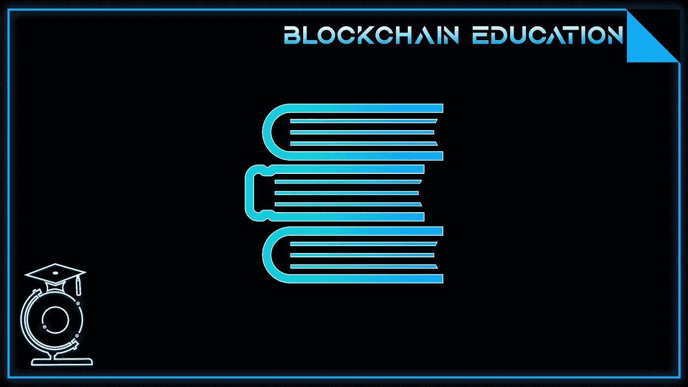

# 什么是 Pip？外汇交易

> 原文：<https://medium.com/coinmonks/what-is-a-pip-forex-trading-91508254c9c4?source=collection_archive---------33----------------------->

在我们的 YouTube 上观看视频的同时，享受这个流的资源！

YouTube:[https://youtu.be/KEDd1-WLgP8](https://youtu.be/KEDd1-WLgP8)

不和:【https://discord.gg/J73qhkj7kr】T2

推特:【https://twitter.com/CryptoverseDAO】

linktree:[https://linktr.ee/cryptoversedao](https://linktr.ee/cryptoversedao)

-

什么是 pip？

发现如何使用 pip 值是帮助你理解外汇交易的好方法。一点是货币交易中最小的报价单位。当你看到报价移动了 100 点，这意味着价格上涨或下跌了货币对的 1%。因为每个货币对都由两种货币组成，这意味着每个货币对的点值是不同的。例如，对于美元/加拿大元(USD/CAD)货币对，一个点是 0.0001 美元，而对于欧元/日元(EUR/JPY)，它是 10 = 1 个点

计算一点的价值:

学习如何计算一个点的价值是理解外汇交易的第一步。点的价值是指从一种货币汇率报价到下一种货币汇率报价的步骤，通常以点来衡量。例如，如果欧元/美元报价为 1.2533/1.2534，那么两个报价之间的差异为 1 个点。一个点的价值会根据每种货币对的总交易量和每笔报价的大小而变化。准确计算一个点价值的关键是知道你交易的是什么货币对，这个货币对值多少美元，以及你用这个货币对兑换了多少钱。

外汇交易中如何使用 Pip 值？

点值是指在货币兑换中可以使用的最小变化单位。这与美国人谈论金钱时使用便士和分币的方式相似。另一方面，货币交易实际上是使用固定金额进行的。在外汇交易中，交易者根据一种货币相对于另一种货币的价值来交易货币。具体来说，个人会根据一种货币以另一种货币表示的价值，将这种货币的价格与其他货币进行比较。外汇交易中的一点指的是小数。

pip 值报告为正值或负值。所有货币对都有基础货币(列出的第一种货币)和报价货币(列出的第二种货币)。例如，在美元/瑞士法郎货币对中，美元是基础货币，瑞士法郎是报价货币。pip 值与第四位小数有关，即. 000001。举例来说，如果一个货币对的交易价格是 1.29%，那么你就要为这个特定货币的交易支付这个金额。在外汇交易中，在建立任何头寸之前，需要计算每笔交易的点值，因为它将影响您的止损和止盈水平。

结论:

总之，外汇交易中的 pip 是指根据汇率随时间的波动，通过使用金融工具进行交易可以获得的利润潜力。【好处】它寻求以高超的能力巧妙地处理交易者面临的风险和威胁。目标是有效地评估整体风险，并利用与指数或货币相关的价格上涨或下跌，这取决于价格是否足够高，可以作为获利的机会。

欧元/美元标准合约一个点的价值计算如下:

点子价值=合约规模 x 一个点子

点值= 100 000 x 0.0001

点值= 1 美元

> 加入 Coinmonks [电报频道](https://t.me/coincodecap)和 [Youtube 频道](https://www.youtube.com/c/coinmonks/videos)了解加密交易和投资

# 另外，阅读

*   [氹欞侊贸易评论](https://coincodecap.com/anny-trade-review) | [火币保证金交易](/coinmonks/huobi-margin-trading-b3b06cdc1519)
*   [分散交易所](https://coincodecap.com/what-are-decentralized-exchanges) | [比特 FIP](https://coincodecap.com/bitbns-fip) | [Pionex 评论](https://coincodecap.com/pionex-review-exchange-with-crypto-trading-bot)
*   [用信用卡购买密码的 10 个最佳地点](https://coincodecap.com/buy-crypto-with-credit-card)
*   [最好的卡达诺钱包](https://coincodecap.com/best-cardano-wallets) | [Bingbon 副本交易](https://coincodecap.com/bingbon-copy-trading)
*   [印度最佳 P2P 加密交易所](https://coincodecap.com/p2p-crypto-exchanges-in-india) | [柴犬钱包](https://coincodecap.com/baby-shiba-inu-wallets)
*   [8 大加密联盟项目](https://coincodecap.com/crypto-affiliate-programs) | [eToro vs 比特币基地](https://coincodecap.com/etoro-vs-coinbase)