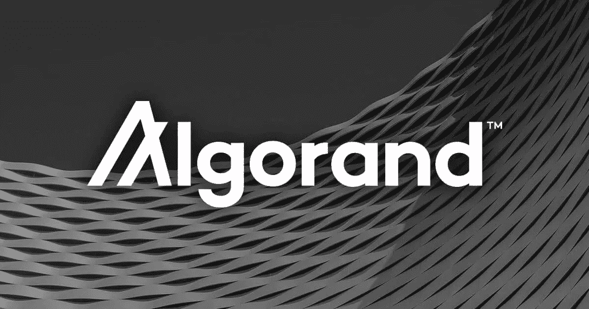

# 什么是 Algorand，它是如何工作的

> 原文：<https://medium.com/coinmonks/what-is-algorand-and-how-does-it-works-c2adc12eef6a?source=collection_archive---------9----------------------->

## 阿尔格兰德解释道

阿尔格兰德是一个去中心化和开源的区块链，于 2019 年 6 月推出。

该项目的幕后策划者是麻省理工学院(MIT)的图灵奖获得者、研究员兼教师希尔维奥·米卡利教授。

在整个项目背后还运行着阿尔格兰德基金会，一个不同的实体…