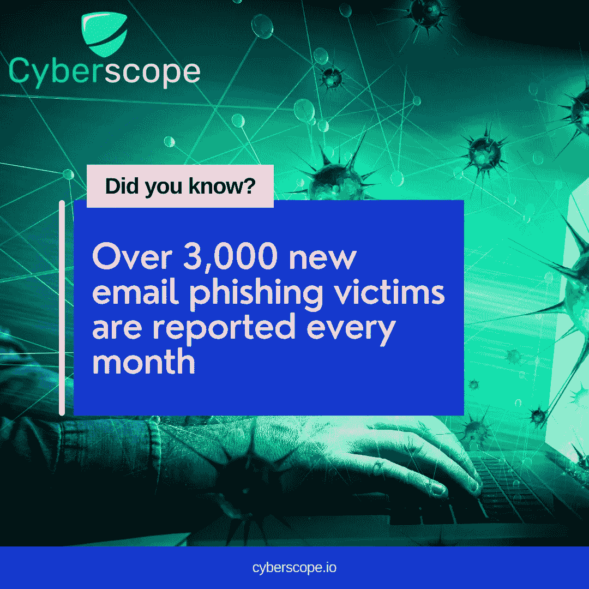
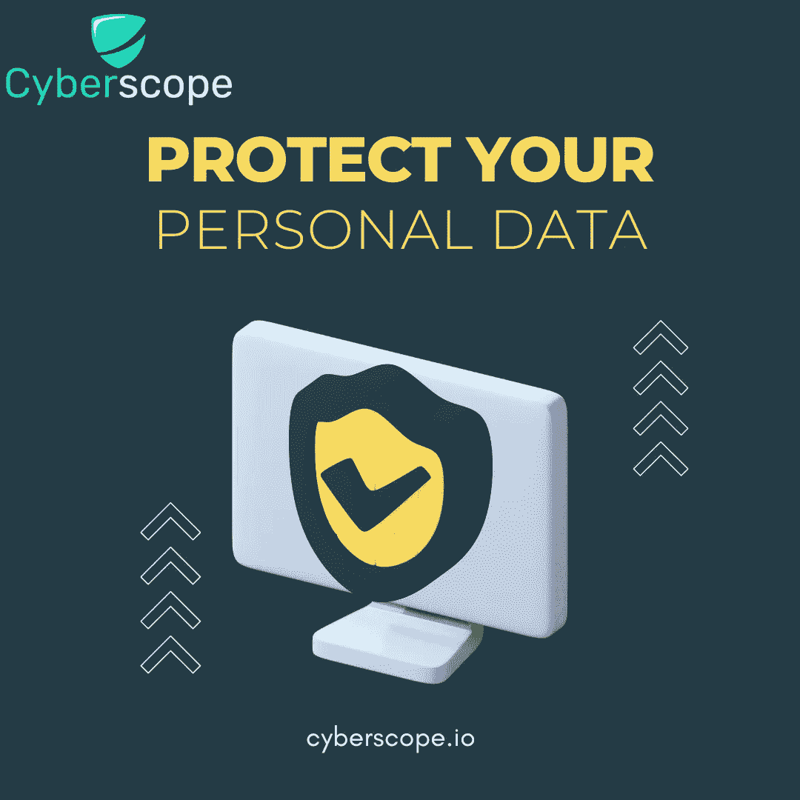

# 什么是电子邮件欺骗，如何识别？

> 原文：<https://medium.com/coinmonks/what-is-an-email-spoof-and-how-to-spot-one-8cc414c7898b?source=collection_archive---------33----------------------->

## 什么是电子邮件欺骗？

电子邮件欺骗是黑客和垃圾邮件发送者的一种艺术和技巧，目的是欺骗人们认为他们的消息来自合法来源，而实际上并非如此。当你收到这样的电子邮件时，你无法确定是谁发的，也无法确定邮件是否合法。这封邮件与真正邮件的唯一区别在于，它很可能会进入你的垃圾邮件文件夹，而不是你的收件箱。

## 如何识别一封恶搞邮件？

这使得欺骗电子邮件很难识别，因为它们通常会像您收到的任何其他正常电子邮件一样被处理。但是你猜对了— [Cyberscope](https://cyberscope.io/) 你已经覆盖了！以下是一些关键指标，可以帮助您识别欺骗性电子邮件:

*   **查看邮件地址，** **不只是显示姓名。**例如，你可能会收到一封来自银行的电子邮件，催促你尽快更改密码。因此，发件人的名字将是“美国美国银行。”如果电子邮件地址类似于“customerservice@nowhere.com ”,那么你很可能是被欺骗了。
*   **检查邮件标题。**邮件头中的电子邮件地址应该与它应该来自的电子邮件地址相匹配。你可以使用一些[工具](https://mxtoolbox.com/Public/Tools/EmailHeaders.aspx?huid=8dac58f8-efc7-4757-ac81-9c7d722ebd59)检查整个邮件头信息，这样你就可以在邮件送达你之前看到邮件的路径。
*   **检查语法错误、紧急消息或对可疑事件采取行动的呼叫。**这封邮件的内容很可能是一些紧急消息，要求您使用第三方(很可能是不可信来源)的凭据登录，因为您的订阅即将结束，或者您的帐户可能会被删除。

## 如果发现网络钓鱼电子邮件，该怎么办？

如果你收到了钓鱼邮件或短信，请举报。您提供的信息有助于打击骗子。

**第一步。**如果您收到了一封网络钓鱼**电子邮件**，请将其转发给政府的反网络钓鱼工作组。

如果你收到了一条钓鱼短信**，把它转发给垃圾邮件。**

**第二步。**向政府相关部门报告网络钓鱼攻击。

## 如果您回复了一封网络钓鱼邮件，该怎么办

如果你认为一个骗子掌握了你的信息，比如你的社会保险号、信用卡号或银行账号，去你政府的相关网站看看。在那里，您将看到根据您丢失的信息采取的具体步骤。如果骗子试图进入你的银行账户，打电话通知你的银行，并更改你的密码以防万一。

## 结论

生活在一个信息唾手可得的现代世界中，这种便利提供了极大的灵活性，但也是一个格外小心的理由，因为黑客和骗子已经抓住了这个机会为自己谋利。Cyberscope 是一家重视用户隐私和保护您自己数据的网络安全公司。

关于我们的更多信息:

[网站](https://www.cyberscope.io/)

[推特](https://twitter.com/cyberscope_io)

[电报](https://t.me/coinscope_co)

…

*最初发布于*[*https://www . cyber scope . io*](https://www.cyberscope.io/)*。*

> 加入 Coinmonks [电报频道](https://t.me/coincodecap)和 [Youtube 频道](https://www.youtube.com/c/coinmonks/videos)了解加密交易和投资

# 另外，阅读

*   最好的比特币[硬件钱包](/coinmonks/hardware-wallets-dfa1211730c6) | [BitBox02 回顾](/coinmonks/bitbox02-review-your-swiss-bitcoin-hardware-wallet-c36c88fff29)
*   [block fi vs Celsius](/coinmonks/blockfi-vs-celsius-vs-hodlnaut-8a1cc8c26630)|[Hodlnaut 评审](/coinmonks/hodlnaut-review-best-way-to-hodl-is-to-earn-interest-on-your-bitcoin-6658a8c19edf) | [KuCoin 评审](https://coincodecap.com/kucoin-review)
*   [Bitsgap 审查](/coinmonks/bitsgap-review-a-crypto-trading-bot-that-makes-easy-money-a5d88a336df2) | [Quadency 审查](/coinmonks/quadency-review-a-crypto-trading-automation-platform-3068eaa374e1) | [Bitbns 审查](/coinmonks/bitbns-review-38256a07e161)
*   [密码本交易平台](/coinmonks/top-10-crypto-copy-trading-platforms-for-beginners-d0c37c7d698c) | [Coinmama 审核](/coinmonks/coinmama-review-ace5641bde6e)
*   [印度加密交易所](/coinmonks/bitcoin-exchange-in-india-7f1fe79715c9) | [比特币储蓄账户](/coinmonks/bitcoin-savings-account-e65b13f92451)
*   [OKEx vs KuCoin](https://coincodecap.com/okex-kucoin) | [摄氏替代度](https://coincodecap.com/celsius-alternatives) | [如何购买 VeChain](https://coincodecap.com/buy-vechain)