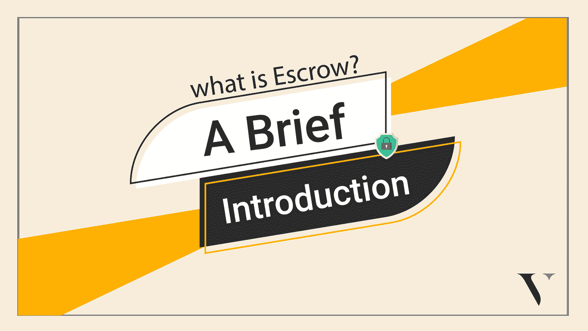

# 什么是托管？简介

> 原文：<https://medium.com/coinmonks/what-is-an-escrow-a-brief-introduction-a166db23e436?source=collection_archive---------48----------------------->

让我们想象一下，你拥有一家精品店，拥有市场上最好的服装材料。一位顾客走过来，看到你的一件他们喜欢的作品。他们通过手机银行转账来支付布料的货款，但是你不会马上收到货款。

就在这时，你接到一个紧急电话，不得不离开，所以你把这块布交给你的邻居保管，直到你确认已经收到付款。在路上，你收到了付款，并打电话给你的邻居将布料汇给客户。这是契约。

托管是一种服务或过程，资金由指定的第三方保管，直到满足某些条件。

在加密领域，有时会使用智能合同来保留和保护资金。一旦满足特定条件，资金将被发送到适当的当事方。

这种类型的托管服务是有益的和多才多艺的。它可以用于房地产交易、保险合并和收购等。

它为交易双方提供了安全、直接和透明的交易。所以你不会失去你辛苦赚来的钱。

*Photo credit: juststartinvesting*

**如何使用比特币进行托管？**

假设你想从一个账户购买[比特币](https://valorexchange.com/blog/post?slug=what-is-bitcoin-a-brief-introduction)。卖家把他们的账户信息发给你，但是你以前从来没有这样做过，你也不认识这个人。如果你汇了钱，但他们不为你的加密账户提供资金，该怎么办？

在 [Valorexchange](https://account.valorexchange.com/signup) ，我们尽最大努力确保所有买家和卖家都能收到他们的付款和加密货币。

如果卖家或买家没有收到他们支付的东西，我们的支持团队将在平台上联系，并立即调查问题。如果你与某人进行一次或多次交易，你不必担心因此失去你的资金或密码。

**为什么我需要托管？**

加密行业的分散性质确保你不需要知道你从谁那里购买加密货币。当涉及到货币兑换时，有许多欺诈案件。当购买加密货币时，你是在向一个陌生人在线汇款，这是一件相对危险的事情。

这就是我们消除这种风险的地方。当你支付硬币时，它们会进入你的钱包，你不用担心是否会收到它们。

**我如何开始？**

用 [Valorexchange](https://account.valorexchange.com/signup) 开户并设置。这是一个快速有效的过程。一旦你都设置好了，你就可以享受快速和安全的交流。

**总之**

我们是 Valor 的一个社区，我们想帮助你[学习加密](https://valorexchange.com/blog/post?slug=4-ways-you-can-use-your-cryptocurrencies-during-a-crash)并在你方便的时候成长或获得加密。你可以享受安全和轻松的转让与托管。[加入我们的社区](https://t.me/valorexchangecommunity)，不要错过任何新闻更新、免费工具和资源。