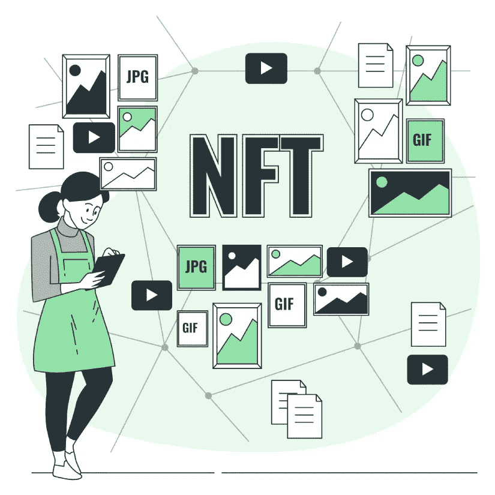

# 什么是 NFT——完全初学者指南

> 原文：<https://medium.com/coinmonks/what-is-an-nft-a-complete-beginners-guide-e13fc2768821?source=collection_archive---------28----------------------->

NFT Development Solutions

## NFTs —简介

你可能听说过最近网上流传的“NFT”一词。如果你想知道这些是什么，并想了解更多，这个博客可能会帮助你。基本上，NFT 是不可替换令牌的缩写，这不能解释很多。在了解什么是不可替代性之前，必须知道什么是可替代性。可替代的意思是某种价值的物品可以被另一种价值相同的物品替代。例如，一张 10 美元的钞票可以换成另一张 10 美元的钞票，或者换成两枚 5 美元的硬币，甚至是相同金额的在线交易。但是，有了不可替换的代币，两个代币就不会一样，而且每一个*都是独一无二的。*

## *非功能性测试的开始和发展*

*NFT 是区块链技术和加密货币的产物。在我们深入研究 NFT 之前，应该先了解这些术语。区块链是数字分类账，可以代表产品经历的任何过程的时间戳。*

*加密货币是一种使用密码学概念来保护交易安全的数字货币。随着世界上许多百万富翁开始投资加密货币，区块链的发展找到了将他们纳入其中的途径，NFT 诞生了。虽然 NFTs 在 2014 年就已经存在，但只是在病毒式网络游戏 CryptoKitties 出售以猫为特色的 NFTs 之后，这个词才获得了更广泛的社交媒体用户。类似地，被称为 CryptoPunks 的像素化艺术形式的贴纸使 NFTs 更受欢迎。随着越来越多的艺术家提出他们的 NFT 艺术形式，NFT 慢慢地受到欢迎。*

*目前，一些在线游戏以 NFT 形式的独特配件为特色，这些配件可以用加密货币购买，并可以在特定游戏的环境中使用。此外，NBA 和 FormulaOne 等体育联盟也推出了专注于游戏内项目的 [***自有 NFTs***](https://www.blockchainappfactory.com/nft-development-services?utm_source=coinmonks&utm_medium=Guest+Blog&utm_campaign=Vishnu) 。越来越多的名人根据他们的主题，甚至特殊时刻的照片和视频来出售 NFT，以拉近与粉丝的距离。还有，歌曲，电影，甚至一些现实生活中的物品都在成为 NFT。*

## *更现实的用途*

*虽然从外表上看，NFT 看起来像是一个艺术品收藏家的乐趣或一次赌博尝试，但像社交媒体一样，它们也有其他正在探索的应用。首先，NFTs 可以让那些从事房地产行业的人松一口气，因为提供与地块相关的 NFT 令牌及其文档可以减少地块被多次出售的情况。*

* [## 最佳 NFT 发展公司|最佳 NFT 发展服务| NFT 发展公司解决方案|…

### 我们的 NFT 开发公司用强大的技术帮助您创建您的 NFT 平台。我们的 NFT 开发流程…

www.blockchainappfactory.com](https://www.blockchainappfactory.com/nft-development-services?utm_source=coinmonks&utm_medium=Guest+Blog&utm_campaign=Vishnu) 

此外，智能住房合同可以使双方受益，无需第三方干预，从而节省相关费用和时间。车辆登记或婚姻登记也是如此。甚至在美国也发生过非功能性投票，这通常可以确保透明的选举实践，几乎可以立即产生结果。篡改 NFTs 几乎是不可能的，因为每个 NFT 都是一个独特的实体，这种做法可能会使其一文不值。

一些服装品牌，如耐克，已经推出了实物 NFT 产品，你可以找到该项目是在哪里制造的，并确保它是真正的交易。NFT 也希望在数字和现实生活应用中作为验证或认证因素。从数字上来说，这种可能性可以缓解社交媒体上的版权侵权检查，因为另一个人不能声称他们创造了一个病毒模因，而他们并没有。随着时间的推移，将 NFT 整合到更现实的应用程序中成为可能，随着元宇宙的到来，NFT 只会从这里开始上升。

## 它们是如何工作的？

你可以在市场上买到非功能性食物，比如 OpenSea、币安等等。在这些网站上，人们可以使用诸如以太、USDT 等加密货币付费购买他们最喜欢的艺术或歌曲或视频作为 NFT。在某些情况下，非森林交易通过拍卖出售，一些著名的拍卖行将非森林交易视为他们的下一个目标。在被列入 NFT 市场之前，每一件物品(一件艺术品或一首歌曲)都会被转换成 NFT。NFT 可能是独一无二的(就像蒙娜丽莎的艺术作品)，也可能有多个相同的 NFT 副本(就像玩家交易卡)。创作者也可以在网站上列出他们的作品，并可以要求任何他们选择的加密货币。出售作品后，创作者可以在物品转手时获得版税，确保被动收入。

## 一家 NFT 开发公司在这里做什么？

一家从事 NFT 开发的公司可以为你做几乎所有的工作，除了创建或购买 NFT 资产并出售。他们可以帮助使用区块链技术实践将资产(数字或物理)转换为非功能性资产。这些公司中的一些也可以帮助你使用 NFT Launchpad，它可以被认为是出售 NFT 的 YouTube 工作室。使用这些，您可以有效地创建和发布 NFT，这样您每次通过另一个组织创建 NFT 的花费就会更少。

## 卖家还是买家——非功能性交易对我有什么好处？

**如果你是创作者，恭喜你！**现在，您可以通过作品的数字化形式获得更多收入，确保您随时都有被动收入。如果你是买家，也恭喜你！你是在直接支持你最喜欢的艺术家，也可以夸耀自己收藏了一件独一无二的物品。

如果你是一个卖家， [***创建自己的 NFT 市场***](https://www.blockchainappfactory.com/nft-marketplace-development?utm_source=coinmonkks&utm_medium=Guest+Blog&utm_campaign=Vishnu) 当你接近一家 NFT 开发公司时会变得很容易，在那里他们会减轻你的压力，你现在可以潜入 NFTs 的世界。

> 加入 Coinmonks [电报频道](https://t.me/coincodecap)和 [Youtube 频道](https://www.youtube.com/c/coinmonks/videos)了解加密交易和投资

# 另外，阅读

*   [从 WazirX 切换到 CoinDCX 的 5 个理由](https://coincodecap.com/reasons-to-switch-from-wazirx-to-coindcx)
*   [联合国硬币评论](https://coincodecap.com/unocoin-review) | [最佳加密赌注硬币](https://coincodecap.com/best-crypto-staking-coins)
*   [如何使用 MetaMask Wallet 获取 KCC 地址？](https://coincodecap.com/kcc-address-metamask)
*   [如何获得自己的。XYZ 领域？](https://coincodecap.com/xyz-domain)
*   [最佳加密交换平台](https://coincodecap.com/best-crypto-swap-platforms) | [最佳加密交易所](https://coincodecap.com/crypto-exchange)
*   [购买比特币印度](/coinmonks/buy-bitcoin-in-india-feb50ddfef94) | [Pionex 评论](/coinmonks/pionex-review-exchange-with-crypto-trading-bot-1e459d0191ea) | [加密交易机器人](/coinmonks/crypto-trading-bot-c2ffce8acb2a)*