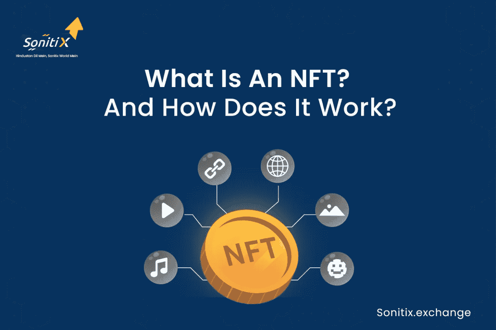

# 什么是 NFT？它是如何工作的？

> 原文：<https://medium.com/coinmonks/what-is-an-nft-and-how-does-it-work-bffeb57105c?source=collection_archive---------46----------------------->

今年，不可替代令牌(NFT)似乎已经从以太中爆发出来。这些数字资产，从艺术和音乐到墨西哥卷饼和卫生纸，正在像 17 世纪充满异国情调的荷兰郁金香一样热卖，有些甚至卖到数百万美元。

另一方面，NFT 是否物有所值——或者是否值得大肆宣传？一些分析师认为，它们就像网络狂热和豆豆娃一样，即将破灭。其他人认为，非功能性交易将会持续下去，并将永远革新投资。

什么是 NFT？

描绘艺术、音乐、游戏中的物品和电影等现实世界元素的数字资产被称为 NFT。他们在网上购买和交易，通常使用加密货币，他们通常用与许多其他加密相同的软件编码。

NFT 也是独一无二的，或者至少是非常小批量的，并且包含独特的识别码。“从本质上来说，NFT 产生了数字稀缺，”Yellow Umbrella Ventures 董事总经理兼华盛顿技术产业协会卡斯卡迪亚区块链委员会主席 Arry Yu 解释道。

这与绝大多数数码产品形成了鲜明的对比，因为数码产品几乎总是无限量供应。如果某种资产有需求，减少供应理论上应该会增加其价值。

然而，许多 NFT 都是已经以某种形式存在于其他地方的数字作品，例如 NBA 比赛的传奇视频剪辑或已经在 Instagram 上流传的数字艺术的安全版本，至少在早期是这样。

# NFT 与加密货币有何不同？

术语“不可替换令牌”是指不可替换的令牌。它的编程方式通常与比特币或以太坊等加密货币相同，但相似之处仅此而已。

加密货币和实物货币都是“可替代的”，这意味着它们可以相互交易或交换。它们也值同样多的钱——一美元总是值另一美元，一个比特币总是值另一个比特币。加密货币的可替代性使其成为执行区块链交易的安全方式。

NFT 不像其他材料。每个都包含一个数字签名，防止 NFT 相互替换或比较(因此是不可替换的)。仅仅因为他们都是 NFT，一个 NBA 顶级投篮剪辑并不是每天都一样的。(就此而言，一个 NBA 最佳投篮镜头不一定等于另一个 NBA 最佳投篮片段。)

# NFT 是如何工作的？

NFT 存储在区块链上，这是一个分散的公共分类账，用于跟踪交易。大多数人都知道区块链是允许加密货币存在的基础技术。

NFT 通常在以太坊区块链举行，但也可以在其他区块链举行。

NFT 由代表有形和无形对象的数字对象组成，例如:

艺术

GIF 的

视频和体育集锦

收藏品

虚拟化身和视频游戏皮肤

设计师运动鞋

音乐

甚至推文也被考虑在内。Twitter 的联合创始人杰克·多西以 NFT 身份发布的第一条推文卖了 290 多万美元。

> 加入 Coinmonks [Telegram group](https://t.me/joinchat/Trz8jaxd6xEsBI4p) 并了解加密交易和投资

# NFT 是用来做什么的？

由于区块链技术和 NFTs，艺术家和内容创作者有了一个独一无二的赚钱机会。例如，艺术家不再需要通过画廊或拍卖行出售他们的作品。相反，艺术家可以把它作为 NFT 直接卖给消费者，让他们保留更大部分的利润。此外，艺术家可以将版税集成到他们的软件中，这样当他们的作品卖给新的所有者时，他们就可以获得销售分成。这是一个可取的特征，因为大多数艺术家在他们的第一次销售后没有收到后续的收益。

利用 NFTs 赚钱不仅限于艺术。为了给慈善机构筹集资金，Charmin 和 Taco Bell 等公司拍卖了以 NFT 为主题的艺术作品。Taco Bell 的 NFT 艺术作品在几分钟内就销售一空，最高出价为 1.5 包以太(WETH)——在撰写本文时相当于 3723.83 美元。Charmin 的产品被称为“NFTP”(不可替代的卫生纸)，Taco Bell 的 NFT 艺术在几分钟内售罄，最高出价为 1.5 包乙醚(WETH)——在撰写本文时相当于 3723.83 美元。

# 如何购买 NFT

如果你有兴趣开始自己的 NFT 系列，你需要以下物品:

首先，你需要一个可以容纳非功能性交易和加密货币的数字钱包。根据您的 NFT 提供商接受的货币，您可能需要购买一些加密货币，如以太。比特币基地、北海巨妖、eToro，甚至 PayPal 和 Robinhood 现在都允许你用信用卡购买加密货币。之后，你就可以把它从交易所转移到你喜欢的钱包里了。

# 受欢迎的 NFT 市场

[OpenSea.io](https://opensea.io/) :这个点对点市场声称出售“稀有的数码产品和纪念品”要开始，只需创建一个帐户，并浏览 NFT 收藏。你也可以通过作品的销量来寻找新的艺术家。

[Rarible](https://rarible.com/) : Rarible 是一个民主、开放的市场，允许艺术家和制作人发行和销售 NFT，类似于 OpenSea。该平台的 RARI 令牌允许用户对费用和社区法规等功能进行投票。

如果你想跟上加密货币行业的趋势，请加入我们在 [Discord](https://discord.gg/BVUnw9te) 、 [Reddit](https://www.reddit.com/user/Sonitixexchange) 和 [Telegram](https://t.me/+JgmgBJTzvaA0NDBl) 上的社区。